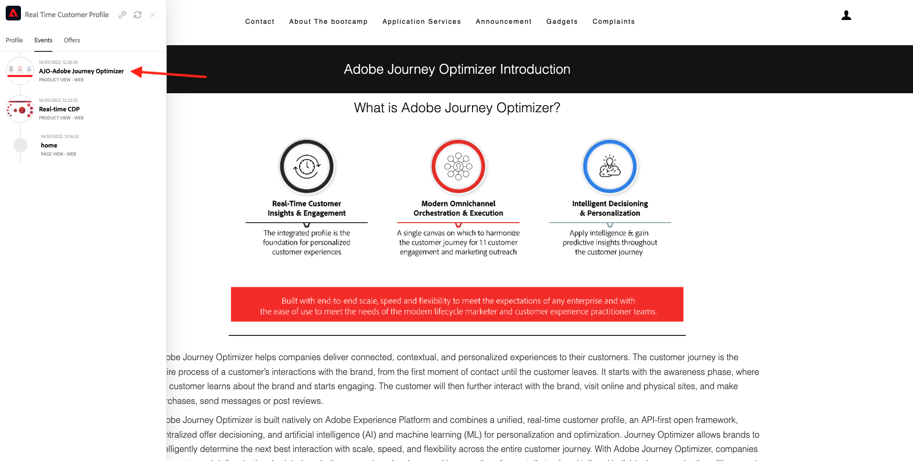

# 1.1 Do desconhecido ao conhecido em nosso site

## Contexto

Adobe Experience Platform・デセンペニャ・パペル・インポータンテ・ネッサ・ヨルナダ。 A plataformaé o cérebro da comunicação, o **経験記録システム**.

プラタフォルマエウムアンビエンテエムは、パラヴラクライアントエングロバマイスドクライアントコンヘキドスをクライアント。 Um visitante desconhecido no site tambéméum cliente do ponto de vista da Plataforma e, comotal, todo o comportamento de um visitante desconhecido também envida Plataforma. Graças a essa abordagem, quando esse visitante eventualmente se torna um cliente conhecido, uma marca também pode visualizar o que anteceu antes daquele momento. Isso ajuda は、特定の de uma の視点で de otimização de attribução e experiência。

## フラクソダヨルナダドクライアンテ

Acesse [https://bootcamp.aepdemo.net](https://bootcamp.aepdemo.net). クリック **すべて許可**.

クリケ・ノ・イコーネ・ド・ロゴシポ・ダ・Adobeは、最高のエスカルド・デ・テラ・パラ・アブリルとは言えません。

Verifique o painel do Visualizador de perfile e no Perfil do cliente em tempo real com o **Experience CloudID** como identificador primário para ste clientte que aindaé desconhecido

Voce também pode ver todos os Eventos de Experiência coletados com base no comportamento do cliente. A lista está vazia no momento, mas isso mudará em breve.

Acesse a opção de menu **アプリケーションサービス** 製品がありません **Real-Time CDP**.

Voêverá a página detales do produto. Um Evento de experiência do tipo **製品表示** agora foi enviado para a Adobe Experience Platform usando a implementação do web SDK que você revisou no Módulo 1. アブラ・オ・ペインエル・ビジュアライゼアドール・デ・ペルフィル・エ・ベリフィク・セウス **エクスペリエンスイベント**.

Acesse a opção de menu **アプリケーションサービス** 製品がありません **Adobe Journey Optimizer**. Mais um Evento de experiência foi enviado para a Adobe Experience Platform.

Abra o painel 視覚化アドールデペルフィル。 アゴラヴォクヴェラ 2 Eventos de experiência do tipo **製品表示**. エンボラオコンポルタメントセハアノニモ、カダクリケレラストレード、アルマゼネアドナAdobe Experience Platform。 Depois que o cliente annonimo se tornar conhecido, poderemos mesclar todo o comportamento annimo automaticamente ao perfil conhecido.

アゴラヴァモスアナリサルセウペルフィルデクライアンテ e usar seu comportamento personalizar sua experiencencia do cliente no site.

プロクシマエタパ： [1.2 seu proprio perfil de cliente em tempo real - UI](./ex2.md)

[レトルナルパラフルクソデウサリオ 1](./uc1.md)

[レトルナーパラトドスオスモドゥロス](../../overview.md)
