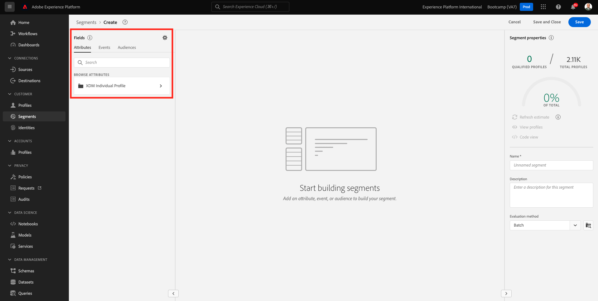
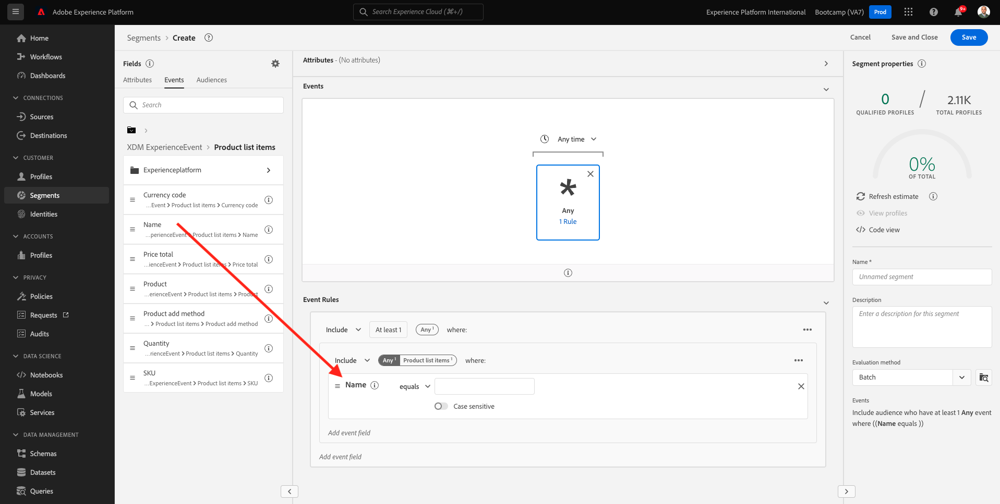

# 1.3 Crieum segmento - UI

Neste exercício, vocêirá criar um segmento usando o Construtor de Segmentos da Adobe Experience Platform.

## ヒスタミン

Acesse [Adobe Experience Platform](https://experience.adobe.com/platform). Depois de fazer ログイン， vocêirá acessar a página inicial da Adobe Experience Platform.

アンテス・デ・コニュナール、ヴォーチェ・プレシャ・セレクショナー・アム **サンドボックス**. サンドボックスをユーザーセレクショナド é にすることはできません ``Bootcamp``. É porivel fazer isso clicando no texto **[!UICONTROL 実稼動版]** ナ・リンハ・アズール・ナ・パルテ・スーペリア・ダ・テラ Depois de selecionar o sandbox apporiado, você verá a tela mudando e agora vocestá em seu [!UICONTROL サンドボックス] 決め手

メニューが見つからない、アクセス **セグメント**. Nesta página, vocêtem uma visão geral de todos segmentos existentes. クリケ・ノ・ボトン+クリアル・セグメントパラ・コメサールはクリアル・ノボ・セグメントと呼ばれる。

Quando estiver no no novo construtor de segmentos, vocêirá perceber imediatamente a opção de menu **属性** リファレンシアド **XDM 個人プロファイル**.

Como o XDM é は言語的な que alimenta o setor de experiência, o XDM tambémémé は基本的な para o construtor de segmentos です。 Todos os dados ingeridos na platforma devem ser mapeados em relação ao XDM e, portanto, todos dados se tornam parte do mesmo modelo de dados, independentemente da da origem dados. イッソ・オフェレセウマグランデ・バンタゲムアオクリアーセグメントス、ポイスはパーティシャルデッサインターフェイス do usuário do construtor de segmento、é 占有コンバイナー dados de qualquer origem no mesmo fluxo de trabalho。 Os segmentos criados no Construtor de segmentos podem ser envidados solutionses como Adobe Target, Adobe Campaign e Adobe Audience Manager para ativação.

アゴラヴォーチャ・クリアル・アム・セグメント・デ・トドス・クライアンテス・クイアリザラム・オ・プロダクト **Real-Time CDP**.

Para construir este segmento, você precisa adicionar um Evento de experiência. ベントス・デ・エクスペリエンシア・クリカンド・ノ・イコーネ **イベント** ナバラ・デ・メニュー **フィールド**.

Em seguida, vocêverá o nó **XDM ExperienceEvents** 優れていると思います。 クリック **XDM ExperienceEvent**.

Acesse **製品リスト項目**.

選択 **名前** ～に対して無礼を言う **名前** メニュー à esquerda na tela do construtor de segmentos na seção **イベント**. Em seguida, o seguinte será exibido:

O parâmetro de comparação deve ser **次と等しい** e, campo de entrada, insira **リアルタイム CDP**.

センプレク・アディシオナール・エレメントトアオコンストラクター・デ・セグメントス、ヴォクレポード・クリカル・ノ・ボサン **推定を更新** para obter uma nova estimativa da população em seu segmento

パラ **評価方法**, selecone **Edge**.

ポールフィム、ヴァモスダルムノームアオセグメントエサルバロ。

コモモデロデノメンクラトゥラ、次を使用します。

- `yourLastName - Interest in Real-Time CDP`

エム・セグイダ、クリケ・ノ・ボトン **保存して閉じる** para salvar seu segmento

Agora vocirá retornarà página de visão geral do segmento, onde verá uma visualização de amostra dos perfis de clientes que qualificam para o seu segmento.

アゴラヴォーポード継続 no próximo exercício e usar seu segmento com o Adobe Target.

プロクシマエタパ： [1.4 Ação:enviu segmento para o Adobe Target](./ex4.md)

[レトルナルパラフルクソデウサリオ 1](./uc1.md)

[レトルナーパラトドスオスモドゥロス](../../overview.md)
