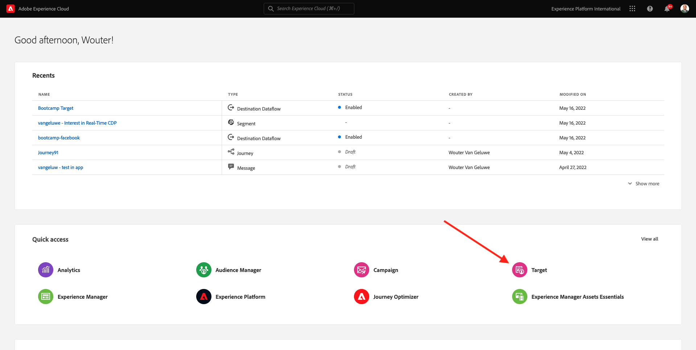

# 1.4 Ação:enviu segmento para o Adobe Target

Acesse [Adobe Experience Platform](https://experience.adobe.com/platform). Depois de fazer ログイン， vocêirá acessar a página inicial da Adobe Experience Platform.

アンテス・デ・コニュナール、ヴォーチェ・プレシャ・セレクショナー・アム **サンドボックス**. 誰かがサンドボックスを選択し、Bootcamp を行うことはありません。 É porivel fazer isso clicando no texto **[!UICONTROL 実稼動版]** ナ・リンハ・アズール・ナ・パルテ・スーペリア・ダ・テラ Depois de selecionar o sandbox apporiado, você verá a tela mudando e agora vocestá em seu [!UICONTROL サンドボックス] 決め手

## 1.4.1 Ative seu segmento para o destino do Adobe Target

O Adobe Target está disponível como um destino do CDP em tempo real. Para configurar sua integração com o Adobe Target, acesse **宛先** e **カタログ**.

クリック **パーソナライズ** メニューなし **カテゴリ**. ヴォクレベラオ・カルタン・デデジノ・ド **Adobe Target**. クリック **セグメントのアクティブ化**.

宛先を選択 ``Bootcamp Target`` e クリック **次へ**.

Na lista de segmentos disponíveis, selione o segmento que vocriou em [1.3 Crie um segmento](./ex3.md), com o nome `yourLastName - Interest in Real-Time CDP`. Em seguida、clique em **次へ**.

ナ・プロキシマ・パギナ、クリック・エム **次へ**.

クリック **完了**.

セグメントアゴラエスタアティバドパラオAdobe Target。

>[!IMPORTANT]
>
>イメディアタメンテ・アポス・クリア・セ・デスティノ・ド・Adobe TargetのReal-Time CDP、ポデ・レヴァ・アテ・ウマ・ホラ・パラ・ク・オ・デスティノ・セジャ・アティバド。 Esteé um tempo de esperaúnico devido a definição da configuração de back-end. デポイス・クエ・オ・テンポ・デ・エスペラ・イニシャル・デ 1 ホラ・デ 1 ホラ・ア・コンフィギュラ・ホラ・ド・バックエンド・フォレム締結、オス・セグメントス・デ・ボルダ・レシオナドス・サン・デジノ・ド・Adobe Target

## 1.4.2 suaatividade のAdobe Targetでの設定

Agora que seu segmento Real-Time CDP está configurado para ser enviado Adobe Target,é 占有設定は suaatividade de Segmentação por experiência no Adobe Target. Neste expercicio, vocêirá configurar uma atividade basedade no Visual Experience Composer.

アセスアパギナの官僚ダAdobe Experience Cloud・アセサンド [https://experiencecloud.adobe.com/](https://experiencecloud.adobe.com/). クリック **ターゲット** 準学長

ナ・パジナ・イニシャル・ド **Adobe Target**, vocêverá todas as atividades existenteses.
クリック **+アクティビティを作成** パラクリアルマ・ノヴァ・アティビデード。

選択 **エクスペリエンスのターゲット設定**.

選択 **ビジュアル** e 定義 a **アクティビティ URL** コモ `https://bootcamp.aepdemo.net/content/aep-bootcamp-experience/language-masters/en/exercises/particpantXX.html`, mas, antes disso，代替 XX por um número entre 01 e 60.

>[!IMPORTANT]
>
>Cada particante da capacitação deve usar uma página da Web separada para evitar a colisão de várias experiências do Adobe Target. É esporivel escolher uma página da Web e contral a URL accessando: [https://bootcamp.aepdemo.net/content/aep-bootcamp-experience/language-masters/en/exercises.html](https://bootcamp.aepdemo.net/content/aep-bootcamp-experience/language-masters/en/exercises.html).
>
>トダスはパギナスのコンパルティラムメスマ URL ベース e termam com o número do particante.
>
>エグザンプロ、または参加者 1 は URL をデバイスします `https://bootcamp.aepdemo.net/content/aep-bootcamp-experience/language-masters/en/exercises/particpant01.html`, o participante 30 deve usar a URL `https://bootcamp.aepdemo.net/content/aep-bootcamp-experience/language-masters/en/exercises/particpant30.html`.

ワークスペースの選択 **AT Bootcamp**.

クリック **次へ**.

Visual Experience Composer の無い Agora vocestá。 Pode levar de 20 a 30 segundos até que o site esteja complete carregado.

オ・プブリコ・パドラオ・サン **すべての訪問者**. クリケノス **3 ドット** ラドデ **すべての訪問者** e クライアント **オーディエンスを変更**.

アゴラボケスタ・ベンド・アリスタ・デ・プブリコス・ディスポニヴェイス、e o segmento da Adobe Experience Platform・ク・ヴォクリオ・アンテリオルメンテ・エネヴィオ・Adobe Target・アゴラ・ファズ・パルテ・デッサ・リスタ。 セグメントのセレシオネは、クレクリオ・アンテリオルメンテ・ナ・Adobe Experience Platform。 クリック **オーディエンスの割り当て**.

Seu segmento da Adobe Experience Platform agora faz parte dessa Atividade de segmentação por experiência.

アンテス・デ・オルタライアイメージ・プリンシパル、ヴォーデヴ・クリカー・エム **すべて許可** banner de cookie がありません。

Para isso, vá para **参照**

Em seguida、clique em **すべて許可**.

Em seguida, retorne para **作成**.

アゴラ・ヴァモスはイメージメンのプリンシパル na página の公式サイトをムダル。 クリックナイメージメンプリンシパル padrano no site, clique em **コンテンツを置換** e セレクション **画像**.

ペルキソ・オ・アルキボ・デ・イメージェム **rtcdp.png**. 1 つのクリックエムを選択 **保存**.

Voêverá a nova experiência com a nova imagem para o seu Público selecionado

クリケ・ノ・ティトウロ・ダ・スア・アティビダード・ノ・カントー・スーペリア・エスケルド・パラ・レノメア・ラ。

パラノーム、次を使用：

- `seuSobrenome - RTCDP - XT (VEC)`

クリック **次へ**.

クリック **次へ**.

ナパジナ **目標と設定**、アクセス **目標指標**.

メタプリンシパル COMO の定義 **エンゲージメント** - **サイト滞在時間**. クリック **保存して閉じる**.

アゴラボケスタナパギナ **アクティビティの概要**. ボーチャインダ・プレシサ・アティビダード。

クリケノカンポ **非アクティブ** e セレクション **有効化**.

Vocêreceberá uma confirmação visual de que sua atividade agora está ativa.

アゴラスアアティヴィダードエスタアティヴァ e pode ser testada no site do bootcamp.

セアゴラヴォクレヴォルタオセウサイト de demonstração e visitar a página do produto para **Real-Time CDP**, você se qualificará instanceamente para o segmento cue criou e verá a a atividade do Adobe Target exibida na página inicial em tempo real.

>[!IMPORTANT]
>
>Cada particante da capacitação deve usar uma página da Web separada para evitar a colisão de várias experiências do Adobe Target. É esporivel escolher uma página da Web e contrar a URL accessando ao リンク： [https://bootcamp.aepdemo.net/content/aep-bootcamp-experience/language-masters/en/exercises.html](https://bootcamp.aepdemo.net/content/aep-bootcamp-experience/language-masters/en/exercises.html).
>
>トダスはパギナスのコンパルティラムメスマ URL ベース e termam com o número do particante.
>
>エグザンプロ、または参加者 1 デヴユーザー a `https://bootcamp.aepdemo.net/content/aep-bootcamp-experience/language-masters/en/exercises/particpant01.html`, o participante 30 deve usar a URL `https://bootcamp.aepdemo.net/content/aep-bootcamp-experience/language-masters/en/exercises/particpant30.html`.

プロクシマエタパ： [1.5 Ação:enviu segmento para o Facebook](./ex5.md)

[レトルナルパラフルクソデウサリオ 1](./uc1.md)

[レトルナーパラトドスオスモドゥロス](../../overview.md)
