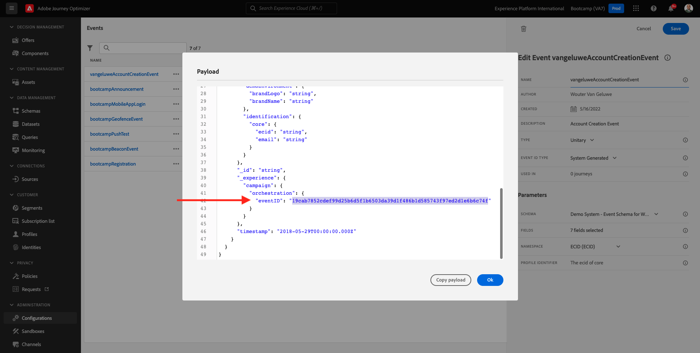

# 2.4 テストスアヨルナダ

## フラクソダヨルナダドクライアンテ

アブラウマノヴァジャネラアノニマドナヴガドルエヴァパラ [https://bootcamp.aepdemo.net](https://bootcamp.aepdemo.net). クリック **すべて許可**. com base no seu comportamento de navegação no fluxo de usário anterio, vocêverá a personalização acontecer na página inicial do site.

クリケ・ノ・イコーネ **プロファイル** 上等のディレイトダテラは無い。

クリック **アカウントの作成**.

プレエンチャ・トドス・カンポスはマヌラリオをする。 um valor real para endereço de e-mail e número de telefone, pois sera usado em exercícios posterores para envio de e-mail e SMS を使用します。

役割のパラバイクソ。 Agora voce inserir o eventID do seu evento personalizado que voccrio no expercicio 2.2. Vocêpode encontrá-lo aqui:

O eventIDé o que precisa ser enviado a Adobe Experience Platform para acionar a jornada que vocurstruiu. eventID ネストの例：
`19cab7852cdef99d25b6d5f1b6503da39d1f486b1d585743f97ed2d1e6b6c74f`

Preencha または eventID no campo **アカウント作成イベント ID** e クライアント **登録**.

Em seguida, a tela abaixo será exibida:

ヴォーチャンベム・レセベラ・エステ E メール、ケ・o・E メール・ク・ヴォーチャン・メスモ・クリオ・コモ・パルテ・デス・エステ・エクスペリシオ。

ヴォーテルミヌーはエキスペルシオをテストした。

プロクシマエタパ： [2.5 Instale e use o aplicativo móvel](./ex5.md)

[レトルナルパラフルクソデウサリオ 2](./uc2.md)

[レトルナーパラトドスオスモドゥロス](../../overview.md)
