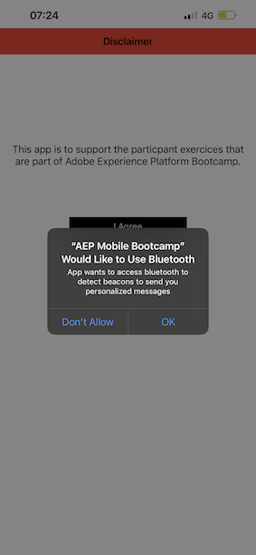

# 2.5 Instale e use o aplicativo móvel

## Instale o aplicativo movel

Antes de instalar o applicativo,é nitário habilitar Rastreamento no seu dispositivo iOS. Para isso, acesse Configuraçoes > Privacidade e segurança > Rastreamento e confirme a opção Peritrir que os applicativos solicititem o rastreamento.

App Store・ダ・Apple・エペスク `aepmobile-bootcamp`.\
クリック **Instalar** ou **ダウンロード**.

Depois que o aplicativo estiver instalado, clique em **Abrir**.

クリック **OK**.

クリック **権限**.

クリック **コンコルド**.

クリック **アプリの Permiter enquanto uso**.

クリック **権限**.

アゴラヴォーケスタノ・アプリカティボ、ナ・パジナ・イニシャル、プロント (a) パラ・ヴェリフィカル・トダ・ヨルナダ・クライアンテ。

## フラクソダヨルナダドクライアンテ

Primeiramente,é nepisario fazer o login. クリック **ログイン**.

Depois de criar sua conta nos excios anteriores, issoé exibido no site. Agora nesario reutilizar o endreço de e-mail da conta cque voccrio uno applicativo para fazer o login.

Digite o endreço de e-mail que vocêsou no site e clique em **ログイン**.

Vocêrecerbera uma confirmação de que está conectado e receberá uma notificação push.

レトルネ・パラ・ア・パジナ・イニシャル・ド・アプリカティボ e os recursos adicionais irano apacerer.

Acesse **製品**. Cliem qualquer producto、ネストされた例： **行くコーヒー**.

Voêverá a página do produto **行くコーヒー** アプリケーティボなし クリック **購入**.

アゴラヴォーカルテルミノーは、exercício e está pronto proximas atividades として設定します。

プロクシマエタパ： [ 2.6 Personalização no call center](./ex6.md)

[レトルナルパラフルクソデウサリオ 2](./uc2.md)

[レトルナーパラトドスオスモドゥロス](../../overview.md)
