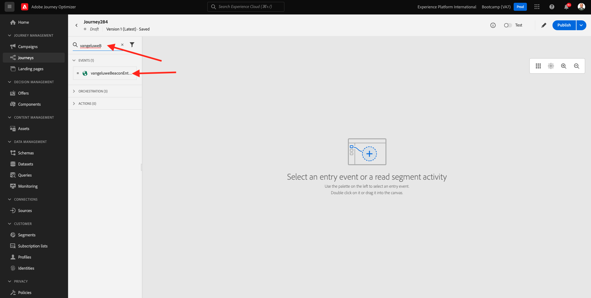
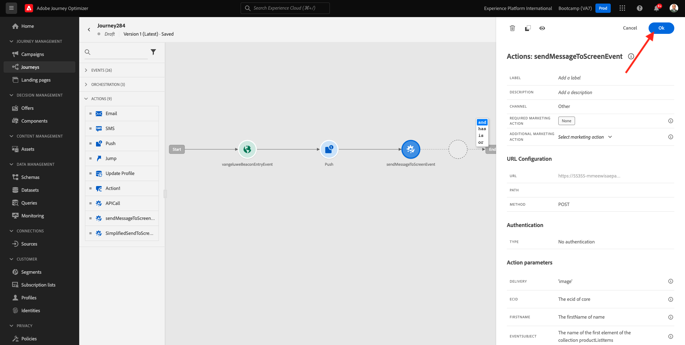

# 3.3 クリースアヨルナダ電子通知のプッシュ

Neste exercício, vocêirá configurar a jornada e a mensagem que precisa ser acionada quando alguém inserir uma sinalização (beacon) usando o aplicativo móvel.

Faça ログインのAdobe Journey Optimizerのアクセスサンド a [Adobe Experience Cloud](https://experience.adobe.com). クリック **Journey Optimizer**.

Vocêserá redirectionado para a visualização da **ホーム** Journey Optimizer Primeiro, verifique se vocé está usando o sandbox correto. サンドボックスクエデヴ・ユサド・エ `Bootcamp`. パラオルタナルドゥウムサンドボックスパラアウトロ、クリック EM **Prod** sandbox na lista からを選択します。 Neste エグザンプロ， o nome do sandboxé **Bootcamp**. Voêestará na visualização da **ホーム**  サンドボックスを設定 `Bootcamp`.

## 3.3.1 クリー・ア・スア・ヨルナダ

メニューがなく、クリック **ジャーニー**. Em seguida、clique em **作成ジャーニー** パラクリアルマ・ノヴァ・ヨルナダ。

ヴォクレヴェラウマテラデヨルナバジア。

エクスペリシオ前部、ボークリウムノボ **イベント**. ベント語 `yourLastNameBeaconEntryEvent` e 置換 `yourLastName` ペロ・セウ・ソブレノーム。 Este foi o resultado da criação do Evento:

アゴラのボーカは、思い切ってエステエベントをコモ・イニシオ・デスタ・ヨルナダ。 Vocêpode fazer isso indo para o lado esquerdo da tela e procurando pelo seu evento na lista de eventos.

セレクワンセウイベント、アレスト e solte o evento na tela de jornada。 スアヨルナダアゴラは、セメルハンテアオセギンテに敬意を表します。 クリック **Ok** para salvar suas alteraçoes

コモセグンダエタパダヨルナダ、ボーディヴアディシオナルマアサオ **プッシュ**. Vá para o lado esquerdo da tela para **アクション**, selection ação **プッシュ** arraste e ソルト ação no segundo nó da sua jornada

ラド・ディレイト・ダ・テラ、アゴラ・ヴォークレベ・クリア・スア通知サオ・プッシュはありません。

定義 **カテゴリ** コモ **マーケティング** e selecione um push surface que permite envirator notificaçaoes push. スーパーファイシーがユーザーセレクショナダを押すネスカソ **mmeewis-app-mobile-bootcamp**.

## 3.3.2 Crie a sua mensagem

クリック **コンテンツを編集**.

Em seguida, a tela abaixo será exibida:

Vamos は、conteúdo da notificação push を定義します。

Clique no campo de texto **タイトル**.

コメス・ナ・アレア・デ・テクスト **オラ**. クリケ・ノ・イコーネ・デ・パーソナライザ・サオ。

トークンデパーソナライゼーションパラオカンポ **名** クエストアルマゼナドエム `profile.person.name.firstName`. メニューがありません， selecione **プロファイル属性**，役割 para baixo/navegue para encontroo elemento **人物** e clique na seta para avançar um nvel até chegar ao campo `profile.person.name.firstName`. クリケ・ノ・イコーネ **+** para adicionar o campo a tela クリック **保存**.

エンタオ、ヴォーチラ・レトルナ・パラ・エスタ・テラ。 Clique noícone de personalização ao lado do campo **本文**.

エスクレバ・ナレア・デ・テクスト `Bem-vindo(a)`.

Em seguida、clique em  **コンテキスト属性** e **Journey Orchestration**.

クリック **イベント**.

Clique nome do seu evento, que deve ser semelhante ao seguinte: **yourLastNameBeaconEntryEvent**.

クリック **場所のコンテキスト**.

クリック **POI インタラクション**.

クリック **POI の詳細**.

クリック番号 **+** アイコン番号 **POI 名**.
エムセギダ、o seguinte será exibido. クリック **保存**.

スア・メンサゲム・アゴラ・エスタ・プロンタ。 クリケナセタノカントスーペリアスケルドパラレトルナーラスアヨルナダ。

クリック **Ok**.

## 3.3.2 Envie uma mensagem para uma tela

コモ・テルセイラ・エタパ・ダ・ヨルナダ、ボーディヴ・アディシオナルマ・アサオ  **sendMessageToScreen**. Vá para o lado esquerdo da tela para **アクション**, selection ação **sendMessageToScreen** e arraste e solte ação no terceiro nó da sua jornada エムセギダ、vocêverá a tela abaixo。

**sendMessageToScreen** é uma ação personalizada que irá publicuma mensagem no **エンドポイント** usado pela exibição na loja A ação **sendMessageToScreen** エスペラ・ク・ムルティプラス・バリアヴェイス・セジャム・ディフィダス。 Vocêpode visualizar essas variáveis rolando para baiaté ver **アクションパラメーター**.

アゴラヴォーチャは、バロレスパラカダパラメトロデアソサンを定義します。 Siga esta tabela para entender quais valores são nesários e onde.

| パラメーター | value |
|:-------------:| :---------------:|
| 配信 | `'image'` |
| ECID | `@{yourLastNameBeaconEntryEvent._experienceplatform.identification.core.ecid}` |
| 名 | `#{ExperiencePlatform.ProfileFieldGroup.profile.person.name.firstName}` |
| EVENTSUBJECT | `#{ExperiencePlatform.ProductListItems.experienceevent.first(currentDataPackField.eventType == "commerce.productViews").productListItems.first().name}` |
| EVENTSUBJECTURL | `#{ExperiencePlatform.ProductListItems.experienceevent.first(currentDataPackField.eventType == "commerce.productViews").productListItems.first()._experienceplatform.core.imageURL}` |
| サンドボックス | `'bootcamp'` |
| CONTAINERID | `''` |
| ACTIVITYID | `''` |
| PLACEMENTID | `''` |

{style=&quot;table-layout:auto&quot;}

Para は、バロアを定義し、clique no icone **編集**.

Em seguida, selection **詳細設定モード**.

Em seguida、cole o valor com base na tabela acima. クリック **Ok**.

レピタエッセスプロセッサパラアジオナールパラカダカンポ。

>[!IMPORTANT]
>
>Para o campo ECID, há referrência ao evento`yourLastNameBeaconEntryEvent`. Lembre-se de substituir  `yourLastName` ペロ・セウ・ソブレノーム。

O resultado final deve ser semelhante ao seguinte:

ロールパラシマクリックエム **Ok**.

ジャーニーに名前を付ける必要があります。 これをおこなうには、 **プロパティ** アイコンを使用して、画面の右上に表示されます。

ボーチュポードインサーレオノームダヨルナダアキ。 使用方法 `yourLastName - Beacon Entry Journey`. クリック **OK** para salvar suas alteraçoes

アゴラヴォーポードパブリカルスアヨルナ・クリカンド・エム **公開**.

クリック **公開** ノバメンテ

Vocêverá uma barra de confirmação verde informando que sua jornaagora está Publicada.

スアヨルナダアゴラエスタアティヴァ e pode ser acionada.

ヴォーテルミヌーはエキスペルシオをテストした。

プロクシマエタパ： [3.4 テストスアヨルナダ](./ex4.md)

[レトルナルパラフルクソデウサリオ 3](./uc3.md)

[レトルナーパラトドスオスモドゥロス](../../overview.md)
