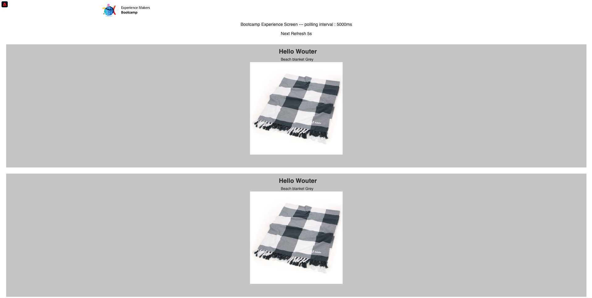

# 3.4 テストスアヨルナダ

パラテスタースア・ヨルナダ， vocêdeve usar o eventID criado no expercio 3.2, que deve ser semelhante ao seguinte.

O eventIDé o que precisa ser envida a Adobe Experience Platform para acionar a jornada. 次の例， o eventIDé:
`e76c0bf0c77c3517e5b6f4c457a0754ebaf5f1f6b9357d74e0d8e13ae517c3d5`.

アブラ・オ・アプリカティボ・モベル・エ・ヴァ・パラ・ア・パギナの官僚。 クリケ・ノ・イコーネ・デ **設定**.

Cole seu eventID no campo **ビーコンの EventID** e クライアント **保存**.

Antes de continuar, abra esta página da web em seu computador: [https://bootcamp.aepdemo.net/content/aep-bootcamp-experience/language-masters/en/screen.html](https://bootcamp.aepdemo.net/content/aep-bootcamp-experience/language-masters/en/screen.html)

Em seguida, será exibida a tela:

レトルネ・パラ・パギナの官僚。 クリケ・ノ・イコーネ・ド **ビーコン**.

Primeiro, selecione **Bootcamp Screen Beacon** e クリケノボタンデ **エントラダ** 」ボタンをクリックします。 イッソ・ペリティラ・ク・ヴォーク・シミュレ・エントラダ・ド・ビーコン。

アゴラはテラ・ダ・ロジャを確認します。 Vocêverá oúltimo produto visualizado apacer nessa tela em 5 segundos.

ボーダンベム・テラ・レシベド・スア通知サオ・プッシュ。

ヴォーテルミヌーはエキスペルシオをテストした。

[レトルナルパラフルクソデウサリオ 3](./uc3.md)

[レトルナーパラトドスオスモドゥロス](../../overview.md)
