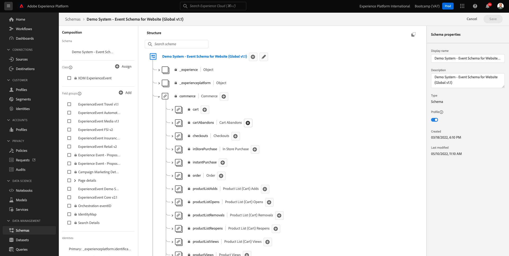

# 4.1Customer Journey Analytics101

## Objectivos

- CJA のエンテンダオクエ
- エンテンダクアルエオパペルド CJA
- CJA を実行するワークフローのエンテンダ：ダコネサンデダオスの洞察

## 4.1.1 O queé oCustomer Journey Analytics?

OCustomer Journey Analytics(CJA) fornece uma インターフェイス em em que os times de Analytics, Negócios e Tecnologia conseguem unir todos dados dados da companisar a jornada cross-channel (online e offline) do cliente de ponta ponta ponta。 O CJAé capaz de fornecer contexto e clareza para essa jornada, trazendo uma visiono acionável em cima dificuldades no processo de converso e possibilitando o planejamento de experincias perantes e personanos ponanos ponas pontos pontos pontos pontos pontos pontos montos montos mantos mantos mantos mantos 関連性が関連性が関連性が関連性です。

O CJA traz o Analysis Workspace conectado a Adobe Experience Platform. Adobe Experience Platformo cérebro da comunicação e da orquestração e, com o CJA, marcas agora podem contextualizar e visualar toes dados, para as equipes de negócios e insights possam eles, analisando toda on-line para-line do cliente cline clinte

デ・ネグシオス e インサイト podem conversar com o CJA, fazer perguntas e obter respostas em tempo real com インターフェイス do usuário de arrastar e soltar, apontar e clicar e fcil de usar do Analysis Workspace.

## 4.1.2 プリンシパはバンタゲン

Os três principais benepícios para os clientes sao:

- A capasidade de dispononibilizar insights para todos (ou seja, democratizar o acesso aos dados).
- A capasidade de ver o cliente em joruma jornada context (ou seja, os dados podem ser visualizados sequencialmente, abrangendo múltiplos canais on-line e off-line).
- A capasidade de aproveitar o poder dos dados sem que haja a nesidade (ou seja, permite que indivíduos usem dados para desbloquears insights e análises profundas profundas para ativação de marketing)

## 4.1.3 ## 4.1.3 Por que escolher oCustomer Journey Analytics?

O CJA nano se destina a subsituir um aplicativo de BI atual, comoPower BI, Microstrategy, Locker ou Tableau. O objetivo de BI ビジュアライゼーションの aplicativos de BI ビジュアライゼーションの dados para criar painéis corporativos para que em uma organização possam ver métricas importantes rapidamente. O objetivo do CJAé trazer poder de análise para de marketing e Negócios, tornando-o uma ferramenta de análise obrigatoria para pessoas

Tradicionalmente, os applicativos de BI têm sido incapazes de perimiter a verdadeira inteligência do cliente:

- エレスナンオポデムファザーアトリブイサオエナンファゼムアナリセスデヨルナダドクライアンテ
- Os aplicativos de BI precisam saber a pergunta com antecedência
- 領事として、サン・リミタダス・ペラ・エストルトゥラ・ド・バンコ・デ・ダドス
- ハビリダデス・デ・SQL サオ・ニサリアス。
- Os aplicativos de BI não permitem que você pergunte o motiveo de um acontecimento.
- Os aplicativos de BI não têm conexão direta com os pontos de contato do cliente.

ポルタント、ウスアリオス・デ・ネゴシオス・アナリスタス・チェガムはベコスの sem saída quase imediatamente, tornando a análise cara, lenta, inflexível e desconectada dos sistemas de ação.

com o CJA voê pode ter uma visão completa da jornada do cliente, usando dados offline e online, com as ferramentas certas para reduzir o tempo de insight, tornando os usuários de negcios independentes por que algo algo algo aco come como como re como respor a como respoder a isso.

## 4.1.4 Compreenda o fluxo de trabalho doCustomer Journey Analytics

Antes de iniciar os próximos expercícios,é essencial compreender quais etapas são nesarias para trazer dados da da da da da da para o CJA para visualizá-los e obter alguns insights profundos. É o que chamamos de fluxo de trabalho do CJA. バモス検証：

アンテス・デ・イニシアはエタパ・アシマ、ナン・セ・エスケサ・ダ・エタパ 0、ク・コンプレエンダー・オス・ダドス・エスト・ディスポニヴェイス・ナ・Adobe Experience Platform。

**ゴミ入りゴミ出し。** Voêdeve ter uma ideia clara de quais dados estão disponíveis e como os esquemas na Adobe Experience Platform são configurados. coisas, nano só na parte de conexão de dados, mas também na hora de construir visualizaçois, es e fazer análises としてコンプレエンダーオス dados que estão na Adobe Experience Platform fazer análises.

## 4.1.5 Etapa 0:Compreender esquemas e データセット da Adobe Experience Platform

Faça ログイン na Adobe Experience Platform accessando a URL: [https://experience.adobe.com/platform](https://experience.adobe.com/platform).

Depois de fazer ログイン， vocêirá acessar a página inicial da Adobe Experience Platform.

アンテス・デ・コニュナール、ヴォーチェ・プレシャ・セレクショナー・アム **サンドボックス**. サンドボックスをユーザーセレクショナド é にすることはできません ``Bootcamp``. ボーチュポーデ・ファザー・イッソ・クリカンド・ノ・イコーネ **[!UICONTROL Prod]** 上等のディレイトダテラは無い。 Depois de selecionar o sandbox apporiado, você verá a tela mudando e agora voceêestá em seu sandbox dedicado.

スキーマがAdobe Experience Platformのデータセットであることを確認します。

| データセット | スキーマ |
| ----------------- |-------------| 
| デモシステム — Web サイトのイベントデータセット (Global v1.1) | デモシステム — Web サイトのイベントスキーマ (Global v1.1) |
| デモシステム — コールセンターのイベントデータセット（グローバル v1.1） | デモシステム — コールセンター（グローバル v1.1）のイベントスキーマ |
| デモシステム — 音声アシスタントのイベントデータセット（グローバル v1.1） | デモシステム — 音声アシスタント用のイベントスキーマ（グローバル v1.1） |

Certifique-se de ter verificado menos:

- ID:CRMID、phoneNumber、ECID、電子メール。 プライマリ識別子はどの ID で、セカンダリ識別子はどれですか。
識別子を見つけるには、スキーマを開き、オブジェクトを確認します `_experienceplatform.identification.core`. スキーマを見る [デモシステム — Web サイトのイベントスキーマ (Global v1.1)](https://experience.adobe.com/platform/schema).

- 識別子：CRMID、phoneNumber、ECID、電子メール。 クァイスはサンオス identificadores primários, quais são os identificadores secundários?
ボケポード・エンコントラール・アブリンド・アム・スキーマ・オブジェトのオブザンド `_experienceplatform.identification.core`. スキーマの検証 [デモシステム — Web サイトのイベントスキーマ (Global v1.1)](https://experience.adobe.com/platform/schema).

- o objeto de comércio dentro do スキーマを探索 [デモシステム — Web サイトのイベントスキーマ (Global v1.1)](https://experience.adobe.com/platform/schema).

- todos os を視覚化 [データセット](https://experience.adobe.com/platform/dataset/browse?limit=50&amp;page=1&amp;sortDescending=1&amp;sortField=created) エベリケオスダドス

アゴラヴォーケスタ・プロント・パラ・コメサル a usar a interface do usário doCustomer Journey Analytics。

プロクシマエタパ： [データセットをAdobe Experience PlatformなしCustomer Journey Analytics](./ex2.md)

[レトルナルパラフルクソデウサリオ 4](./uc4.md)

[レトルナーパラトドスオスモドゥロス](../../overview.md)
