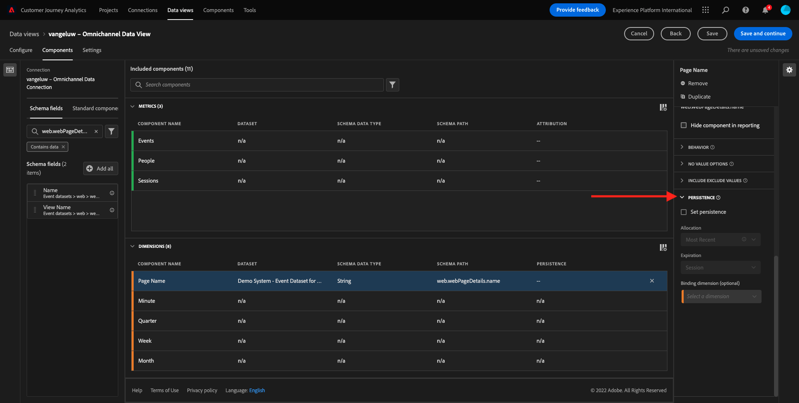
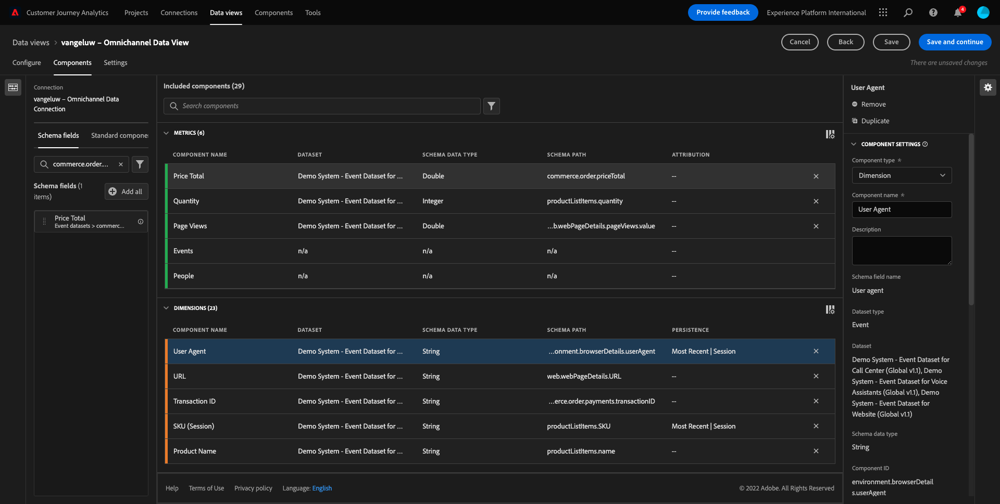

# 4.3 Crie uma Visualização de Dados

## Objectivos

- Entenda a UI de Visualização de Dados
- Compreenda as configuraçoes básicas de definição de visita
- Compreenda a attribução e a Persistência em uma Visualização de

## 4.3.1 Visualização de Dados

アゴラ、com sua conexão の結論，é 占領プログレディルパラ影響者は、ビジュアライゼーションをサンドル。 Uma diferença entre o Adobe Analytics e o CJAé que o CJA precisa de uma visualização de dados para limpar e preparar os dados antes da visualização.

Uma Visualização de Dadosé semelhante ao ae mitconto de Virtual Report Suites no Adobe Analytics, onde vocelece as definitiones de visita com reconchemento de contexto, filteragem e também comoponents tos santes sados sados

Será nesário, no mínimo, uma Visualização de Dados por conexão. No entanto, para alguns casos de uso,éótimo ter múltiplas Visualizaçoes de Dados para a mesma conexão, com o objetivo de fornecer insights diferentes para iples distintas distas. Se você deseja que sua empresa seja orientada por dados, deve adaptar a forma como os dados ssano vistos em cada equipe. アルゴリズムの終了：

- Métricas de UX apenas para a eupide de UX デザイン
- os mesmos nomes para KPIs e metricas para o metricas para oGoogle Analyticse para oCustomer Journey Analytics、para que a epuide de análise digital fale apenas 1 idioma を使用します。
- Visualização de Dados フィルタのパラモストラ、por エグザンプロ、dados para apenas um mercado、ou marca、ou apenas para Dispositivos mvois。

ナテラデ **接続** marque caixa de seleção da conexão que vocabou de criar クリック  **データビューを作成**.

Vocêserá redirectionado para o fluxo de trabalho **データビューを作成** ワークフロー。

## 4.3.2 Definição de Visualização de Dados

アゴラヴォーコードは、定義として設定されます。

A **接続** que vocriou no expercicio anterior já está selecionada スアコネサンセチャマ `yourLastName – Omnichannel Data Connection`.

Em seguida, dêum nome ua Visualização de Dados seguindo este modelo de nomenclatura: `yourLastName – Omnichannel Data View`.

メズモの内側のバラは descrição: `yourLastName – Omnichannel Data View`.

| 名前 | 説明 |
| ----------------- |-------------| 
| `yourLastName – Omnichannel Data View` | `yourLastName – Omnichannel Data View` |

パラ **タイムゾーン**，セレオネオフソホラリオ **ベルリム、エストコルモ、ローマ、ベルナ、ブルクセラス、ヴィエナ、アムステルダン GMT+01:00**. エステ・アム・セナリオ・レアメンテ・インテレスサンテ、ポイス・アルグマ・エンプレサス・オペラム・ディフェレンテス・パイセ・エ・ジオグラフィアス。 Alocar o fuso horario certo para cada país evitara erros típicos de dados, como, por exemgno, acreditar ce a maioria das pessoas compra camisetasàs 4h no Peru.

Voce também pode modificar nomenclatura das métricas principais (Pessoa, Sessão e Evento). イッソナンエオブリガトリオ、マスアルガンクリエンテスゴスタムドゥユサルペソア、ヴィシタスエアセソエムベゾデペソア、セッサオエイベントス (convenção de nomenclatura padro doCustomer Journey Analytics)。

seguintes configuraçoes definidas としてのアゴラ語の vodeve ter:

クリック **保存して続行**.

## 4.3.3 コンポーネント da ビジュアライゼーション dados

Neste expercício, vocêirá configurar os componentsesários para analisar os dados e visualizá-los usando o Analysis Workspace. ネスタ IU, há três areas principais:

- ラド・エスカード：コンポーネント disponíveis dos データセットセレクション
- 明王：Components adicionados a Visualização de Dados
- ラド・ディレイト：コンポーネントの構成

>[!IMPORTANT]
>
>Se vocé não encontruma métrica ou dimensiospecica, verifique se o campo `Contains data` foi removido de sua visualização de dados カソ・コントラリオ、除外エッセ・カンポ。
>
>

アゴラ・ヴォーチェ・プレシャ・アラスター・ソルター・オス・コンポーネント (Agora vocarastar e soltar os components) 必要性パラ・アナリセ・ノス (Anarise nos) **追加されたコンポーネント**. Para isso, você deve selecionar os コンポーネント no menu a esquerda e arrastá-los e soltá-los na tela no meio.

Vamos começar com o primeiro componente: **名前 (web.webPageDetails.name)**. Pesquise esse componente e arraste-o e solte-o na tela.

Esse componenteé o nome da página, como voce derivar da leitura do campo do schema `(web.webPageDetails.name)`.

エンタント、ユサル **名前** como o nome nãoé a melhor convenção de nomenclatura para um usuário corporatevo compreender rapidamente essa dimensiono

バモス・ムダル・オ・ノーム・パラ **ページ名**. クリケノコンポーネント e o renomeie na area **コンポーネント設定**.

Configuraçoes de persistência são として **永続性設定**. Os concietos de eVars e prop não existem no CJA, mas as configuraçoes de Persistência possibilitam um comportamento semelhante.

Se vocênão alterar essas configuraçoes, o CJA irá interpretar a dimensionsão como um **Prop** (nivel de ocorrência)。 Além disso, podemos alterar a Persistência para tornar a dimensionuma **eVar** （パルシャロ・ヴァロ・アオ・ロンゴ・ダ・ヨルナダ）。

Se vocênão estiver familizado com eVars e Props, [leia mais sob isso na documentação](https://experienceleague.adobe.com/docs/analytics/landing/an-key-concepts.html)...

Vamos deixar o Nome da Página como Prop. デッサフォルマ、ヴォークナンプレシサオルタルネヌマ **永続化設定**.

| 検索するコンポーネント名 | 新しい名前 | 永続化設定 |
| ----------------- |-------------| --------------------| 
| 名前 (web.webPageDetails.name) | ページ名 |          |

Em seguida, escolha a dimensiono **phoneNumber** solte-a na tela を使用します。 O novo nome deve ser **電話番号**.

Configuraçoes de persistência, pois o Número de Celular deve persicale no nível do usário のように Por フィム、ヴァモスアルター。

Para alterar a Persistência, role para baixo no menu a direita e abra a aba **永続性**:

caixa de seleção para modificar a configuraçoes de persistência として Marque a caixa de seleção para modificar。 選択 **最新** e o escopo **担当者（レポートウィンドウ）**, pois nos preocupamos apenas com oúltimo número de celular da pessoa. Se o cliente não preencher o celular em visitas futuras, vocainda verá esse valor preenchido.

| 検索するコンポーネント名 | 新しい名前 | 永続化設定 |
| ----------------- |-------------| --------------------| 
| phoneNumber | 電話番号 | 最新、担当者（レポートウィンドウ） |

オプロキシモ成分 `web.webPageDetails.pageViews.value`.

メニューの追加、ペスキー `web.webPageDetails.pageViews.value`. アレステ・ソルテ・エッサ・メトリカ・ナ・テラ。

ノームパラの変更 **ページビュー数** の下に **コンポーネント設定**.

| 検索するコンポーネント名 | 新しい名前 | 属性設定 |
| ----------------- |-------------| --------------------| 
| web.webPageDetails.pageViews.value | ページビュー数 |         |

Para as configuraçoes de attribução, deixaremos em branco.

Observação:設定のとおり、 de persistência nas métricas também podem ser alteradas no Analysis Workspace. エムアルグンカソス、ボークポデオプタルポーココンフィギュラララスアクイパラエヴィタルクオススウサリオスデネゴシオステナムペンサルクアルエオメルホルモデロデペルシステンシア。

エムセギダ、ヴォクテラ・ク・コフィュラヴァリアスディメンソエメトリカス、コンフォーメ・インディカドナ・タベラ・アバイクソ。

### 寸法

| 検索するコンポーネント名 | 新しい名前 | 永続化設定 |
| ----------------- |-------------| --------------------| 
| brandName | ブランド名 | 最新、セッション |
| 冷感 | 通話感 |          |
| 呼び出し ID | 呼び出しインタラクションタイプ |          |
| callTopic | トピックを呼び出し | 最新、セッション |
| ecid | ECID | 最新、担当者（レポートウィンドウ） |
| メール | 電子メール ID | 最新、担当者（レポートウィンドウ） |
| 支払タイプ | 支払タイプ |          |
| 製品追加メソッド | 製品追加メソッド | 最新、セッション |
| イベントタイプ | イベントタイプ |         |
| 名前 (productListItems.name) | 製品名 |         |
| SKU | SKU（セッション） | 最新、セッション |
| トランザクション ID | トランザクション ID |         |
| URL (web.webPageDetails.URL) | URL |         |
| ユーザーエージェント | ユーザーエージェント | 最新、セッション |

### メトリカ

| 検索するコンポーネント名 | 新しい名前 | 属性設定 |
| ----------------- |-------------| --------------------| 
| 数量 | 数量 |          |
| commerce.order.priceTotal | 売上高 |         |

Sua configuração deve ser semelhante ao seguinte:

サンセエスケサデサルバルスアビジュアライゼーショデダドス エントンクリケ **保存**.

## 4.3.4 メトリカスカルカダ

Embora tenhamos organizado todos componentes na Visualização de dados, vocainda deve adaptar alguns deles para que os usários de negcios estejam prontos para iniciar suas análises.

Se vocêse lembra, não troxemo 特別な Métricas como Adicionar ao Carrinho, Visualização do produto ou Compras para a Visualização de dados. エンタント、テモスマディメンションシャマダ： **イベントタイプ**. Então, vamos 誘導体は tipos de interação criando 3 métricas calculadas 。

Vamos começar com a primeira Métrica: **製品表示**.

ラド・エスカード、ペスキースはいりません **イベントタイプ** ディメンションを選択します。 Em seguida, arraste-o e solte-o na tela **含まれるコンポーネント**.

ノバメトリカのクリック・パラ・セレシオナー **イベントタイプ**.

Agora altere o nome e は、descrição do componente para os seguintes valores:

| コンポーネント名 | コンポーネント説明 |
| ----------------- |-------------| 
| 製品表示 | 製品表示 |

アゴラヴァモスコンタルアペナスイベントデ **製品表示**. Para fazer isso、役割パラバイクソエム **コンポーネント設定** アテヴァヴァロレス・デ **除外する値を含める**. Certifique-se de habiliar a opção **値を含める/除外する**.

コモケリモスコンタルアペナス **製品表示**、特に **commerce.productViews** クリテリオス諸島

アゴラアスアメトリカカルカダエスタ・エストナ・プロンタ！

Em seguida, repita o mesmo processo para os eventos **買い物かごに追加** e **購入**.

### 買い物かごに追加

Primeiro, arraste e solte a mesma dimensionsão **イベントタイプ**.

Vocêverá um alerta pop-up de um Campo Duplicado, pois estamos usando a mesma varivel. クリック **強制的に追加**:

Agora, siga o mesmo processo que fizemos para a métrica Visualizaçoes de produto:
- Primeiro altere o nome e descrição.
- ポール・フィム、アディシオネ **commerce.productListAdds** como critério para contar apenas Add To Cart

| 名前 | 説明 | 条件 |
| ----------------- |-------------| -------------|
| 買い物かごに追加 | 買い物かごに追加 | commerce.productListAdds |

### 購入

Primeiro, arraste e solte a mesma dimensionsão **イベントタイプ** duas métricas anteriores としての como fizemos para 。

Vocêverá um alerta pop-up de um Campo Duplicado, pois estamos usando a mesma varivel. クリック **強制的に追加**:

Agora, siga o mesmo processo que fizemos para as metricas 製品表示 e 買い物かごに追加：
- Primeiro altere o nome e descrição.
- ポール・フィム、アディシオネ **commerce.purchases** コンプラスとしての critérios para contabilizar apenas

| 名前 | 説明 | 条件 |
| ----------------- |-------------| -------------|
| 購入 | 購入 | commerce.purchases |

Sua configuração final deve semelhante ao seguinte. クリック **保存して続行**.

## 4.3.5 コンポーネント da Configuração de Dados

Vocedeve ser redirectionado para esta tela:

Nesta aba, vocêpode modificar algumas configuraçoes importantes para alterar a forma como os dados sano processados. Vamos começar defindo o **セッションタイムアウト** 30 分 Graças ao registro de data e hora de cada evento de experiência, voce pode estender o canto de uma sessão em todos canais. エグザンプロ、o que acontese um cliente ligar para o call center depois de visitar o site? Usando Tempos Limite de Sessão personalizados, vocêtem muita flexidade para decidir o que uma sessão e como essa essão irá mesclar os dados.

Nesta aba voceêpode modificar autoas coisas como filtor os dados usando um segmento/filto. Voê não precisara fazer isso neste expercício.

Quando の用語、クリック・エム **保存して終了**.

>[!NOTE]
>
>Voce pode voltar a esta Visualização de dados postermente e アルターを configuraçoes e os コンポーネントとしてクォルマーモメントに設定します。 もう一つは afetarão a forma como os dados históricos são mostrados です。

アゴラヴォーポード継続 com a parte de visualização e análise!

プロクシマエタパ： [4.4 Prepação de dados emCustomer Journey Analytics](./ex4.md)

[レトルナルパラフルクソデウサリオ 4](./uc4.md)

[レトルナーパラトドスオスモドゥロス](./../../overview.md)
