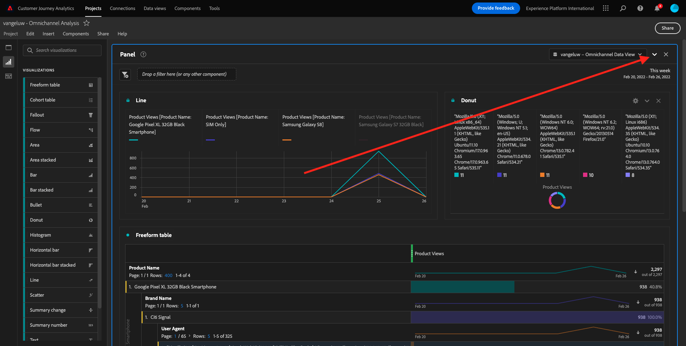
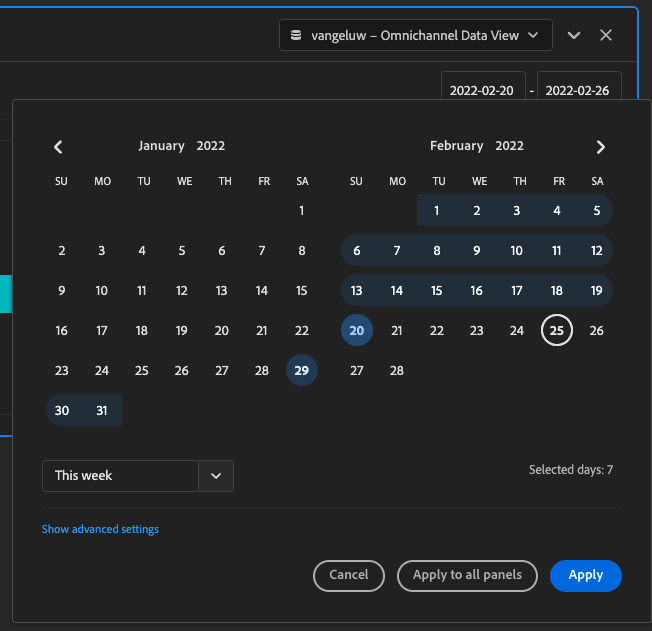

# 4.5Customer Journey Analytics

## Objectivos

- UI を拡張してAnalysis Workspace
- Conheça alguns recursos que tornam o Analysis Workspace tão diferente.
- Analysis Workspaceのアナリサルの CJA ユサンド

## Contexto

Neste expercício, vocêusará o Analysis Workspace no CJA para analizar visualizaçoes de productos, funis de productos, rotatividade など

Vamos usar o projeto que vocriou em  [4.4 Prepação de dados no Analysis Workspace](./ex4.md)，エンタンアセス [https://analytics.adobe.com](https://analytics.adobe.com).

アブラ・セウ・プロジェト `yourLastName - Omnichannel Analysis`.

Com seu projeto aberto e Visualização de dados `yourLastName - Omnichannel Analysis` selecionado, vocêestá pronto para comçar a construir suas primeirs visualizaçoes

## Quantas の視覚化 de productos temos diariamente?

datas certas para analisar os dados としての Em primeiro lugar, precisamos selecionar。 Acesse o menu suspenso do calendarrio no lado direito da tela. Clique nele selecione o intervalo de datas applicável.

>[!IMPORTANT]
>
>Selecione um intervalo de datas como **今週** ou **今月**. Os dados disponíveis mais recentes for am absovidos em 19 de setembro de 2022.

メトリカスカルカダとしてエンコントロールする、ラドエスカルド（アレアデコンポーネント）のメニューなし **製品表示**. セレシオネアス e アレスト e solte solte na tela, no canto superior direito da tabela de forma livre.

ディメンションを自動的に変更 **日** セラ・アディシオナダ・パラ・クリア・スア・プリメイラ・タベラ アゴラヴォークドバースアペルガンタレスポンディダイメディアタンテ。

エムセギダ、クリック com o botão direito do mouse no resumo da métrica.

クリック **視覚化** e セレクション **線** como visualizationção.

Vocêverá as suas visualizaçoes de producto por dia.

ヴォーチュポーデアルターオエスコポデテンポパラオディアクリカンドエム **設定** na visualização.

クリケノポントアオラドデ **線** e **データソースを管理**.

Em seguida、clique em **選択をロック** e セレクション **選択した項目** para bloquear esta visualização para que ela sempre exiba uma linha do tempo de Visualizaçoes de produtos

## 5 個の製品メイス訪問者

クアサオ 5 製品マイス・ビストス？

Lembre-se de salvar o projoto de tempos em tempos.

| OS | ショートカット |
| ----------------- |-------------| 
| Windows | Ctrl + S |
| Mac | Command + S |

Vamos começar a contrar os 5 produtos mais vistos. No menu do lado esquerdo, encontre o Nome do produto - Dimensiono.

アゴラアレステエソルテ **製品名** パラは次元を置き換える **日**:

エステセラオレスルタド。

Em seguida、tente dividir um dos produtos por Nome da marca. ペスク **brandName** アラースト・パラ・バイクソ・ド・プリメイロ・ノーム・ド・プロドト

エム・セギダ、ファサ・ム・デタラメント・ウサンド・オ・アンテ・デ・ウサリオ。 ペスク **ユーザーエージェント** arraste-o para baixo do nome da marca

Em seguida, será exibida a tela abaixo:

Por fim, voce pode adicionar mais visualizaçoes. lado esquerdo, em visualizaçoes, pesquise がありません `Donut`. ペグ `Donut`, arratese e solte na tela sob a visualização **線** 

次に、表で最初の 5 つを選択します。 **ユーザーエージェント**  行を **Google Pixel XL 32GB ブラックスマートフォン** > **シティ信号**. 5 行を選択する際、 **CTRL** ボタン（Windows の場合）または **コマンド** ボタン (Mac)

Em seguida, na Tabela, selecione as primeiras 5 linhad de **ユーザーエージェント** デタラメントク・フィゼモス・エム **Google Pixel XL 32GB ブラックスマートフォン** > **シティ信号**. Ao セレオナーを 5 リニャス、segure o botão **CTRL** （Windows なし） o botão **コマンド** (Macなし )。

Vocêverá o gráfico de donut alterado:

Vocêpode até adaptar o design para ser mais legível, tornando o gráfico de **線** オグラフィコデ **ドーナツ** um poco menor para que sejam exibidos lado a lado

クリケノポントアオラドデ *ドーナツ** para **データソースを管理**. Em seguida、clique em **選択をロック** para bloquear essa visualização para que sempre exiba uma linha do tempo de Visualizaçoes de produto

Saiba mais sobre visualizaçoes usando o Analysis Workspace em:

- [https://experienceleague.adobe.com/docs/analytics/analyze/analysis-workspace/visualizations/freeform-analysis-visualizations.html?lang=ja](https://experienceleague.adobe.com/docs/analytics/analyze/analysis-workspace/visualizations/freeform-analysis-visualizations.html?lang=ja)
- [https://experienceleague.adobe.com/docs/analytics/analyze/analysis-workspace/visualizations/t-sync-visualization.html](https://experienceleague.adobe.com/docs/analytics/analyze/analysis-workspace/visualizations/t-sync-visualization.html)

## Funil de interação do produto, da visualizaçãoà compra

Existem muitas formas de resolver esta questão. Uma delasé usar o Tipo de Interação de Produto e usá-lo em uma tabela de formato livre. Outra formaé usar uma **フォールアウトビジュアライゼーション**. Vamos usar oúltimo, pois queremos 視覚化 e analisar ao mesmo テンポ。

Feche o painel の実際のクリカンド・アクイ：

アゴラ・アディシオネ・ム・ノボ・ペイン・ブランコ・クリカンド・エム **+空のパネルを追加**.

Clique na visualização de **フォールアウト**.

Selecione o mesmo intervalo de datas do exercício anteror.

Em seguida, vocêverá:

ディメンションのエンコントロール **イベントタイプ** nos コンポーネントは、lado esquerdo ではありません。

ディメンションの Clique na seta para a brigur a dimension:

Voêverá todos os Tipos de eventos disponíveis.

項目を 1 つ選択 **commerce.productViews** e arraste e solte o no campo **タッチポイントを追加** デントロダ **フォールアウトビジュアライゼーション**.

Faça o mesmo com **commerce.productListAdds** および **commerce.purchases** e solte-os no campo **タッチポイントを追加** デントロダ  **フォールアウトビジュアライゼーション**. Sua visualização agora deve ser semelhante ao seguinte:

ボーチュポードファザームイタスコイサアクイ。 アルゴリズムの終了：比較 ao longo do tempo, comparar cada passo por dispositivo ou comparar por fidelidade No entanto, se quisermos analisar coisas interressantes como porque os clientes não compram depois de adicionar um item ao carrinho, podemos usar a melhor ferramenta do CJA:com o botão direito をクリックします。

Clique com o botão direito do mouse no touchpoint **commerce.productListAdds**. Em seguida、clique em **このタッチポイントでのフォールアウトを分類**.

ウマノヴァ・タベラ・デ・フォルマト・リヴル・セラ・クリアダ・パラ・アナリサル・クエ・ア・ペソアス・フィゼラム・セ・ナン・コンプララム。

代替 **イベントタイプ** 作成者 **ページ名**, na nova tabela de formato livre, para ver em quainas eles estão indo, em vez da Página de confirmação de compra

## ペソア・ファゼムのサイト・アンテス・デ・アセサール・パギナ・キャンセル・サービスコ？

ノバメンテ， há muitas formas de realizar essa análise. Vamos usar a análise de fluxo para iniciar parte da descoberta.

Feche o painel の実際のクリカンド・アクイ：

アゴラ・アディシオネ・ム・ノボ・ペイン・ブランコ・クリカンド・エム **+空のパネルを追加**.

Clique na visualização **フロー**.

Em seguida, será exibido:

Selecione o mesmo intervalo de datas do exercício anteror.

ディメンションのエンコントロール **ページ名** nos コンポーネントは、lado esquerdo ではありません。

ディメンションの Clique na seta para a brigur a dimension:

パギナス・ヴィスタとしてのヴォーチェ・エンコントララ・トダス。 ノーム・ダ・パギナのエンコントレ： **サービスをキャンセル**.
ソルトを整列 **サービスをキャンセル** na Visualização de fluxo no campo do meio:

Em seguida, será exibido:

Vamos agaora analisar se os clientes que visitaram a página C **サービスをキャンセル** サイト também ligaram para o コールセンター e qual foi o resultado はありません。

Nas ディメンション、レトルン e エンコントロールティポデインタラサオデシャマダ。 ソルトを整列 **呼び出しインタラクションタイプ** primeira interaçãoà direita em に代わる para 置き換え **フロービジュアライゼーション**.

アゴラヴォーカルの視覚化チケット・デ・サポルテ・ドス・クリエンテ・リガラム・パラ中央デ・アテンディメントにパギナのデポワ・デ・ヴィジタルをデポワに **サービスをキャンセル**.

Em seguida, nas dimensions, procure **通話感**. Arraste e solte para は primeira interação a direita na visualização de fluxo に置き換わります。

Em seguida, será exibido:

コモポード ver, execuamos uma análise omnichannel usando ビジュアライゼーション ação de fluxo. Graças a isso, descobrimos que alguns clientes que estavam pensando em cancelar o serviço tiveram avaliação positiva depois de ligar para o call center. タルヴェス・テナモスムダド・デ・イデイア comuma promoção?

## Qualé o desempenho dos clientes com um contato de Call center Positivo em relação aos principais KPIs?

Primeiramente, vamos segmentar os dados para obter apenas usários com chamadas **陽性**. CJA、os Segmentos サンシャマドス・デ・フィルトロス。 Acesse para filtros na area de componentes (no lado esquerdo) e clique **+**.

デントロドコンストラクターデフィルター、dêum nome ao フィルター

| 名前 | 説明 |
| ----------------- |-------------| 
| 通話感 — ポジティブ | 通話感 — ポジティブ |

NOS コンポーネント (dentro do Construtor de filtor), encontre **通話感** e arraste e solte na definição do construtor de filter.

アゴラセレオネ **陽性** コモバローパラフィルター

Altere o escopo para o nível **人物**.

Para 最終処理、Basta Clicar Em **保存**.

エンタオ、ヴォーチラ・レトルナ・パラ・エスタ・テラ。 Se ainda não retornou, feche o painel antero.

アゴラ・アディシオネ・ム・ノボ・ペイン・ブランコ・クリカンド・エム **+空のパネルを追加**.

Selecione o mesmo intervalo de datas do exercício anteror.

クリック **フリーフォームテーブル**.

アゴラアレスト e solte o filtoro que vacabou de criar。

オラ・デ・アディシオナール・アルグマ・メトリカス。 Comece com **製品表示**. Arraste e solte na tabela de forma liver. ボーチャンベムポーデはメトリカを除く **イベント**.

Faça o mesmo com **人**, **買い物かごに追加** e **購入**. ヴァイアカバーコムウマタベラコモセギンテ。

Graças a primeira análise de fluxo, uma nova pergunta surgiu. Então decidimos criar esta tabela e verificar alguns KPIs em segmento para responder a essa pergunta. Como voce ver, o tempo de insighté muis rápido do que usar SQL ou usar ousars soluçoes de BI.

## Recapitulação do Analysis Workspace e doCustomer Journey Analytics

O Analysis Workspaceは、Analytics を使用してトダを削除します。 Ele forene uma tela lobsta e flexível para criar projectos de analytics personalizados. Arraste e solte qualte qualquer número de tabelas de dados, visualizaçoes e componentes (dimensions, métricas, segmentos e granuridades de tempo) para um projeto. Vocepode criar de forma instantânea filtros e analises, gráficos de coorte, alertas, segmentos, análises de fluxo e relatórios de curadoria e agendamento para compartilhar com quer peso aem seu negio

プロクシマエタパ： [4.6 De insights a ação](./ex6.md)

[レトルナルパラフルクソデウサリオ 4](./uc4.md)

[レトルナーパラトドスオスモドゥロス](./../../overview.md)
