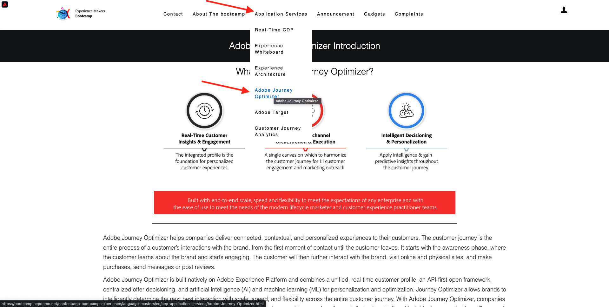

# 1.1 ウェブサイト上の未知から既知まで

## コンテキスト

未知のものから既知のものへのジャーニーは、獲得から定着までのカスタマージャーニーと同様に、最近のブランドの間で最も重要なトピックの 1 つです。

Adobe Experience Platformはこの道のりで大きな役割を果たします。 プラットフォームはコミュニケーションの頭脳である **記録のエクスペリエンスシステム**.

Platform は、既知の顧客だけでなく、顧客という言葉が広い環境です。 Web サイト上の未知訪問者も、Platform の観点からは顧客なので、未知訪問者としての行動もすべて Platform に送信されます。 このアプローチのおかげで、この訪問者が最終的に既知の顧客になると、ブランドはその瞬間の前に何が起こったかを視覚化できます。 これは、アトリビューションとエクスペリエンスの最適化の観点から役立ちます。

## カスタマージャーニーフロー

に移動 [https://bootcamp.aepdemo.net](https://publish9122.adobedemo.com/content/aep-bootcamp-experience/language-masters/en.html). クリック **すべて許可**.

画面の左上隅にあるAdobeロゴアイコンをクリックして、プロファイルビューアを開きます。

を使用して、プロファイルビューアパネルとリアルタイム顧客プロファイルを確認します **EXPERIENCE CLOUDID** この現在不明な顧客のプライマリ識別子として。

また、顧客の行動に基づいて収集されたすべてのエクスペリエンスイベントを表示することもできます。 リストは現在空ですが、すぐに変更されます。

に移動します **アプリケーションサービス** メニューオプションを選択し、製品をクリックします。 **Real-Time CDP**.

製品の詳細ページが表示されます。 タイプのエクスペリエンスイベント **製品表示** は、モジュール 1 で確認した Web SDK 実装を使用してAdobe Experience Platformに送信されました。 プロファイルビューアパネルを開き、 **エクスペリエンスイベント**.

に移動します **アプリケーションサービス** メニューオプションを選択し、製品をクリックします。 **Adobe Journey Optimizer**. 別のエクスペリエンスイベントがAdobe Experience Platformに送信された。

プロファイルビューアパネルを開きます。 タイプの 2 つのエクスペリエンスイベントが表示されます **製品表示**. 動作が匿名の間、すべてのクリックが追跡され、Adobe Experience Platformに保存されます。 匿名の顧客が認識されると、すべての匿名の行動を既知のプロファイルに自動的に結合できます。

次に、顧客プロファイルを分析し、行動を使用して web サイトでの顧客体験をパーソナライズします。

次の手順： [1.2 独自のリアルタイム顧客プロファイルの視覚化 – UI](./ex2.md)

[ユーザーフロー 1 に戻る](./uc1.md)

[すべてのモジュールに戻る](../../overview.md)
