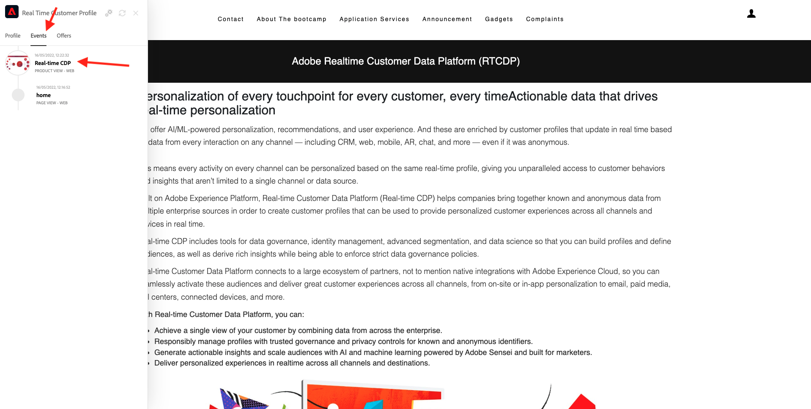

# 1.1 不明から Web サイト上で既知まで

## コンテキスト

未知から既知へのジャーニーは、最近のブランドの中で最も重要なトピックの 1 つで、獲得から定着までのカスタマージャーニーです。

Adobe Experience Platformはこの旅で大きな役割を果たしています。 プラットフォームはコミュニケーションの脳です。 **経験記録システム**.

プラットフォームとは、「顧客」という単語が、既知の顧客だけではなく、幅広い環境を指します。 Web サイト上の不明な訪問者は、Platform の観点からの顧客でもあるので、不明な訪問者としての行動もすべて Platform に送信されます。 このアプローチにより、訪問者が最終的に既知の顧客になったとき、ブランドはその時点以前の出来事も視覚化できます。 これは、アトリビューションとエクスペリエンスの最適化の観点から役立ちます。

## カスタマージャーニーフロー

に移動します。 [https://bootcamp.aepdemo.net](https://bootcamp.aepdemo.net). クリック **すべて許可**.

画面の左上隅にあるAdobeロゴアイコンをクリックして、プロファイルビューアを開きます。

プロファイルビューアパネルと、リアルタイム顧客プロファイルを **Experience CloudID** を現在不明なこの顧客の主な識別子として使用する。

また、顧客の行動に基づいて収集されたすべてのエクスペリエンスイベントを表示することもできます。 リストは現在空ですが、まもなく変更されます。

次に移動： **アプリケーションサービス** メニューオプションを選択し、製品をクリックします。 **Real-Time CDP**.

製品の詳細ページが表示されます。 タイプのエクスペリエンスイベント **製品表示** は、モジュール 1 で確認した Web SDK 実装を使用して、Adobe Experience Platformに送信されるようになりました。 プロファイルビューアパネルを開き、 **エクスペリエンスイベント**.

次に移動： **アプリケーションサービス** メニューオプションを選択し、製品をクリックします。 **Adobe Journey Optimizer**. 別のエクスペリエンスイベントがAdobe Experience Platformに送信されました。

プロファイルビューアパネルを開きます。 これで、次のタイプの 2 つのエクスペリエンスイベントが表示されます **製品表示**. この動作は匿名ですが、クリックのたびに追跡され、Adobe Experience Platformに保存されます。 匿名顧客が認識されたら、すべての匿名行動を知名プロファイルに自動的に結合できます。

次に、顧客プロファイルを分析し、行動を使用して Web サイトでの顧客体験をパーソナライズします。

次のステップ： [1.2 自身のリアルタイム顧客プロファイルの視覚化 — UI](./ex2.md)

[ユーザーフローに戻る 1](./uc1.md)

[すべてのモジュールに戻る](../../overview.md)
