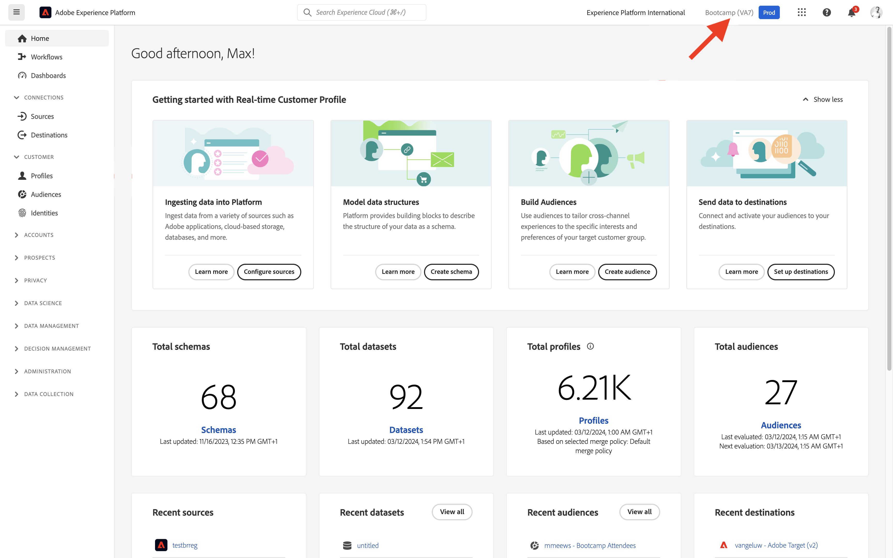

# 1.3 オーディエンスの作成 – UI

この演習では、Adobe Experience Platform Audience Builder を使用してオーディエンスを作成します。

## ストーリー

[Adobe Experience Platform](https://experience.adobe.com/platform) に移動します。 ログインすると、Adobe Experience Platformのホームページが表示されます。

続行する前に、**サンドボックス** を選択する必要があります。 選択するサンドボックスの名前は ``Bootcamp`` です。 これを行うには、画面上部の青い線のテキスト **[!UICONTROL 実稼動製品]** をクリックします。 適切な [!UICONTROL &#x200B; サンドボックス &#x200B;] を選択すると、画面が変更され、専用の [!UICONTROL &#x200B; サンドボックス &#x200B;] が表示されます。

左側のメニューの **オーディエンス** に移動します。 このページには、**オーディエンス** のパフォーマンスに関する重要な情報を含むダッシュボードが表示されます。

**参照** をクリックして、既存のすべてのオーディエンスの概要を確認します。 「**+ オーディエンスを作成**」ボタンをクリックして、新しいオーディエンスの作成を開始します。

「オーディエンスを作成」するか、「ルールを作成」するかを尋ねるポップ **ップ IP** 表示さ **ま**。 「**ルールを作成」** 選択して続行し、「**作成**」をクリックします。

![セグメント化][def]

オーディエンスビルダーに移動すると、すぐに **属性** メニューオプションと **XDM 個人プロファイル** 参照が表示されます。

XDM はエクスペリエンスビジネスを強化する言語なので、XDM はオーディエンスビルダーの基盤にもなります。 Platform で取り込まれるすべてのデータは XDM にマッピングする必要があり、そのため、すべてのデータは、そのデータの出所に関係なく、同じデータモデルの一部になります。 これにより、オーディエンスを構築する際に大きなメリットが得られます。この 1 つの Audience Builder UI からは、同じワークフローで任意のオリジンのデータを組み合わせることができます。 Audience Builder 内で作成されたオーディエンスは、Adobe Target、Adobe Campaign、その他のアクティベーションチャネルなどのソリューションに送信できます。

次に、商品 **Real-Time CDP** を閲覧したすべての顧客のオーディエンスを作成する必要があります。

このオーディエンスを構築するには、エクスペリエンスイベントを追加する必要があります。 すべてのエクスペリエンスイベントを表示するには、**フィールド** メニューバーの **イベント** アイコンをクリックします。

次に、最上位の **XDM ExperienceEvents** ノードを確認します。 **XDM ExperienceEvent** をクリックします。

**製品リスト項目** に移動します。

**名前** を選択し、左側のメニューから **名前** オブジェクトをオーディエンスビルダーキャンバスの「**イベント**」セクションにドラッグ&amp;ドロップします。 次の画面が表示されます。

比較パラメーターは **次に等しい** 必要があり、入力フィールドに **Real-time CDP** と入力します。

オーディエンスビルダーに要素を追加するたびに、「**推定を更新**」ボタンをクリックして、オーディエンスの母集団の新しい推定を取得できます。

**評価方法** として、「**Edge**」を選択します。

最後に、オーディエンスに名前を付けて保存します。

命名規則として、次を使用します。

- `yourLastName - Interest in Real-Time CDP`

次に、「**保存して閉じる** ボタンをクリックして、オーディエンスを保存します。

次にオーディエンスの概要ページに戻り、オーディエンスに該当する顧客プロファイルのサンプルプレビューが表示されます。

次の演習に進み、オーディエンスをAdobe Targetで使用できるようになりました。

次の手順：[1.4 行動を起こす：オーディエンスをAdobe Targetに送信します &#x200B;](./ex4.md)

[ユーザーフロー 1 に戻る](./uc1.md)

[すべてのモジュールに戻る](../../overview.md)

[def]: ./images/segmentationpopup.png
