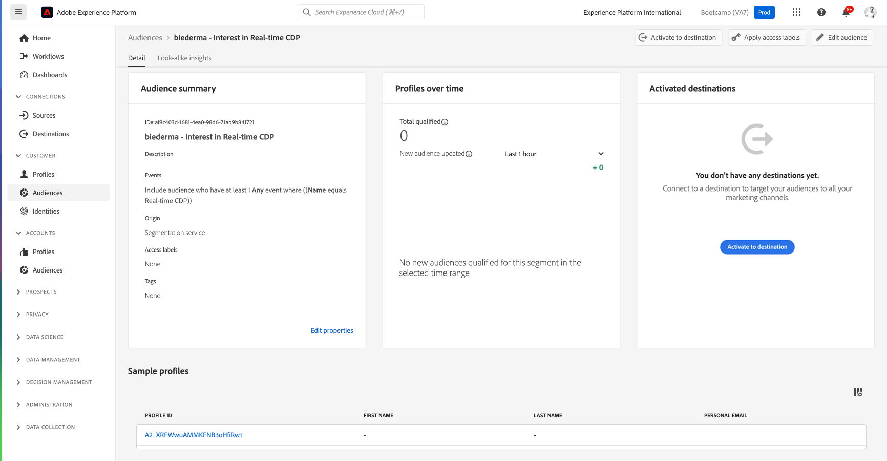

# 1.3 セグメントの作成 – UI

この演習では、Adobe Experience Platformのセグメントビルダーを使用してセグメントを作成します。

## ストーリー

に移動 [Adobe Experience Platform](https://experience.adobe.com/platform). ログインすると、Adobe Experience Platformのホームページが表示されます。

続行する前に、を選択する必要があります **sandbox**. 選択するサンドボックスの名前はです ``Bootcamp``. それには、テキストをクリックします **[!UICONTROL 実稼動製品]** 画面上部の青い線 適切なを選択した後 [!UICONTROL sandbox]画面が変わり、専用の画面が表示されます [!UICONTROL sandbox].

左側のメニューで、に移動します。 **セグメント**. このページでは、既存のすべてのセグメントの概要を確認できます。 「」をクリック **+ セグメントを作成** ボタンをクリックして、新しいセグメントの作成を開始します。

新しいセグメントビルダーに移動すると、すぐに **属性** メニューオプションと **XDM 個人プロファイル** 参照。

XDM はエクスペリエンスビジネスを強化する言語なので、XDM はセグメントビルダーの基盤にもなります。 Platform で取り込まれるすべてのデータは XDM にマッピングする必要があり、そのため、すべてのデータは、そのデータの出所に関係なく、同じデータモデルの一部になります。 これにより、セグメントを作成する際に大きなメリットが得られます。この 1 つのセグメントビルダー UI では、同じワークフローで任意のオリジンのデータを組み合わせることができます。 セグメントビルダー内で作成されたセグメントは、Adobe Target、Adobe Campaign、Adobe Audience Managerなどのソリューションに送信してアクティブ化できます。

次に、製品を表示したすべての顧客のセグメントを作成する必要があります **Real-Time CDP**.

このセグメントを作成するには、エクスペリエンスイベントを追加する必要があります。 「」をクリックすると、すべてのエクスペリエンスイベントを検索できます **イベント** アイコン **フィールド** メニューバー。

次に、最上位レベルを示します。 **XDM ExperienceEvents** ノード。 クリックする **XDM ExperienceEvent**.

に移動 **商品リスト項目**.

を選択 **名前** をドラッグ&amp;ドロップします **名前** オブジェクトを左側のメニューからセグメントビルダーキャンバスに追加します。 **イベント** セクション。 次の画面が表示されます。

比較パラメーターは次のようになります **等しい** 入力フィールドに「」と入力します。 **リアルタイム CDP**.

セグメントビルダーに要素を追加するたびに、 **見積もりを更新** ボタンをクリックして、セグメント内の母集団の新しい推定値を取得します。

As **評価方法**&#x200B;を選択 **Edge**.

最後に、セグメントに名前を付けて保存します。

命名規則として、次を使用します。

- `yourLastName - Interest in Real-Time CDP`

次に、 **保存して閉じる** ボタンをクリックしてセグメントを保存します。

次に、セグメントの概要ページに戻り、セグメントに適格な顧客プロファイルのサンプルプレビューが表示されます。

次の演習に進み、セグメントをAdobe Targetで使用できるようになりました。

次の手順： [1.4 アクションの実行：セグメントをAdobe Targetに送信します](./ex4.md)

[ユーザーフロー 1 に戻る](./uc1.md)

[すべてのモジュールに戻る](../../overview.md)
