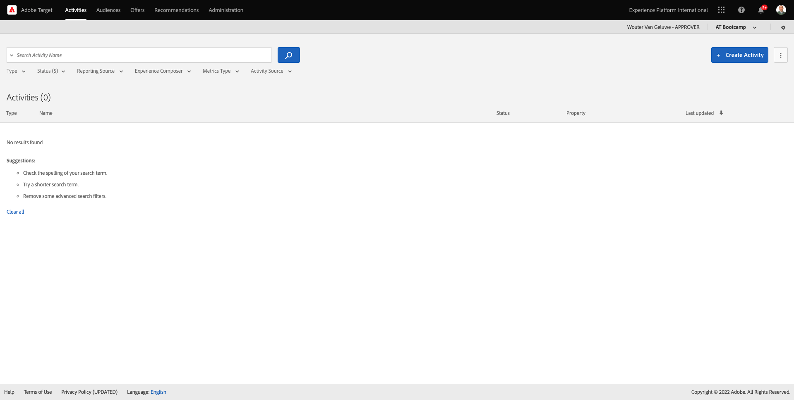
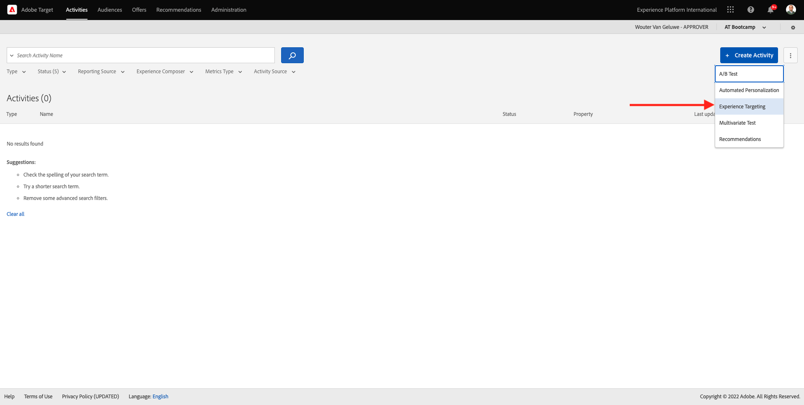

# 1.4 アクションの実行：オーディエンスをAdobe Targetに送信します

[Adobe Experience Platform](https://experience.adobe.com/platform) に移動します。 ログインすると、Adobe Experience Platformのホームページが表示されます。

続行する前に、**サンドボックス** を選択する必要があります。 選択するサンドボックスの名前は ``Bootcamp`` です。 これを行うには、画面上部の青い線のテキスト **[!UICONTROL 実稼動製品]** をクリックします。 適切な [!UICONTROL &#x200B; サンドボックス &#x200B;] を選択すると、画面が変更され、専用の [!UICONTROL &#x200B; サンドボックス &#x200B;] が表示されます。

## 1.4.1 Adobe Targetの宛先に対するオーディエンスのアクティブ化

Adobe Targetは、Real-Time CDPから入手できます。 Adobe Target統合を設定するには、**Destinations**/**Catalog** に移動します。

**カテゴリ** メニューの **Personalization** をクリックします。 **Adobe Target** の宛先カードが表示されます。 **オーディエンスをアクティブ化** をクリックします。

宛先 ``Bootcamp Target`` を選択し、「**次へ**」をクリックします。

使用可能なオーディエンスのリストで、「[1.3 オーディエンスの作成 &#x200B;](./ex3.md)」で作成したオーディエンス（「`yourLastName - Interest in Real-Time CDP`」という名前）を選択します。 次に、「**次へ**」をクリックします。

次のページで、「**次へ**」をクリックします。

「**完了**」をクリックします。

これで、オーディエンスがAdobe Targetに対してアクティブ化されました。

>[!IMPORTANT]
>
>Adobe Targetの宛先をReal-Time CDPで作成した後、宛先が有効になるまで最大 1 時間かかる場合があります。 バックエンド設定が原因で、これは 1 回限りの待機時間です。 最初の 1 時間の待機時間とバックエンド設定が完了すると、Adobe Targetの宛先に送信される新しく追加されたエッジオーディエンスを、リアルタイムでターゲティングできるようになります。

## 1.4.2 Adobe Target フォームベースのアクティビティの設定

Real-Time CDP オーディエンスがAdobe Targetに送信されるように設定されたので、Adobe Targetでエクスペリエンスのターゲット設定アクティビティを設定できます。 この演習では、Visual Experience Composer ベースのアクティビティを設定します。

[https://experiencecloud.adobe.com/](https://experiencecloud.adobe.com/) にアクセスして、Adobe Experience Cloud ホームページに移動します。 **Target** をクリックして開きます。

**Adobe Target** のホームページには、既存のすべてのアクティビティが表示されます。
「**+ アクティビティを作成**」をクリックして、新しいアクティビティを作成します。

**エクスペリエンスのターゲット設定** を選択します。

**ビジュアル** を選択し、**アクティビティ URL** を `https://bootcamp.aepdemo.net/content/aep-bootcamp-experience/language-masters/en/exercises/particpantXX.html` に設定しますが、その前に XX を 01～30 の数字に置き換えてください。

>[!IMPORTANT]
>
>イネーブルメントのすべての参加者は、様々なAdobe Target エクスペリエンスの競合を避けるために、個別の web ページを使用する必要があります。 Web ページを選択して URL を見つけるには、[https://bootcamp.aepdemo.net/content/aep-bootcamp-experience/language-masters/en/exercises.html](https://bootcamp.aepdemo.net/content/aep-bootcamp-experience/language-masters/en/exercises.html) にアクセスしてください。
>
>ページはすべて同じベース URL を共有し、最後に参加者の数が表示されます。
>
>例えば、参加者 1 は URL `https://bootcamp.aepdemo.net/content/aep-bootcamp-experience/language-masters/en/exercises/particpant01.html` を使用し、参加者 30 は URL `https://bootcamp.aepdemo.net/content/aep-bootcamp-experience/language-masters/en/exercises/particpant30.html` を使用する必要があります。

ワークスペース **AT Bootcamp** を選択します。

「**次へ**」をクリックします。

Visual Experience Composer が表示されます。 Web サイトが完全に読み込まれるまでに 20～30 秒かかる場合があります。

デフォルトオーディエンスは、現在 **すべての訪問者** です。 **すべての訪問者** の横にある **3 ドットをクリックし**&#x200B;**オーディエンスを変更** をクリックします。

これで、使用可能なオーディエンスのリストが表示され、以前に作成してAdobe Targetに送信したAdobe Experience Platform オーディエンスが、このリストの一部になりました。 Adobe Experience Platformで以前作成したオーディエンスを選択します。 **オーディエンスを割り当て** をクリックします。

Adobe Experience Platform オーディエンスは、このエクスペリエンスのターゲット設定アクティビティに含まれるようになりました。

ヒーロー画像を変更する前に、Cookie バナーの **すべて許可** をクリックする必要があります。

これを行うには、**参照** に移動します。

次に、「すべて許可 **をクリックし** す。

次に、**作成** に戻ります。

次に、web サイトのホームページでヒーロー画像を変更します。 Web サイトでデフォルトのヒーロー画像をクリックし、「**コンテンツを置換**」をクリックして **画像** を選択します。

画像ファイル **rtcdp.png** を検索します。 選択して「**保存** をクリックします。

選択したオーディエンスに対して、新しい画像付きの新しいエクスペリエンスが表示されます。

左上隅のアクティビティのタイトルをクリックして、名前を変更します。

名前には、次を使用してください。

- `yourLastName - RTCDP - XT (VEC)`

「**次へ**」をクリックします。

「**次へ**」をクリックします。

**目標と設定** - ページで、**目標指標** に移動します。

プライマリ目標を **エンゲージメント** - **オンサイト滞在時間** に設定します。 **保存して閉じる** をクリックします。

**アクティビティの概要** ページが表示されます。 アクティビティをアクティベートする必要があります。

フィールド **非アクティブ** をクリックし、「**アクティブ化**」を選択します。

その後、アクティビティがライブになったことを示す視覚的な確認が表示されます。

これでアクティビティが有効になり、bootcamp web サイトでテストできます。

デモ Web サイトに戻って **Real-Time CDP** の商品ページにアクセスすると、作成したオーディエンスの資格が即座に得られ、Adobe Target アクティビティがホームページにリアルタイムで表示されます。

>[!IMPORTANT]
>
>イネーブルメントのすべての参加者は、様々なAdobe Target エクスペリエンスの競合を避けるために、個別の web ページを使用する必要があります。 Web ページを選択して URL を見つけるには、[https://bootcamp.aepdemo.net/content/aep-bootcamp-experience/language-masters/en/exercises.html](https://bootcamp.aepdemo.net/content/aep-bootcamp-experience/language-masters/en/exercises.html) にアクセスしてください。
>
>ページはすべて同じベース URL を共有し、最後に参加者の数が表示されます。
>
>例えば、参加者 1 は URL `https://bootcamp.aepdemo.net/content/aep-bootcamp-experience/language-masters/en/exercises/particpant01.html` を使用し、参加者 30 は URL `https://bootcamp.aepdemo.net/content/aep-bootcamp-experience/language-masters/en/exercises/particpant30.html` を使用する必要があります。

次の手順：[1.5 対処：オーディエンスをFacebookに送信 &#x200B;](./ex5.md)

[ユーザーフロー 1 に戻る](./uc1.md)

[すべてのモジュールに戻る](../../overview.md)
