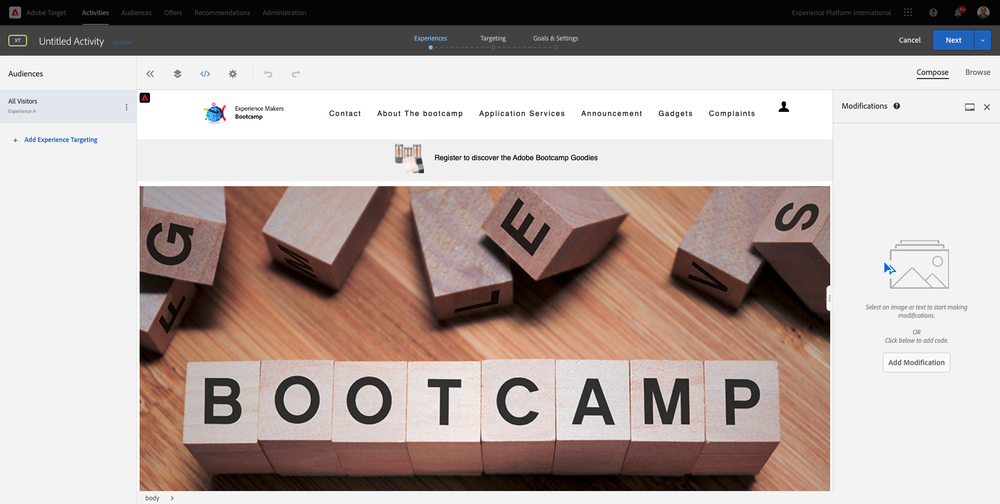

# 1.4 措置をとる：セグメントをAdobe Targetに送信

に移動します。 [Adobe Experience Platform](https://experience.adobe.com/platform). ログイン後、Adobe Experience Platformのホームページに移動します。

続行する前に、 **サンドボックス**. 選択するサンドボックスの名前はです ``Bootcamp``. これを行うには、 **[!UICONTROL 実稼動版]** 画面の上の青い線で表示されます。 適切な [!UICONTROL サンドボックス]画面が変更され、専用の [!UICONTROL サンドボックス].

## 1.4.1 Adobe Targetの宛先へのセグメントのアクティブ化

Adobe Targetは、Real-Time CDPからの宛先として利用できます。 Adobe Target統合を設定するには、に移動します。 **宛先**、 **カタログ**.

クリック **パーソナライズ** 内 **カテゴリ** メニュー 次に、 **Adobe Target** 宛先カード。 クリック **セグメントのアクティブ化**.

宛先を選択 ``Bootcamp Target`` をクリックし、 **次へ**.

使用可能なセグメントのリストで、 [1.3 セグメントの作成](./ex3.md)（という名前） `yourLastName - Interest in Real-Time CDP`. 次に、「**次へ**」をクリックします。

次のページで、 **次へ**.

「**完了**」をクリックします。

これで、セグメントがAdobe Targetに対してアクティブ化されました。

>[!IMPORTANT]
>
>Real-Time CDPでAdobe Targetの宛先を作成したばかりの場合、宛先が有効になるまで最大 1 時間かかる場合があります。 これは、バックエンド設定の設定による 1 回限りの待機時間です。 最初の 1 時間の待機時間とバックエンドの設定が完了すると、Adobe Targetの宛先に送信される新しく追加されたエッジセグメントを、リアルタイムでのターゲティングに使用できるようになります。

## 1.4.2 Adobe Targetのフォームベースのアクティビティの設定

Real-Time CDPセグメントをAdobe Targetに送信するように設定したら、Adobe Targetでエクスペリエンスのターゲット設定アクティビティを設定できます。 この演習では、Visual Experience Composer ベースのアクティビティを設定します。

Adobe Experience Cloudのホームページで、 [https://experiencecloud.adobe.com/](https://experiencecloud.adobe.com/). クリック **ターゲット** をクリックして開きます。

の **Adobe Target** ホームページには、既存のすべてのアクティビティが表示されます。
クリック **+アクティビティを作成** をクリックして、新しいアクティビティを作成します。

選択 **エクスペリエンスのターゲット設定**.

選択 **ビジュアル** そして、 **アクティビティ URL** から `https://bootcamp.aepdemo.net/content/aep-bootcamp-experience/language-masters/en/exercises/particpantXX.html`ただし、その前に、XX を 01 ～ 30 の数値に置き換えます。

>[!IMPORTANT]
>
>様々なAdobe Targetエクスペリエンスの衝突を避けるために、イネーブルメントの各参加者は個別の Web ページを使用する必要があります。 Web ページを選択し、次の場所から URL を検索できます。 [https://bootcamp.aepdemo.net/content/aep-bootcamp-experience/language-masters/en/exercises.html](https://bootcamp.aepdemo.net/content/aep-bootcamp-experience/language-masters/en/exercises.html).
>
>すべてのページが同じベース URL を共有し、参加者の数で終わります。
>
>例えば、参加者 1 は URL を使用する必要があります `https://bootcamp.aepdemo.net/content/aep-bootcamp-experience/language-masters/en/exercises/particpant01.html`, participant 30 は URL を使用する必要があります `https://bootcamp.aepdemo.net/content/aep-bootcamp-experience/language-masters/en/exercises/particpant30.html`.

ワークスペースを選択 **AT Bootcamp**.

「**次へ**」をクリックします。

これで、Visual Experience Composer に移動しました。 Web サイトが完全に読み込まれるまでに 20 ～ 30 秒かかる場合があります。

デフォルトのオーディエンスは現在 **すべての訪問者**. をクリックします。 **3 ドット** 次の **すべての訪問者** をクリックし、 **オーディエンスを変更**.

これで、使用可能なオーディエンスのリストが表示され、以前に作成してAdobe Targetに送信したAdobe Experience Platformセグメントがこのリストに含まれます。 以前にAdobe Experience Platformで作成したセグメントを選択します。 クリック **オーディエンスの割り当て**.

Adobe Experience Platformセグメントは、このエクスペリエンスのターゲット設定アクティビティの一部になりました。

ヒーロー画像を変更する前に、 **すべて許可** をオンにします。

これをおこなうには、に移動します。 **参照**

次に、「 **すべて許可**.

次へ、 **作成**.

次に、Web サイトのホームページでヒーロー画像を変更します。 Web サイトのデフォルトのヒーロー画像をクリックし、 **コンテンツを置換** 次に、 **画像**.

画像ファイルを検索します。 **rtcdp.png**. 選択して、 **保存**.

選択したオーディエンスの新しい画像で新しいエクスペリエンスが表示されます。

左上隅のアクティビティのタイトルをクリックして、名前を変更します。

名前には、次を使用してください。

- `yourLastName - RTCDP - XT (VEC)`

「**次へ**」をクリックします。

「**次へ**」をクリックします。

の **目標と設定**  — ページ、移動 **目標指標**.

プライマリ目標を **エンゲージメント** - **サイト滞在時間**. 「**保存して閉じる**」をクリックします。

これで、 **アクティビティの概要** ページ。 アクティビティをアクティブ化する必要があります。

フィールドをクリックします。 **非アクティブ** を選択し、 **有効化**.

その後、アクティビティがライブになったことを視覚的に確認します。

これでアクティビティが実行され、bootcamp の Web サイトでテストできます。

次に、デモ Web サイトに戻り、 **Real-Time CDP**&#x200B;作成したセグメントに即座に適合し、Adobe Targetアクティビティがホームページにリアルタイムで表示されます。

>[!IMPORTANT]
>
>様々なAdobe Targetエクスペリエンスの衝突を避けるために、イネーブルメントの各参加者は個別の Web ページを使用する必要があります。 Web ページを選択し、次の場所から URL を検索できます。 [https://bootcamp.aepdemo.net/content/aep-bootcamp-experience/language-masters/en/exercises.html](https://bootcamp.aepdemo.net/content/aep-bootcamp-experience/language-masters/en/exercises.html).
>
>すべてのページが同じベース URL を共有し、参加者の数で終わります。
>
>例えば、参加者 1 は URL を使用する必要があります `https://bootcamp.aepdemo.net/content/aep-bootcamp-experience/language-masters/en/exercises/particpant01.html`, participant 30 は URL を使用する必要があります `https://bootcamp.aepdemo.net/content/aep-bootcamp-experience/language-masters/en/exercises/particpant30.html`.

次のステップ： [1.5 措置をとる：セグメントをFacebookに送信](./ex5.md)

[ユーザーフローに戻る 1](./uc1.md)

[すべてのモジュールに戻る](../../overview.md)
