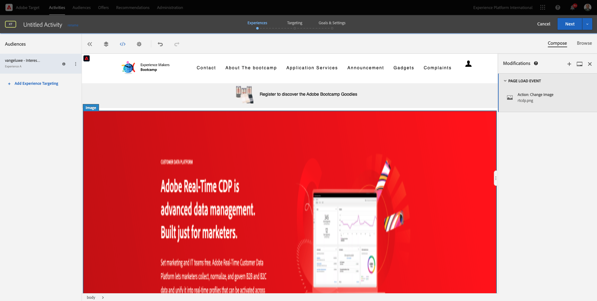
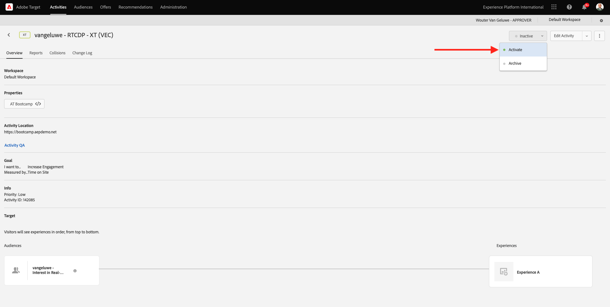

# 1.4 アクションの実行：セグメントをAdobe Targetに送信します

に移動 [Adobe Experience Platform](https://experience.adobe.com/platform). ログインすると、Adobe Experience Platformのホームページが表示されます。

続行する前に、を選択する必要があります **sandbox**. 選択するサンドボックスの名前はです ``Bootcamp``. それには、テキストをクリックします **[!UICONTROL 実稼動製品]** 画面上部の青い線 適切なを選択した後 [!UICONTROL sandbox]画面が変わり、専用の画面が表示されます [!UICONTROL sandbox].

## 1.4.1 Adobe Target宛先へのセグメントのアクティブ化

Adobe Targetは、Real-Time CDPから入手できます。 Adobe Target統合を設定するには、以下に移動します **宛先**、終了 **カタログ**.

クリック **Personalization** が含まれる **カテゴリ** メニュー。 「」が表示されます。 **Adobe Target** 宛先カード。 クリック **セグメントのアクティブ化**.

宛先を選択 ``Bootcamp Target`` をクリックして、 **次**.

使用可能なセグメントのリストで、作成したセグメントを選択します [1.3 セグメントの作成](./ex3.md)。この名前は `yourLastName - Interest in Real-Time CDP`. 次に、「**次へ**」をクリックします。

次のページ **次**.

「**完了**」をクリックします。

これで、Adobe Targetに対してセグメントがアクティブ化されました。

>[!IMPORTANT]
>
>Adobe Targetの宛先をReal-Time CDPで作成した後、宛先が有効になるまで最大 1 時間かかる場合があります。 バックエンド設定が原因で、これは 1 回限りの待機時間です。 最初の 1 時間の待ち時間とバックエンド設定が完了すると、Adobe Targetの宛先に送信される新しく追加されたエッジセグメントを、リアルタイムでターゲティングできるようになります。

## 1.4.2 Adobe Target フォームベースのアクティビティの設定

Real-Time CDP セグメントがAdobe Targetに送信されるように設定されたので、Adobe Targetでエクスペリエンスのターゲット設定アクティビティを設定できます。 この演習では、Visual Experience Composer ベースのアクティビティを設定します。

に移動して、Adobe Experience Cloud ホームページに移動します。 [https://experiencecloud.adobe.com/](https://experiencecloud.adobe.com/). クリック **ターゲット** をクリックして開きます。

日 **Adobe Target** ホームページを開くと、既存のすべてのアクティビティが表示されます。
クリック **+ アクティビティを作成** 新規アクティビティを作成します。

を選択 **エクスペリエンスのターゲット設定**.

を選択 **ビジュアル** を設定して、 **アクティビティ URL** 対象： `https://bootcamp.aepdemo.net/content/aep-bootcamp-experience/language-masters/en/exercises/particpantXX.html`ただし、その前に、XX を 01～30 の数字に置き換えてください。

>[!IMPORTANT]
>
>イネーブルメントのすべての参加者は、様々なAdobe Target エクスペリエンスの競合を避けるために、個別の web ページを使用する必要があります。 Web ページを選択して、次の場所で URL を見つけることができます。 [https://bootcamp.aepdemo.net/content/aep-bootcamp-experience/language-masters/en/exercises.html](https://bootcamp.aepdemo.net/content/aep-bootcamp-experience/language-masters/en/exercises.html).
>
>ページはすべて同じベース URL を共有し、最後に参加者の数が表示されます。
>
>例えば、参加者 1 は URL を使用する必要があります `https://bootcamp.aepdemo.net/content/aep-bootcamp-experience/language-masters/en/exercises/particpant01.html`、参加者 30 は URL を使用 `https://bootcamp.aepdemo.net/content/aep-bootcamp-experience/language-masters/en/exercises/particpant30.html`.

ワークスペースを選択します **AT Bootcamp**.

「**次へ**」をクリックします。

Visual Experience Composer が表示されます。 Web サイトが完全に読み込まれるまでに 20～30 秒かかる場合があります。

現在、デフォルトオーディエンスはです **すべての訪問者**. 「」をクリック **3 ドット** 次の **すべての訪問者** をクリックして、 **オーディエンスを変更**.

これで、使用可能なオーディエンスのリストが表示され、以前に作成してAdobe Targetに送信したAdobe Experience Platform セグメントが、このリストの一部になりました。 以前にAdobe Experience Platformで作成したセグメントを選択します。 クリック **オーディエンスを割り当て**.

Adobe Experience Platform セグメントは、この「エクスペリエンスのターゲット設定」アクティビティに含まれるようになります。

ヒーロー画像を変更する前に、をクリックする必要があります。 **すべて許可** cookie のバナーに表示されます。

これを行うには、に移動します。 **参照**

次に、 **すべて許可**.

次に、に戻ります **作成**.

次に、web サイトのホームページでヒーロー画像を変更します。 Web サイトでデフォルトのヒーロー画像をクリックし、 **Replace Content** を選択してから、 **画像**.

画像ファイルを検索 **rtcdp.png**. これを選択し、 **保存**.

選択したオーディエンスに対して、新しい画像付きの新しいエクスペリエンスが表示されます。

左上隅のアクティビティのタイトルをクリックして、名前を変更します。

名前には、次を使用してください。

- `yourLastName - RTCDP - XT (VEC)`

「**次へ**」をクリックします。

「**次へ**」をクリックします。

日 **目標と設定** - ページ、に移動 **目標指標**.

プライマリ目標を次に設定： **エンゲージメント** - **サイト滞在時間**. 「**保存して閉じる**」をクリックします。

現在： **アクティビティの概要** ページ。 アクティビティをアクティベートする必要があります。

フィールドをクリック **Inactive** を選択して、 **Activate**.

その後、アクティビティがライブになったことを示す視覚的な確認が表示されます。

これでアクティビティが有効になり、bootcamp web サイトでテストできます。

デモ Web サイトに戻って、の製品ページにアクセスする場合 **Real-Time CDP**&#x200B;を選択すると、作成したセグメントにすぐに適合し、Adobe Target アクティビティがホームページにリアルタイムで表示されます。

>[!IMPORTANT]
>
>イネーブルメントのすべての参加者は、様々なAdobe Target エクスペリエンスの競合を避けるために、個別の web ページを使用する必要があります。 Web ページを選択して、次の場所で URL を見つけることができます。 [https://bootcamp.aepdemo.net/content/aep-bootcamp-experience/language-masters/en/exercises.html](https://bootcamp.aepdemo.net/content/aep-bootcamp-experience/language-masters/en/exercises.html).
>
>ページはすべて同じベース URL を共有し、最後に参加者の数が表示されます。
>
>例えば、参加者 1 は URL を使用する必要があります `https://bootcamp.aepdemo.net/content/aep-bootcamp-experience/language-masters/en/exercises/particpant01.html`、参加者 30 は URL を使用 `https://bootcamp.aepdemo.net/content/aep-bootcamp-experience/language-masters/en/exercises/particpant30.html`.

次の手順： [1.5 アクションの実行：セグメントをFacebookに送信します](./ex5.md)

[ユーザーフロー 1 に戻る](./uc1.md)

[すべてのモジュールに戻る](../../overview.md)
