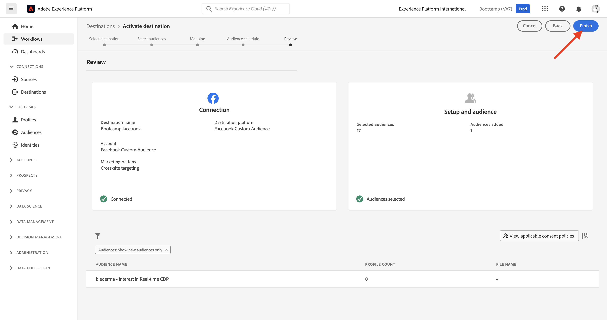
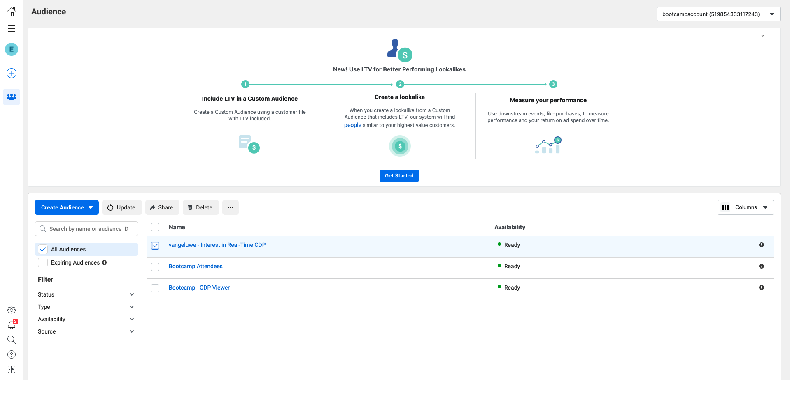

# 1.5 措置をとる：セグメントをFacebookに送信

に移動します。 [Adobe Experience Platform](https://experience.adobe.com/platform). ログイン後、Adobe Experience Platformのホームページに移動します。

続行する前に、 **サンドボックス**. 選択するサンドボックスの名前はです ``Bootcamp``. これを行うには、 **[!UICONTROL 実稼動版]** 画面の上の青い線で表示されます。 適切な [!UICONTROL サンドボックス]画面が変更され、専用の [!UICONTROL サンドボックス].

左側のメニューで、に移動します。 **宛先**&#x200B;を選択し、 **カタログ**. 次に、 **宛先カタログ**. In **宛先**&#x200B;をクリックし、 **セグメントのアクティブ化** の **Facebook Custom Audience** カード。

宛先を選択 **bootcamp-facebook** をクリックし、 **次へ**.

使用可能なセグメントのリストで、前の演習で作成したセグメントを選択します。 「**次へ**」をクリックします。

の **マッピング** ページで、 **変換を適用** チェックボックスが有効になっている。 「**次へ**」をクリックします。

の **セグメントスケジュール** ページで、 **オーディエンスの起源** を設定し、 **顧客から直接**. 「**次へ**」をクリックします。

最後に、 **レビュー** ページ、クリック **完了**.

これで、セグメントがFacebook Custom Audiences にリンクされました。 顧客がこのセグメントを認定されるたびに、シグナルがFacebookサーバーサイドに送信され、Facebook側のカスタムオーディエンスにその顧客を含めます。

facebookでは、「カスタムオーディエンス」の下にAdobe Experience Platformからのセグメントが表示されます。

これで、カスタムオーディエンスがFacebookに表示されます。

[ユーザーフローに戻る 1](./uc1.md)

[すべてのモジュールに戻る](../../overview.md)
