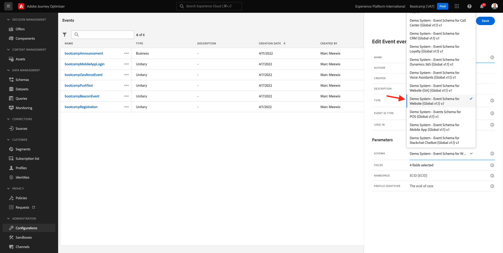

# 2.2 イベントの作成

[Adobe Experience Cloud](https://experience.adobe.com) に移動して、Adobe Journey Optimizerにログインします。 **Journey Optimizer** をクリックします。

Journey Optimizerの **ホーム** ビューにリダイレクトされます。 最初に、正しいサンドボックスを使用していることを確認します。 使用するサンドボックスは `Bootcamp` です。 サンドボックスを切り替えるには、「**Prod**」をクリックし、リストからサンドボックスを選択します。 この例では、サンドボックスの名前は **Bootcamp** です。 その後、サンドボックス `Bootcamp` ージの **ホーム** ビューに移動します。

左側のメニューで、下にスクロールして、**設定** をクリックします。 次に、「イベント **の下にある** 管理 **ボタンをクリック** ます。

次に、使用可能なすべてのイベントの概要が表示されます。 「**イベントを作成**」をクリックして、独自のイベントの作成を開始します。

新しい空のイベントウィンドウがポップアップ表示されます。

まず、イベントに「`yourLastNameAccountCreationEvent`」のような名前を付け、`Account Creation Event` のような説明を追加します。

次に、**タイプ** が **単一** に設定されていることを確認し、**イベント ID タイプ** の選択で「**システム生成**」を選択します。

次に、スキーマを選択します。 この演習では、スキーマを準備しました。 スキーマ `Demo System - Event Schema for Website (Global v1.1) v.1` を使用してください。

スキーマを選択すると、「**フィールド**」セクションで多数のフィールドが選択されます。 **フィールド** セクションの上にマウスポインターを置くと、3 つのアイコンポップアップが表示されます。 **編集** アイコンをクリックします。

**フィールド** ウィンドウポップアップが表示され、メールをパーソナライズする必要のあるフィールドの一部を選択する必要があります。  既にAdobe Experience Platformにあるデータを使用して、後で他のプロファイル属性を選択します。

オブジェクト `_experienceplatform.demoEnvironment` で、必ず **brandLogo** フィールドと **brandName** フィールドを選択してください。

オブジェクト `_experienceplatform.identification.core` で、「**メール**」フィールドを必ず選択してください。

**OK** をクリックして、変更を保存します。

この画像が表示されます。 もう一度 **保存** をクリックして、変更を保存します。

これで、イベントが設定され、保存されました。

イベントを再度クリックすると、**イベントを編集** 画面が再度開きます。 **フィールド** にポインタを合わせると、3 つのアイコンが再び表示されます。 **ペイロードを表示** アイコンをクリックします。

これで、期待されるペイロードの例が表示されます。
イベントには一意のオーケストレーション eventID があり、`_experience.campaign.orchestration.eventID` が表示されるまでペイロードを下にスクロールすると見つかります。

イベント ID は、ジャーニーをトリガーするためにAdobe Experience Platformに送信する必要があるものです。ジャーニーは、次の演習の 1 つで作成します。 この eventID は後で必要になることがあるので、覚えておいてください。
`"eventID": "19cab7852cdef99d25b6d5f1b6503da39d1f486b1d585743f97ed2d1e6b6c74f"`

**OK** をクリックし、続いて **キャンセル** をクリックします。

これで、この演習が完了しました。

次の手順：[2.3 メールメッセージを作成する &#x200B;](./ex3.md)

[ユーザーフロー 2 に戻る](./uc2.md)

[すべてのモジュールに戻る](../../overview.md)
