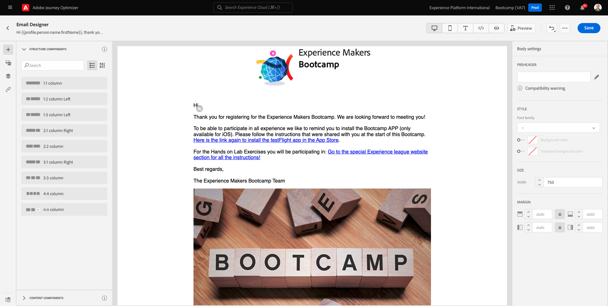
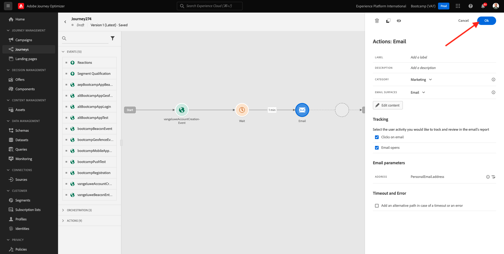
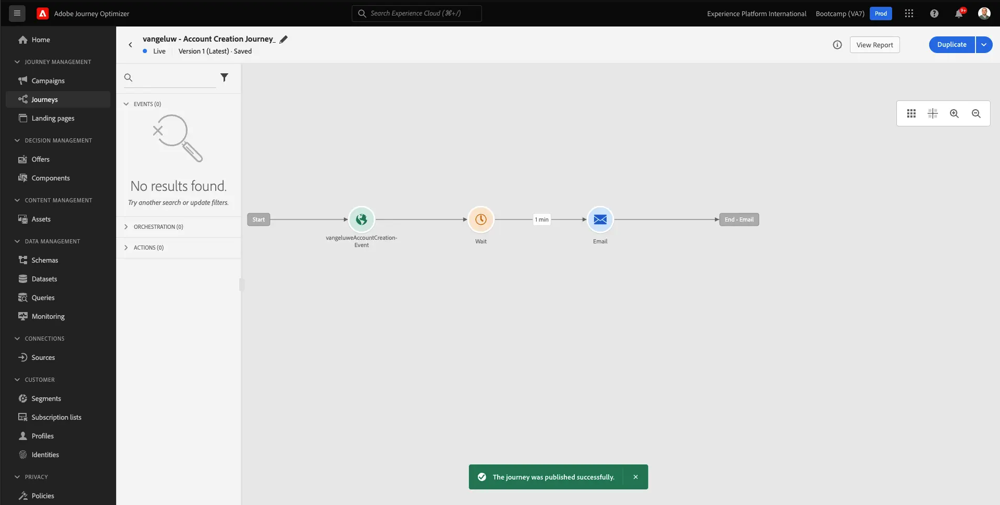

# 2.3 ジャーニーとメールメッセージの作成

この演習では、デモ Web サイトでアカウントが作成されたときにトリガーする必要があるジャーニーを設定します。

[Adobe Experience Cloud](https://experience.adobe.com) に移動して、Adobe Journey Optimizerにログインします。 **Journey Optimizer** をクリックします。

Journey Optimizerの **ホーム** ビューにリダイレクトされます。 最初に、正しいサンドボックスを使用していることを確認します。 使用するサンドボックスは `Bootcamp` です。 サンドボックスを切り替えるには、「**Prod**」をクリックし、リストからサンドボックスを選択します。 この例では、サンドボックスの名前は **Bootcamp** です。 その後、サンドボックス `Bootcamp` ージの **ホーム** ビューに移動します。

## 2.3.1 ジャーニーの作成

左のメニューで、「**ジャーニー**」をクリックします。次に、「**ジャーニーを作成**」をクリックして、新規のジャーニーを作成します。

すると、空のジャーニー画面が表示されます。

前の演習では、新しい **イベント** を作成しました。 この `yourLastNameAccountCreationEvent` のように名前を付け、`yourLastName` を姓に置き換えました。 イベント作成の結果：

次に、このジャーニーをこのイベントの開始として受け取る必要があります。 これを行うには、画面の左側に移動して、イベントのリストでイベントを検索します。

イベントを選択し、ジャーニーキャンバスにドラッグ&amp;ドロップします。 ジャーニーは次のようになります。

ジャーニーの 2 番目のステップとして、短い **待機** ステップを追加する必要があります。 画面の左側の **オーケストレーション** セクションに移動して、これを見つけます。 プロファイル属性を使用し、リアルタイム顧客プロファイルに入力されていることを確認する必要があります。

ジャーニーは次のようになります。 画面の右側には、待機時間を設定する必要があります。 1 分に設定します。 これにより、イベントの発生後にプロファイル属性が使用可能になるまで、十分な時間が与えられます。

**OK** をクリックして、変更を保存します。

ジャーニーの 3 番目の手順として、**メール** アクションを追加する必要があります。 画面の左側に移動して **アクション** し、**メール** アクションを選択して、ジャーニーの 2 番目のノードにドラッグ&amp;ドロップします。 これが表示されます。

**カテゴリ** を **マーケティング** に設定し、メールを送信できるメールサーフェスを選択します。 この場合、選択するメールサーフェスは **メール** です。 **メールのクリック数** と **メールの開封数** のチェックボックスが両方とも有効になっていることを確認します。

次の手順では、メッセージを作成します。 それには、「**コンテンツを編集** をクリックします。

## 2.3.2 メッセージの作成

メッセージを作成するには、「**コンテンツを編集**」をクリックします。

これが表示されます。

**件名** テキストフィールドをクリックします。

テキスト領域で書き始めます **こんにちは**

件名がまだ完了していません。 次に、`profile.person.name.firstName` に保存されている「名 **フィールドのパーソナライゼーショントークンを取り込む必要が** ります。 左側のメニューで、下にスクロールして **Person** 要素を見つけ、矢印をクリックしてレベルを深くします。

次に、**フルネーム** 要素を見つけて、矢印をクリックしてレベルを深くします。

最後に、「**名** フィールドを見つけ、その横にある「**+**」記号をクリックします。 テキストフィールドにパーソナライゼーショントークンが表示されます。

次に、「**, thank you for signing up!**。「**保存**」をクリックします。

その後、ここに戻ります。 **メールDesigner** をクリックして、メールのコンテンツを作成します。

次の画面では、メールのコンテンツを指定するための 3 つの異なる方法を選択するように求められます。

- **ゼロからデザイン**：空のキャンバスから開始し、WYSIWYG エディターを使用して、構造およびコンテンツコンポーネントをドラッグ&amp;ドロップして、メールのコンテンツを視覚的に作成します。
- **独自にコーディング**:HTMLを使用してコーディングし、独自のメールテンプレートを作成します
- **HTMLをインポート**：既存のHTMLテンプレートをインポートします。

**HTMLを読み込み** をクリックします。 または、「**保存済みのテンプレート**」をクリックし、テンプレート **Bootcamp - メールテンプレート** を選択することもできます。

**HTMLを読み込み** を選択した場合、ファイル **mailtemplatebootcamp.html** をドラッグ&amp;ドロップして、[ こちら ](../../assets/html/mailtemplatebootcamp.html.zip) からダウンロードできます。 「インポート」をクリックします。

すると、次のデフォルトのメールテンプレートが表示されます。

メールをパーソナライズしましょう。 テキスト **Hi** の横にある「」をクリックし、「**Personalizationを追加**」アイコンをクリックします。

次に、`profile.person.name.firstName` に保存されている **名** パーソナライゼーショントークンを取り込む必要があります。 メニューで、**ユーザー** 要素を見つけ、**姓名** 要素にドリルダウンし、**+** アイコンをクリックして、名フィールドを式エディターに追加します。

「**保存**」をクリックします。

これで、パーソナライゼーションフィールドがテキストにどのように追加されたかがわかります。

「**保存**」をクリックして、メッセージを保存します。

メッセージダッシュボードに戻るには、左上隅の件名テキストの横にある **矢印** をクリックします。

登録メールの作成が完了しました。 左上隅の矢印をクリックして、ジャーニーに戻ります。

「**OK**」をクリックします。

## 2.3.3 ジャーニーのPublish

ジャーニーに名前を付ける必要があります。 画面の左上にある **鉛筆** アイコンをクリックすると、これを行うことができます。

ジャーニーの名前をここに入力できます。 `yourLastName - Account Creation Journey` を使用してください。 「**OK**」をクリックして変更を保存します。

これで、**Publish** をクリックしてジャーニーを公開できます。

もう一度 **0}Publish} をクリックします。**

その後、ジャーニーが公開済みになったことを示す緑色の確認バーが表示されます。

これで、この演習が完了しました。

次の手順：[2.4 ジャーニーのテスト ](./ex4.md)

[ユーザーフロー 2 に戻る](./uc2.md)

[すべてのモジュールに戻る](../../overview.md)