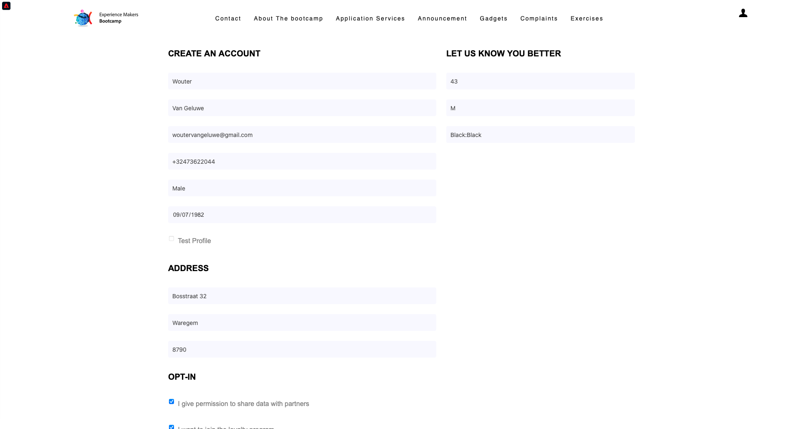

# 2.4 ジャーニーのテスト

## カスタマージャーニーフロー

新しい、クリーンな匿名ブラウザーウィンドウを開き、に移動します。 [https://bootcamp.aepdemo.net](https://bootcamp.aepdemo.net). クリック **すべて許可**. 前のユーザーフローでの閲覧行動に基づいて、Web サイトのホームページにパーソナライゼーションが表示されます。

次をクリック： **プロファイル** アイコンをクリックします。

クリック **アカウントの作成**.

フォームのすべてのフィールドに入力します。 電子メールアドレスと電話番号には、実際の値を使用します。電子メールと SMS の配信に関する後の演習で使用されるからです。

下にスクロールします。 次に、演習 2.2 で作成したカスタムイベントの eventID を入力する必要があります。次の ID を参照してください。

イベント ID は、作成したジャーニーをトリガー化するために、Adobe Experience Platformに送信する必要があるものです。 この例では eventID です。 `19cab7852cdef99d25b6d5f1b6503da39d1f486b1d585743f97ed2d1e6b6c74f`

「 」フィールドに eventID を入力します。 **アカウント作成イベント ID** をクリックし、 **登録**.

これが見えます

また、この電子メールも届きます。この電子メールは、この演習の一環として自分で作成した電子メールです。

これで、この練習が完了しました。

次のステップ： [2.5 モバイルアプリをインストールして使用する](./ex5.md)

[ユーザーフローに戻る 2](./uc2.md)

[すべてのモジュールに戻る](../../overview.md)
