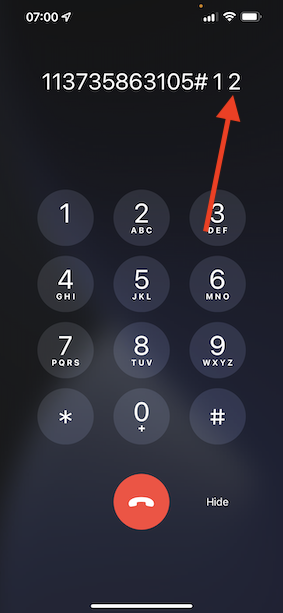

# 2.6 コールセンターにおけるパーソナライゼーション

既にブートキャンプ中に複数回話し合ったように、顧客体験のパーソナライズは、オムニチャネル方式で発生すべきことです。 コールセンターは、多くの場合、カスタマージャーニーの他の部分とは完全に切り離されており、多くの場合、カスタマーエクスペリエンスに不満を抱きますが、そうする必要はありません。 コールセンターをAdobe Experience Platformにリアルタイムで簡単に接続する方法の例を見てみましょう。

## 顧客ジャーニーフロー

前の演習では、モバイルアプリケーションを使用し、 **購入** 」ボタンをクリックします。

注文の状況に関する質問があるとしますが、どうしますか？ 通常はコールセンターに電話します。

コールセンターに連絡する前に、 **ロイヤルティ ID**. ロイヤルティ ID は、Web サイトのプロファイルビューアで確認できます。

この場合、 **ロイヤルティ ID** が **5863105**. デモ環境でのコールセンター機能のカスタム実装の一環として、にプレフィックスを追加する必要があります。 **ロイヤルティ ID**. プレフィックスは **11373**&#x200B;である場合、この例で使用するロイヤルティ ID は **11373 5863105**.

それは今からやりましょう。 電話を使って番号を呼び出す **+1 (323) 745-1670**.

ロイヤリティ ID の入力が求められ、その後に **#**. ロイヤルティ ID を入力します。

そうすれば、 **こんにちは、名**. この名は、Adobe Experience Platformのリアルタイム顧客プロファイルから取得されます。 次に 3 つの選択肢があります。 プレス番号 **1**, **注文ステータス**.

ご注文状況をお聞きの上、 **1** メインメニューに戻る場合、または 2 を押します。 押す **2**.

次に、1 ～ 5 の数値（1 は低、5 は高）を選択して、コールセンターの体験を評価するよう求められます。 選択を行います。

コールセンターへの呼び出しが終了します。

に移動します。 [Adobe Experience Platform](https://experience.adobe.com/platform). ログイン後、Adobe Experience Platformのホームページに移動します。

続行する前に、 **サンドボックス**. 選択するサンドボックスの名前はです ``Bootcamp``. これを行うには、 **[!UICONTROL 実稼動版]** 画面の上の青い線で表示されます。 適切な [!UICONTROL サンドボックス]画面が変更され、専用の [!UICONTROL サンドボックス].

左側のメニューで、に移動します。 **プロファイル** および **参照**.

を選択します。 **ID 名前空間** **電子メール** 顧客プロファイルのメールアドレスを入力します。 クリック **表示**. 「 」をクリックして、プロファイルを開きます。

顧客プロファイルが再度表示されます。 に移動します。 **イベント**.

イベントの下に、eventType が **callCenter**. 最初のイベントは、質問に対する回答の結果です **通話満足度の評価**.

少し下にスクロールすると、 **注文ステータス**.

に移動します。 **セグメントのメンバーシップ**. コールセンターでのインタラクションに基づいて、2 つのセグメントがリアルタイムでプロファイルで認定されるようになりました。 これらのセグメントメンバーシップを使用して、他のチャネルでの通信やパーソナライゼーションの影響を受けることができます。

これで、この練習が完了しました。

[ユーザーフローに戻る 2](./uc2.md)

[すべてのモジュールに戻る](../../overview.md)
