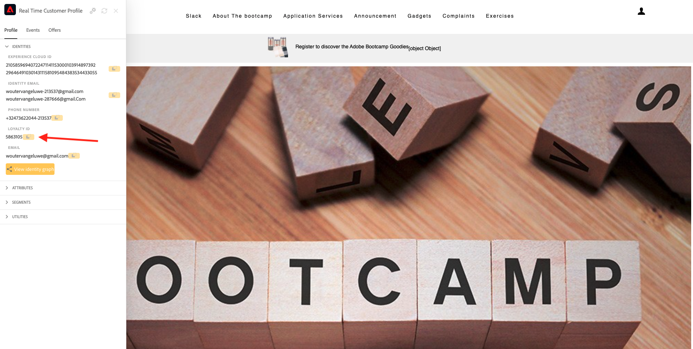
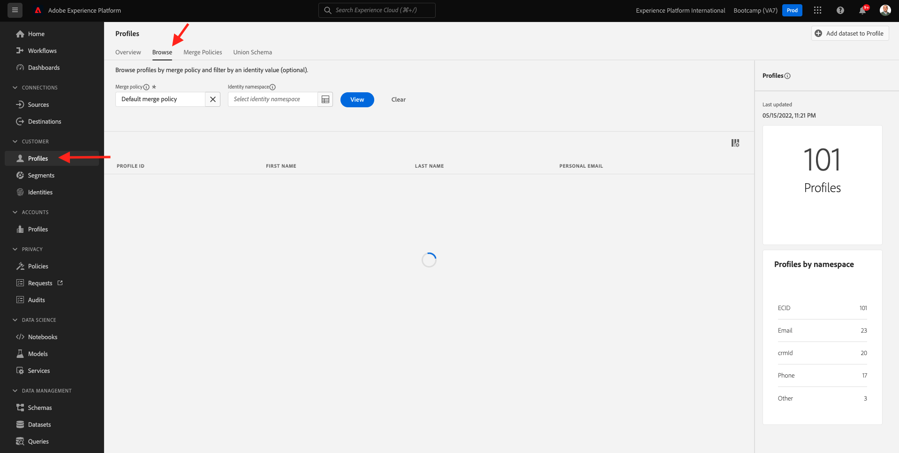

# 2.6 コールセンターのPersonalization

既にブートキャンプ中に複数回議論されているように、カスタマーエクスペリエンスのパーソナライズは、オムニチャネル方式で行う必要があります。 コールセンターは多くの場合、カスタマージャーニーの残りの部分からかなり切り離されており、カスタマーエクスペリエンスにフラストレーションを与える原因になることが多いですが、そうする必要はありません。 コールセンターをAdobe Experience Platformに簡単にリアルタイムで接続する方法の例を示します。

## カスタマージャーニーフロー

前の演習では、モバイルアプリケーションを使用して、「**購入**」ボタンをクリックして製品を購入しました。

あなたの注文のステータスについて質問があるとしましょう、あなたは何をしますか？ 通常は、コールセンターに電話します。

コールセンターに電話する前に、**ロイヤルティ ID** を把握している必要があります。 ロイヤルティ ID は、web サイトのプロファイルビューアで確認できます。

この場合、**ロイヤルティ ID** は **5863105** になります。 デモ環境のコールセンター機能のカスタム実装の一環として、**ロイヤルティ ID** にプレフィックスを追加する必要があります。 プレフィックスは **11373** なので、この例で使用するロイヤルティ ID は **11373 5863105** です。

今それを行いましょう。 電話を使って、電話番号 **+1 （323） 745-1670** に電話してください。

ロイヤルティ ID を入力し、続いて **#** を入力するように求められます。 ロイヤルティ ID を入力します。

すると **こんにちは、名** と聞こえます。 この名前は、Adobe Experience Platformのリアルタイム顧客プロファイルから取得されます。 その後、3 つの選択肢があります。 番号 **1**、**注文ステータス** を押します。

注文状況を確認した後、**1** キーを押してメインメニューに戻るか、2 を押すかを選択できます。 **2** を押します。

次に、1 ～ 5 の数値を選択して、コールセンターのエクスペリエンスを評価するように求められます。1 は低、5 は高です。 好きなものを選びなさい。

コールセンターへの通話が終了します。

[Adobe Experience Platform](https://experience.adobe.com/platform) に移動します。 ログインすると、Adobe Experience Platformのホームページが表示されます。

続行する前に、**サンドボックス** を選択する必要があります。 選択するサンドボックスの名前は ``Bootcamp`` です。 これを行うには、画面上部の青い線のテキスト **[!UICONTROL 実稼動製品]** をクリックします。 適切な [!UICONTROL &#x200B; サンドボックス &#x200B;] を選択すると、画面が変更され、専用の [!UICONTROL &#x200B; サンドボックス &#x200B;] が表示されます。

左側のメニューで、**プロファイル**、「参照 **の順に移動** ます。

**ID 名前空間**&#x200B;**メール** を選択し、顧客プロファイルのメールアドレスを入力します。 **表示** をクリックします。 クリックしてプロファイルを開きます。

顧客プロファイルが再び表示されます。 **イベント** に移動します。

「イベント」には、eventType が **callCenter** の 2 つのイベントがあります。 最初のイベントは、「通話満足度を評価 **という質問に対する回答の結果** す。

少し下にスクロールすると、**注文ステータス** を確認するオプションを選択したときに記録されたイベントが表示されます。

**セグメントメンバーシップ** に移動します。 コールセンターを通じて得られたインタラクションに基づいて、2 つのセグメントがリアルタイムでプロファイルに適合することがわかります。 これらのセグメントメンバーシップは、他のチャネルでのコミュニケーションとパーソナライゼーションの動作に影響を与えるために使用でき、またそうする必要があります。

これで、この演習が完了しました。

[ユーザーフロー 2 に戻る](./uc2.md)

[すべてのモジュールに戻る](../../overview.md)
