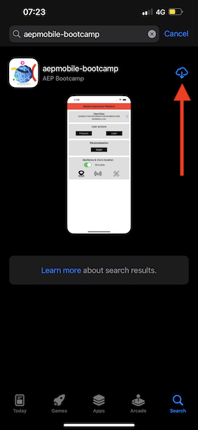

# 3.1 モバイルアプリを使用し、ビーコンエントリをトリガーします

## モバイルアプリのインストール

アプリケーションをインストールする前に、iOS デバイスで **トラッキング** を有効にする必要があります。 これを行うには、**設定**/**プライバシーとセキュリティ**/**トラッキング** に移動し、「**アプリによるトラッキングのリクエストを許可**」オプションを確認します。

Apple App Storeに移動し、`aepmobile-bootcamp` を検索します。 **インストール** または **ダウンロード** をクリックします。

アプリケーションをインストールしたら、「**開く**」をクリックします。

「**OK**」をクリックします。

**許可** をクリックします。

**同意します** をクリックします。

「**アプリの使用中に許可**」をクリックします。

**許可** をクリックします。

これで、ホームページのアプリで、カスタマージャーニーを実行する準備が整いました。

## カスタマージャーニーフロー

まず第一に、ログインする必要があります。 **ログイン** をクリックします。

前の演習でアカウントを作成した後、Web サイトでこれを見ました。 ログインするには、アプリで作成したアカウントのメールアドレスを再利用する必要があります。

Web サイトで使用したメールアドレスをここに入力し、「**ログイン**」をクリックします。

その後、ログインしたという確認が表示され、プッシュ通知が届きます。

アプリのホームページに戻ると、追加の機能が表示されます。

まず、**製品** に移動します。 任意の製品（この例では **Coffee to go** をクリックします。

アプリに **Coffee to go** 製品ページが表示されます。

次に、オフラインストアの場所でのビーコンエントリイベントをシミュレートします。 これをシミュレートする目的は、店舗の画面での顧客体験をパーソナライズすることです。 店舗でのエクスペリエンスを視覚化するために、店舗に入ったばかりの顧客に関連する情報を動的に表示するページが作成されました。

続行する前に、コンピューターでこの Web ページを開いてください：[https://bootcamp.aepdemo.net/content/aep-bootcamp-experience/language-masters/en/screen.html](https://bootcamp.aepdemo.net/content/aep-bootcamp-experience/language-masters/en/screen.html)

次の画面が表示されます。

次に、ホームページに戻ります。 **ビーコン** アイコンをクリックします。

その後、これが表示されます。 最初に **Bootcamp スクリーンビーコン** を選択し、次に **エントリ** ボタンをクリックします。 これにより、ビーコンエントリをシミュレートできます。

次に、店舗の画面を見てみましょう。 最後に表示した製品が 5 秒以内にそこに表示されます。

次に、**製品** に戻ります。 任意の製品（この例では **ビーチブランケット日焼け** をクリックします。

次に、ホームページに戻ります。 **ビーコン** アイコンをクリックします。

その後、これが表示されます。 最初に **Bootcamp スクリーンビーコン** を選択し、次にもう一度 **エントリ** ボタンをクリックします。 これにより、ビーコンエントリをシミュレートできます。

ここで、店舗の画面を再度見てみましょう。 最後に表示した製品が 5 秒以内にそこに表示されます。

次に、web サイトでプロファイルビューアも見てみましょう。 ここには、顧客とのやり取りがAdobe Experience Platformに収集され保存されていることを示すために、追加された多くのイベントが表示されます。

次の演習では、独自のビーコンエントリジャーニーを設定およびテストします。

次の手順：[3.2 イベントを作成する &#x200B;](./ex2.md)

[ユーザーフロー 3 に戻る](./uc3.md)

[すべてのモジュールに戻る](../../overview.md)
