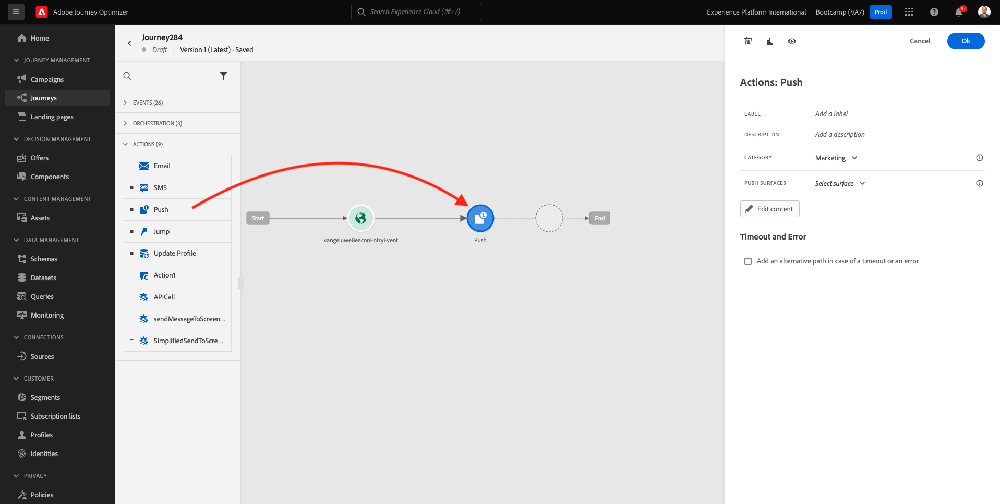
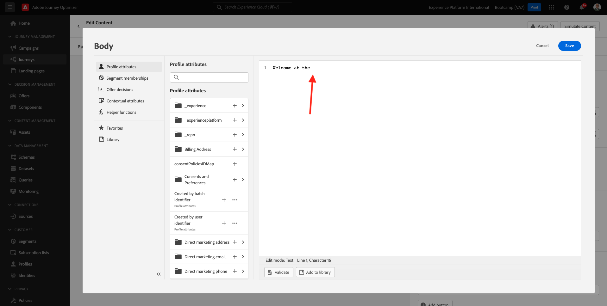
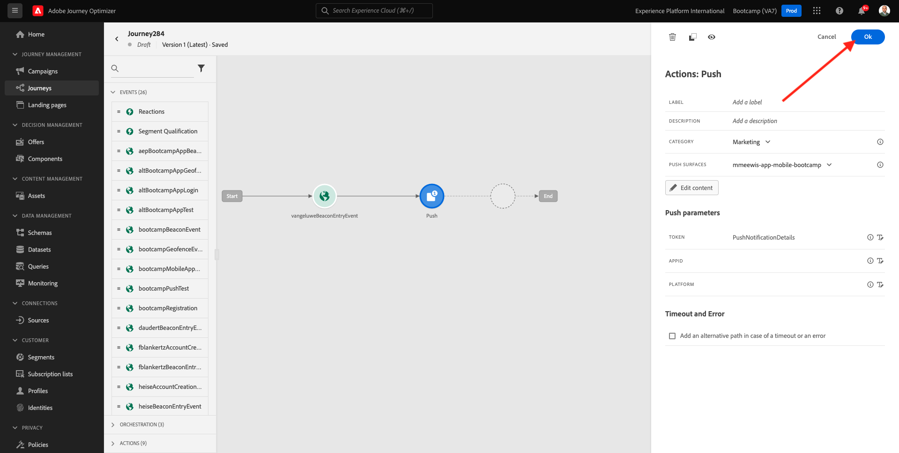

# 3.3 ジャーニーとプッシュ通知の作成

この演習では、モバイルアプリを使用して、誰かがビーコンに入ったときにトリガーされる必要があるジャーニーとメッセージを設定します。

[Adobe Experience Cloud](https://experience.adobe.com) に移動して、Adobe Journey Optimizerにログインします。 **Journey Optimizer** をクリックします。

Journey Optimizerの **ホーム** ビューにリダイレクトされます。 最初に、正しいサンドボックスを使用していることを確認します。 使用するサンドボックスは `Bootcamp` です。 サンドボックスを切り替えるには、「**Prod**」をクリックし、リストからサンドボックスを選択します。 この例では、サンドボックスの名前は **Bootcamp** です。 その後、サンドボックス `Bootcamp` ージの **ホーム** ビューに移動します。

## 3.3.1 ジャーニーの作成

左のメニューで、「**ジャーニー**」をクリックします。次に、「**ジャーニーを作成**」をクリックして、新規のジャーニーを作成します。

すると、空のジャーニー画面が表示されます。

前の演習では、新しい **イベント** を作成しました。 この `yourLastNameBeaconEntryEvent` のように名前を付け、`yourLastName` を姓に置き換えました。 イベント作成の結果：

次に、このジャーニーをこのイベントの開始として受け取る必要があります。 これを行うには、画面の左側に移動して、イベントのリストでイベントを検索します。

イベントを選択し、ジャーニーキャンバスにドラッグ&amp;ドロップします。 ジャーニーは次のようになります。 **OK** をクリックして、変更を保存します。

ジャーニーの 2 番目の手順として、**プッシュ** アクションを追加する必要があります。 画面の左側に移動して **アクション** し、**プッシュ** アクションを選択して、ジャーニーの 2 番目のノードにドラッグ&amp;ドロップします。

画面の右側で、プッシュ通知を作成する必要があります。

**カテゴリ** を **マーケティング** に設定し、プッシュ通知の送信を可能にするプッシュサーフェスを選択します。 この場合、選択するプッシュサーフェスは **mmeeewis-app-mobile-bootcamp** です。

## 3.3.2 メッセージの作成

**コンテンツを編集** をクリックします。

次の画面が表示されます。

プッシュ通知の内容を定義します。

「**タイトル**」テキストフィールドをクリックします。

テキストエリアで書き始めます **こんにちは**。 パーソナライゼーションアイコンをクリックします。

`profile.person.name.firstName` に保存されているフィールド **名** のパーソナライゼーショントークンを取り込みます。 左側のメニューで、「**プロファイル属性**」を選択し、下にスクロールして **人物** 要素を見つけ、矢印をクリックして、フィールド `profile.person.name.firstName` に到達するまでレベルの深さを移動します。 **+** アイコンをクリックして、キャンバスにフィールドを追加します。 「**保存**」をクリックします。

その後、ここに戻ります。 フィールド **本文** の横にあるパーソナライゼーションアイコンをクリックします。

テキスト領域に、`Welcome at the ` と入力します。

次に、「コンテキスト属性 **、「** Journey Orchestration **」の順にクリックし** す。

**イベント** をクリックします。

イベントの名前をクリックします。次のようになります。**yourLastNameBeaconEntryEvent**

**コンテキストを配置** をクリックします。

**POI インタラクション** をクリックします。

**POI 詳細** をクリックします。

**POI 名** の「**+**」アイコンをクリックします。
その後、これが表示されます。 「**保存**」をクリックします。

これで、メッセージの準備が整いました。 左上隅の矢印をクリックして、ジャーニーに戻ります。

「**OK**」をクリックします。

## 3.3.2 画面にメッセージを送信する

ジャーニーの 3 番目の手順として、**sendMessageToScreen** アクションを追加する必要があります。 画面の左側に移動して **アクション** し、**sendMessageToScreen** アクションを選択して、ジャーニーの 3 番目のノードにドラッグ&amp;ドロップします。 その後、これが表示されます。

**sendMessageToScreen** アクションは、ストア内表示で使用されるエンドポイントにメッセージを公開するカスタムアクションです。 **sendMessageToScreen** アクションには、複数の変数を定義する必要があります。 **アクションパラメーター** が表示されるまで下にスクロールすると、これらの変数を確認できます。

次に、各アクションパラメーターの値を設定する必要があります。 次の表に、必要な値を示します。

| パラメーター | 値 |
|:-------------:| :---------------:|
| 配信 | `'image'` |
| ECID | `@{yourLastNameBeaconEntryEvent._experienceplatform.identification.core.ecid}` |
| 名 | `#{ExperiencePlatform.ProfileFieldGroup.profile.person.name.firstName}` |
| EVENTSUBJECT | `#{ExperiencePlatform.ProductListItems.experienceevent.first(currentDataPackField.eventType == "commerce.productViews").productListItems.first().name}` |
| EVENTSUBJECTURL | `#{ExperiencePlatform.ProductListItems.experienceevent.first(currentDataPackField.eventType == "commerce.productViews").productListItems.first()._experienceplatform.core.imageURL}` |
| SANDBOX | `'bootcamp'` |
| CONTAINERID | `''` |
| ACTIVITYID | `''` |
| PLACEMENTID | `''` |

{style="table-layout:auto"}

これらの値を設定するには、「**編集** アイコンをクリックします。

次に、「**詳細設定モード**」を選択します。

次に、上記の表に基づいて値を貼り付けます。 「**OK**」をクリックします。

このプロセスを繰り返して、各フィールドの値を追加します。

>[!IMPORTANT]
>
>フィールド ECID には、イベント `yourLastNameBeaconEntryEvent` への参照があります。 必ず `yourLastName` を姓に置き換えてください。

最終的な結果は次のようになります。

上にスクロールして、「**OK**」をクリックします。

ジャーニーに名前を付ける必要があります。 画面の左上にある **鉛筆** アイコンをクリックすると、これを行うことができます。

ジャーニーの名前をここに入力できます。 `yourLastName - Beacon Entry Journey` を使用してください。 「**OK**」をクリックして変更を保存します。

これで、**Publish** をクリックしてジャーニーを公開できます。

もう一度 **0}Publish} をクリックします。**

その後、ジャーニーが公開済みになったことを示す緑色の確認バーが表示されます。

これでジャーニーがライブになり、トリガーできます。

これで、この演習が完了しました。

次の手順：[3.4 ジャーニーのテスト ](./ex4.md)

[ユーザーフロー 3 に戻る](./uc3.md)

[すべてのモジュールに戻る](../../overview.md)
