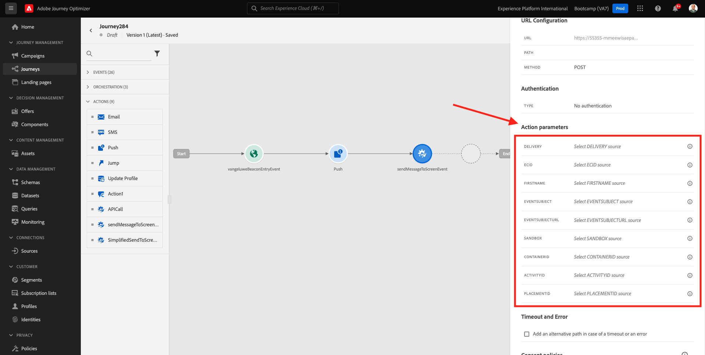

# 3.3 ジャーニーとプッシュ通知の作成

この演習では、モバイルアプリを使用して、誰かがビーコンに入ったときにトリガーされる必要があるジャーニーとメッセージを設定します。

に移動してAdobe Journey Optimizerにログインします。 [Adobe Experience Cloud](https://experience.adobe.com). クリック **Journey Optimizer**.

にリダイレクトされます **ホーム**  Journey Optimizerで表示します。 最初に、正しいサンドボックスを使用していることを確認します。 使用するサンドボックスはと呼ばれます `Bootcamp`. サンドボックスを変更するには、をクリックします。 **Prod** リストからサンドボックスを選択します。 この例では、サンドボックスの名前はです **Bootcamp**. その後、 **ホーム** サンドボックスの表示 `Bootcamp`.

## 3.3.1 ジャーニーの作成

左のメニューで、「**ジャーニー**」をクリックします。次に、 **ジャーニーを作成** 新規ジャーニーを作成します。

すると、空のジャーニー画面が表示されます。

前の演習では、新しい **イベント**. 次のような名前を付けました `yourLastNameBeaconEntryEvent` およびが置き換えられました `yourLastName` 姓で。 イベント作成の結果：

次に、このジャーニーをこのイベントの開始として受け取る必要があります。 これを行うには、画面の左側に移動して、イベントのリストでイベントを検索します。

イベントを選択し、ジャーニーキャンバスにドラッグ&amp;ドロップします。 ジャーニーは次のようになります。 クリック **Ok** 変更を保存します。

ジャーニーの 2 番目の手順として、を追加する必要があります **プッシュ** アクション。 画面の左側に移動して、以下を行います **アクション**&#x200B;を選択し、 **プッシュ** アクションを実行してから、ジャーニーの 2 番目のノードにドラッグ&amp;ドロップします。

画面の右側で、プッシュ通知を作成する必要があります。

を **カテゴリ** 対象： **Marketing** を選択し、プッシュ通知の送信を有効にするプッシュサーフェスを選択します。 この場合、選択するプッシュサーフェスはです。 **mmeeewis-app-mobile-bootcamp**.

## 3.3.2 メッセージの作成

クリック **コンテンツを編集**.

次の画面が表示されます。

プッシュ通知の内容を定義します。

「」をクリックします **タイトル** テキストフィールド。

テキスト領域に書き込みを開始します **こんにちは**. パーソナライゼーションアイコンをクリックします。

次に、フィールドのパーソナライゼーショントークンを取り込みます **名** に保存されます。 `profile.person.name.firstName`. 左側のメニューで、を選択します。 **プロファイル属性**、下にスクロールするか、に移動して見つけます。 **人物** フィールドに到達するまで深いレベルに行くために要素と矢印をクリック `profile.person.name.firstName`. 「」をクリックします **+** アイコンをクリックしてフィールドをキャンバスに追加します。 「**保存**」をクリックします。

その後、ここに戻ります。 フィールドの横にあるパーソナライゼーションアイコンをクリックします **本文**.

テキスト領域に、次のように入力します `Welcome at the `.

次に、 **コンテキスト属性** その後 **Journey Orchestration**.

クリック **イベント**.

イベントの名前をクリックします。次のようになります。 **yourLastNameBeaconEntryEvent**.

クリック **場所の背景**.

クリック **POI インタラクション**.

クリック **POI の詳細**.

「」をクリックします **+** アイコン オン **POI 名**.
その後、これが表示されます。 「**保存**」をクリックします。

これで、メッセージの準備が整いました。 左上隅の矢印をクリックして、ジャーニーに戻ります。

「**OK**」をクリックします。

## 3.3.2 画面にメッセージを送信する

ジャーニーの 3 番目の手順として、を追加する必要があります **sendMessageToScreen** アクション。 画面の左側に移動して、以下を行います **アクション**&#x200B;を選択し、 **sendMessageToScreen** アクションを実行してから、ジャーニーの 3 番目のノードにドラッグ&amp;ドロップします。 その後、これが表示されます。

この **sendMessageToScreen** アクションは、店舗ディスプレイで使用されるエンドポイントにメッセージを公開するカスタムアクションです。 この **sendMessageToScreen** アクションでは、多数の変数を定義する必要があります。 表示されるまで下にスクロールすると、これらの変数を確認できます **アクションパラメーター**.

次に、各アクションパラメーターの値を設定する必要があります。 次の表に、必要な値を示します。

| パラメーター | value |
|:-------------:| :---------------:|
| 配信 | `'image'` |
| ECID | `@{yourLastNameBeaconEntryEvent._experienceplatform.identification.core.ecid}` |
| 名 | `#{ExperiencePlatform.ProfileFieldGroup.profile.person.name.firstName}` |
| EVENTSUBJECT | `#{ExperiencePlatform.ProductListItems.experienceevent.first(currentDataPackField.eventType == "commerce.productViews").productListItems.first().name}` |
| EVENTSUBJECTURL | `#{ExperiencePlatform.ProductListItems.experienceevent.first(currentDataPackField.eventType == "commerce.productViews").productListItems.first()._experienceplatform.core.imageURL}` |
| SANDBOX | `'bootcamp'` |
| CONTAINERID | `''` |
| ACTIVITYID | `''` |
| PLACEMENTID | `''` |

{style="table-layout:auto"}

これらの値を設定するには、 **編集** アイコン。

次に、を選択します **詳細設定モード**.

次に、上記の表に基づいて値を貼り付けます。 「**OK**」をクリックします。

このプロセスを繰り返して、各フィールドの値を追加します。

>[!IMPORTANT]
>
>フィールド ECID には、イベントへの参照があります `yourLastNameBeaconEntryEvent`. 必ずを `yourLastName` 姓で。

最終的な結果は次のようになります。

上にスクロールして、 **Ok**.

ジャーニーに名前を付ける必要があります。 それには、 **鉛筆** アイコンが画面の左上に表示されます。

ジャーニーの名前をここに入力できます。 を使用してください。 `yourLastName - Beacon Entry Journey`. 「**OK**」をクリックして変更を保存します。

次をクリックして、ジャーニーを公開できます。 **公開**.

クリック **公開** また。

その後、ジャーニーが公開済みになったことを示す緑色の確認バーが表示されます。

これでジャーニーがライブになり、トリガーできます。

これで、この演習が完了しました。

次の手順： [3.4 ジャーニーのテスト](./ex4.md)

[ユーザーフロー 3 に戻る](./uc3.md)

[すべてのモジュールに戻る](../../overview.md)
