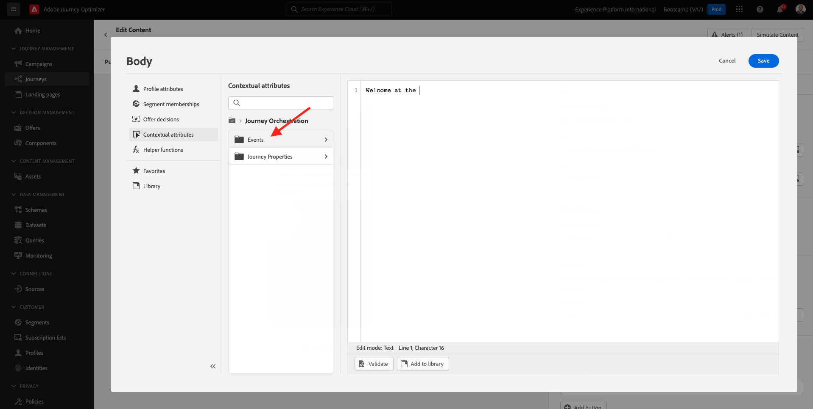
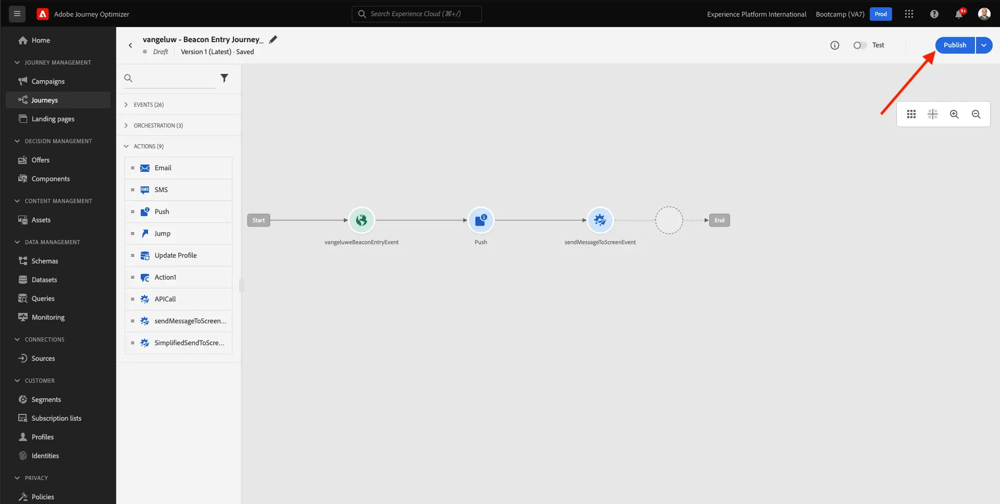

# 3.3 ジャーニーとプッシュ通知の作成

この演習では、モバイルアプリを使用して誰かがビーコンに入ったときにトリガーする必要があるジャーニーとメッセージを設定します。

に移動してAdobe Journey Optimizerにログインします。 [Adobe Experience Cloud](https://experience.adobe.com). クリック **Journey Optimizer**.

リダイレクト先： **ホーム**  Journey Optimizerで表示 まず、正しいサンドボックスを使用していることを確認します。 使用するサンドボックスは、と呼ばれます。 `Bootcamp`. サンドボックス間を切り替えるには、 **Prod** リストからサンドボックスを選択します。 この例では、サンドボックスの名前はです。 **Bootcamp**. その後、 **ホーム** サンドボックスの表示 `Bootcamp`.

## 3.3.1 ジャーニーの作成

左のメニューで、「**ジャーニー**」をクリックします。次に、「 **作成ジャーニー** をクリックして、新しいジャーニーを作成します。

すると、空のジャーニー画面が表示されます。

前の練習では、新しい **イベント**. このように名前を付けました `yourLastNameBeaconEntryEvent` および置き換え済み `yourLastName` を姓に置き換えます。 これは、イベントの作成の結果です。

次に、このイベントをこのイベントの開始として使用する必要があります。ジャーニー これをおこなうには、画面の左側に移動して、イベントのリストでイベントを検索します。

イベントを選択し、ジャーニーキャンバスにドラッグ&amp;ドロップします。 ジャーニーは次のようになりました。 クリック **Ok** 変更を保存します。

ジャーニーの 2 番目の手順として、 **プッシュ** アクション。 画面の左側に移動して、 **アクション**&#x200B;を選択し、 **プッシュ** アクションを実行し、ジャーニーの 2 番目のノードにドラッグ&amp;ドロップします。

画面の右側で、次にプッシュ通知を作成する必要があります。

を **カテゴリ** から **マーケティング** プッシュ通知を送信できるプッシュサーフェスを選択します。 この場合、選択する押し出しサーフェスは次のようになります。 **mmeewis-app-mobile-bootcamp**.

## 3.3.2 メッセージの作成

クリック **コンテンツを編集**.

次の内容が表示されます。

プッシュ通知の内容を定義します。

次をクリック： **タイトル** テキストフィールド。

テキスト領域で、 **こんにちは**. パーソナライゼーションアイコンをクリックします。

次に、フィールドのパーソナライゼーショントークンを取り込む必要があります **名** それは以下の下に保存されています `profile.person.name.firstName`. 左側のメニューで、 **プロファイル属性**、下にスクロール/移動して、 **人物** 要素を選択し、矢印をクリックして、フィールドに到達するまで深いレベルに移動します。 `profile.person.name.firstName`. 次をクリック： **+** アイコンをクリックして、フィールドをキャンバスに追加します。 「**保存**」をクリックします。

その後、戻ってきます。 フィールドの横にあるパーソナライゼーションアイコンをクリックします。 **本文**.

テキスト領域で、 `Welcome at the `.

次に、「 **コンテキスト属性** その後 **Journey Orchestration**.

クリック **イベント**.

イベントの名前をクリックします。次のようになります。 **yourLastNameBeaconEntryEvent**.

クリック **場所のコンテキスト**.

クリック **POI インタラクション**.

クリック **POI の詳細**.

次をクリック： **+** アイコン **POI 名**.
これが見えます 「**保存**」をクリックします。

これで、メッセージの準備が整いました。 左上隅の矢印をクリックして、ジャーニーに戻ります。

「**OK**」をクリックします。

## 3.3.2 画面にメッセージを送信する

ジャーニーの 3 番目の手順として、 **sendMessageToScreen** アクション。 画面の左側に移動して、 **アクション**&#x200B;を選択し、 **sendMessageToScreen** アクションを実行し、ジャーニーの 3 番目のノードにドラッグ&amp;ドロップします。 これが見えます

この **sendMessageToScreen** 「 」アクションは、ストア内ディスプレイで使用されるエンドポイントにメッセージを公開するカスタムアクションです。 この **sendMessageToScreen** action には、定義される変数の数が必要です。 これらの変数は、下にスクロールして表示されます。 **アクションパラメーター**.

次に、各アクションパラメーターの値を設定する必要があります。 どの値が必要かをどこで把握するには、次の表に従います。

| パラメーター | value |
|:-------------:| :---------------:|
| 配信 | `'image'` |
| ECID | `@{yourLastNameBeaconEntryEvent._experienceplatform.identification.core.ecid}` |
| 名 | `#{ExperiencePlatform.ProfileFieldGroup.profile.person.name.firstName}` |
| EVENTSUBJECT | `#{ExperiencePlatform.ProductListItems.experienceevent.first(currentDataPackField.eventType == "commerce.productViews").productListItems.first().name}` |
| EVENTSUBJECTURL | `#{ExperiencePlatform.ProductListItems.experienceevent.first(currentDataPackField.eventType == "commerce.productViews").productListItems.first()._experienceplatform.core.imageURL}` |
| サンドボックス | `'bootcamp'` |
| CONTAINERID | `''` |
| ACTIVITYID | `''` |
| PLACEMENTID | `''` |

{style=&quot;table-layout:auto&quot;}

これらの値を設定するには、 **編集** アイコン

次に、 **詳細設定モード**.

次に、上のテーブルに基づいて値を貼り付けます。 「**OK**」をクリックします。

この手順を繰り返して、各フィールドの値を追加します。

>[!IMPORTANT]
>
>フィールド ECID には、イベントへの参照があります `yourLastNameBeaconEntryEvent`. 必ず `yourLastName` 姓です。

最終結果は次のようになります。

上にスクロールし、 **Ok**.

ジャーニーに名前を付ける必要があります。 これをおこなうには、 **プロパティ** アイコンを使用して、画面の右上に表示されます。

ここにジャーニーの名前を入力できます。 以下を使用してください： `yourLastName - Beacon Entry Journey`. 「**OK**」をクリックして変更を保存します。

これで、「 **公開**.

クリック **公開** 再び

次に、ジャーニーが公開されたことを示す緑色の確認バーが表示されます。

ジャーニーはライブになり、トリガーできます。

これで、この練習が完了しました。

次のステップ： [3.4 ジャーニーのテスト](./ex4.md)

[ユーザーフローに戻る 3](./uc3.md)

[すべてのモジュールに戻る](../../overview.md)
