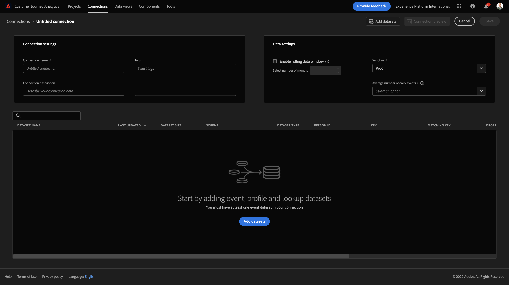

# 4.2Customer Journey AnalyticsでのAdobe Experience Platformデータセットの接続

## 目標

- データ接続 UI について
- Adobe Experience Platformデータを CJA に取り込む
- ユーザー ID とデータの組み合わせについて
- データストリーミングの概念をCustomer Journey Analytics

## 4.2.1 接続

に移動します。 [analytics.adobe.com](https://analytics.adobe.com) をクリックして、Customer Journey Analyticsにアクセスします。

Customer Journey Analyticsのホームページで、に移動します。 **接続**.

CJA と Platform の間でおこなわれた様々な接続を、以下に示します。 これらの接続の目標は、Adobe Analyticsのレポートスイートと同じです。 しかし、データの収集は全く異なります。 すべてのデータはAdobe Experience Platformデータセットから取得されます。

最初の接続を作成しましょう。 **新しい接続を作成**&#x200B;をクリックします。

次に、 **接続を作成** UI

これで、接続に名前を付けることができます。

次の命名規則を使用してください： `yourLastName – Omnichannel Data Connection`.

例：`vangeluw - Omnichannel Data Connection`

また、使用する正しいサンドボックスを選択する必要があります。 サンドボックスメニューで、サンドボックスを選択します。これは、 `Bootcamp`. この例では、使用するサンドボックスはです。 **Bootcamp**. また、 **毎日のイベントの平均数** から **100 万未満**.

サンドボックスを選択した後、この接続へのデータセットの追加を開始できます。 クリック **データセットを追加**.

## 4.2.2 Adobe Experience Platformデータセットの選択

データセットを検索します。 `Demo System - Event Dataset for Website (Global v1.1)`. クリック **+** をクリックして、この接続にデータセットを追加します。

次に、のチェックボックスを検索して確認します。 `Demo System - Event Dataset for Voice Assistants (Global v1.1)` および `Demo System - Event Dataset for Call Center (Global v1.1)`.

その後、これを取得します。 「**次へ**」をクリックします。

## 4.2.3 人物 ID とデータの結合

### 人物 ID

今の目標は、これらのデータセットを結合することです。 選択したすべてのデータセットに対して、 **人物 ID**. 各データセットには、独自のユーザー ID フィールドがあります。

ご覧のように、ほとんどのユーザーは自動的にユーザー ID を選択しています。 これは、Adobe Experience Platformの各プライマリでスキーマ識別子が選択されているからです。 例として、次にのスキーマを示します。 `Demo System - Event Schema for Call Center (Global v1.1)`を使用すると、プライマリ識別子が `phoneNumber`.

ただし、接続用にデータセットを結合する際に使用する識別子に影響を与えることもできます。 データセットにリンクされたスキーマ内で設定されている任意の識別子を使用できます。 ドロップダウンをクリックして、各データセットで使用できる ID を確認します。

前述のように、データセットごとに異なるユーザー ID を設定できます。 これにより、複数のオリジンの異なるデータセットを CJA で統合できます。 NPS や調査データを取り込むと、状況や何が起きたのかを理解するのに非常に興味深く役立つと思います。

ユーザー ID フィールドの値が対応している限り、ユーザー ID フィールドの名前は重要ではありません。 例えば、 `email` 1 つのデータセットと `emailAddress` を使用します。 If `delaigle@adobe.com` は、両方のデータセットのユーザー ID フィールドと同じ値です。CJA は、データをステッチできます。

現在、匿名行動を既知の行動に結び付けるなど、他にもいくつかの制限があります。 FAQ はこちらで確認してください。 [FAQ](https://experienceleague.adobe.com/docs/analytics-platform/using/cja-overview/cja-faq.html?lang=ja).

### ユーザー ID を使用したデータのステッチ

これで、ユーザー ID を使用したデータセットのステッチの概念を理解したので、次を選択します `email` を設定します。

各データセットに移動して、ユーザー ID を更新します。

次に、 `email` をクリックします。

3 つのデータセットを結び付けたら、続行する準備が整いました。

| データセット | 人物 ID |
| ----------------- |-------------| 
| デモシステム — Web サイトのイベントデータセット (Global v1.1) | 電子メール |
| デモシステム — 音声アシスタントのイベントデータセット（グローバル v1.1） | 電子メール |
| デモシステム — コールセンターのイベントデータセット（グローバル v1.1） | 電子メール |

また、すべてのデータセットで、次のオプションが有効になっていることを確認する必要があります。

- すべての新しいデータをインポート
- 既存のすべてのデータをバックフィル

クリック **データセットを追加**.

クリック **保存** 次の演習に進みます。
を作成した後、 **接続** CJA でデータが使用可能になるまでに数時間かかる場合があります。

次のステップ： [4.3 データビューの作成](./ex3.md)

[ユーザーフローに戻る 4](./uc4.md)

[すべてのモジュールに戻る](./../../overview.md)
