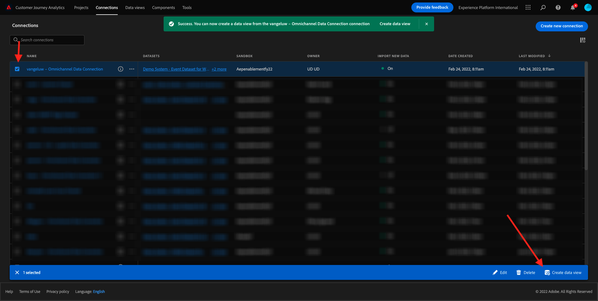

# 4.3 データビューの作成

## 目標

- データビュー UI について
- 訪問定義の基本設定を理解する
- データビュー内でのアトリビューションと永続性について

## 4.3.1 データビュー

接続が完了すると、ビジュアライゼーションに影響を与える操作を進めることができます。 Adobe Analyticsと CJA の違いは、CJA がビジュアライゼーションの前にデータを消去して準備するために、データビューが必要という点です。

データビューは、Adobe Analyticsの仮想レポートスイートの概念に似ています。ここでは、コンテキストに応じた訪問の定義、フィルタリングおよびコンポーネントの呼び出し方法も定義します。

1 つの接続につき少なくとも 1 つのデータビューが必要です。 ただし、一部の使用例では、同じ接続に対して複数のデータビューを持つことが最適です。この場合、異なるチームに異なるインサイトを提供することを目的としています。
会社をデータ主導型にしたい場合は、各チームでのデータの表示方法を調整する必要があります。 以下にいくつかの例を示します。

- UX デザインチームの UX 指標のみ
- デジタル分析チームが 1 言語のみを話せるように、Google Analyticsの KPI と指標にはCustomer Journey Analyticsと同じ名前を使用します。
- フィルターを適用して、例えば、1 つの市場のみ、1 つのブランド、またはモバイルデバイスのみのデータを表示します。

の **接続** 画面で、作成した接続の前にあるチェックボックスをオンにします。 クリック **データビューを作成**.

リダイレクト先： **データビューを作成** ワークフロー。

## 4.3.2 データビューの定義

これで、データビューの基本的な定義を設定できます。

この **接続** 前の練習で作成した内容は既に選択されています。 接続にという名前が付けられています `yourLastName – Omnichannel Data Connection`.

次に、次の命名規則に従って、データビューに名前を付けます。 `yourLastName – Omnichannel Data View`.

説明に同じ値を入力： `yourLastName – Omnichannel Data View`.

| 名前 | 説明 |
| ----------------- |-------------| 
| `yourLastName – Omnichannel Data View` | `yourLastName – Omnichannel Data View` |

の **タイムゾーン**、タイムゾーンを選択します。 **ベルリン、ストックホルム、ローマ、ベルン、ブリュッセル、ウィーン、アムステルダム GMT+01:00**. これは、一部の企業が異なる国や地域で事業を行っているので、非常に興味深い設定です。 各国に適切なタイムゾーンを割り当てると、例えば、ペルーでは、大多数の人が午前 4 時に T シャツを購入するといった、一般的なデータミスを回避できます。

また、主な指標の命名（人、セッションおよびイベント）を変更することもできます。 これは必須ではありませんが、人、セッション、イベント (Customer Journey Analyticsのデフォルトの命名規則 ) の代わりに、人、訪問、ヒットを使用することをお勧めするお客様もいます。

次の設定を行う必要があります。

クリック **保存して続行**.

## 4.3.3 データビューコンポーネント

この演習では、データを分析し、Analysis Workspaceを使用して視覚化するために必要なコンポーネントを設定します。 この UI には、次の 3 つの主な領域があります。

- 左側：選択したデータセットから使用可能なコンポーネント
- 中央：データビューに追加されたコンポーネント
- 右側：コンポーネント設定

>[!IMPORTANT]
>
>特定の指標やディメンションが見つからない場合は、フィールドが `Contains data` がデータビューから削除されました。 そうでない場合は、そのフィールドを削除してください。
>
>

次に、分析に必要なコンポーネントを、 **追加されたコンポーネント**. これをおこなうには、左側のメニューでコンポーネントを選択し、中央のキャンバスにドラッグ&amp;ドロップする必要があります。

最初のコンポーネントから始めましょう。 **名前 (web.webPageDetails.name)**. このコンポーネントを検索し、キャンバスにドラッグ&amp;ドロップします。

このコンポーネントは、スキーマフィールドの読み取りから派生できるページ名です `(web.webPageDetails.name)`.

ただし、 **名前** というのは、ビジネスユーザーがこのディメンションをすばやく理解するのに、名前が最適な命名規則ではないからです。

名前をに変更しましょう。 **ページ名**. コンポーネントをクリックし、内で名前を変更します。 **コンポーネント設定** 領域

本当に重要なのは **永続性設定**. eVar と prop の概念は CJA には存在しませんが、永続性設定も同様の動作を可能にします。

これらの設定を変更しない場合、CJA はディメンションを **Prop** （ヒットレベル）。 また、永続性を変更して、ディメンションを **eVar** （ジャーニー全体で値を保持します）。

eVar および Prop に詳しくない場合は、 [詳しくは、ドキュメントを参照してください](https://experienceleague.adobe.com/docs/analytics/landing/an-key-concepts.html).

ページ名は prop のままにしておきましょう。 したがって、 **永続化設定**.

| 検索するコンポーネント名 | 新しい名前 | 永続化設定 |
| ----------------- |-------------| --------------------| 
| 名前 (web.webPageDetails.name) | ページ名 |          |

次に、寸法を選択します。 **phoneNumber** キャンバスにドロップします。 新しい名前は次のようになります。 **電話番号**.

最後に、モバイル番号がユーザーレベルで保持されるように、永続性設定を変更します。

永続性を変更するには、右側のメニューで下にスクロールし、 **永続性** タブ：

永続化設定を変更するには、このチェックボックスをオンにします。 選択 **最新** そして **担当者（レポートウィンドウ）** 対象範囲。その人物の最後の携帯電話番号のみが考慮されます。 顧客が将来の訪問でモバイルに入力しなかった場合でも、この値は入力されたままになります。

| 検索するコンポーネント名 | 新しい名前 | 永続化設定 |
| ----------------- |-------------| --------------------| 
| phoneNumber | 電話番号 | 最新、担当者（レポートウィンドウ） |

次のコンポーネントは、 `web.webPageDetails.pageViews.value`.

左側のメニューで、を検索します。 `web.webPageDetails.pageViews.value`. この指標をキャンバスにドラッグ&amp;ドロップします。

名前をに変更します。 **ページビュー数** の下に **コンポーネント設定**.

| 検索するコンポーネント名 | 新しい名前 | 属性設定 |
| ----------------- |-------------| --------------------| 
| web.webPageDetails.pageViews.value | ページビュー数 |         |

アトリビューション設定では、これは空のままにします。

注意：指標の永続性設定は、Analysis Workspaceでも変更できます。 場合によっては、ビジネスユーザーがどれが最適な永続性モデルかを考慮する必要がないように、ここで設定することもできます。

次に、次の表に示すように、多くのDimensionと指標を設定する必要があります。

### Dimension

| 検索するコンポーネント名 | 新しい名前 | 永続化設定 |
| ----------------- |-------------| --------------------| 
| brandName | ブランド名 | 最新、セッション |
| 冷感 | 通話感 |          |
| 呼び出し ID | 呼び出しインタラクションタイプ |          |
| callTopic | トピックを呼び出し | 最新、セッション |
| ecid | ECID | 最新、担当者（レポートウィンドウ） |
| メール | 電子メール ID | 最新、担当者（レポートウィンドウ） |
| 支払タイプ | 支払タイプ |          |
| 製品追加メソッド | 製品追加メソッド | 最新、セッション |
| イベントタイプ | イベントタイプ |         |
| 名前 (productListItems.name) | 製品名 |         |
| SKU | SKU（セッション） | 最新、セッション |
| トランザクション ID | トランザクション ID |         |
| URL (web.webPageDetails.URL) | URL |         |
| ユーザーエージェント | ユーザーエージェント | 最新、セッション |
| レベル | ロイヤルティレベル |          |
| ポイント | 顧客のライフタイム値 |          |

### 指標

| 検索するコンポーネント名 | 新しい名前 | 属性設定 |
| ----------------- |-------------| --------------------| 
| 数量 | 数量 |          |
| commerce.order.priceTotal | 売上高 |         |

設定は次のようになります。

忘れずに **保存** データビュー。 クリック **保存** 今すぐ。

## 4.3.4 計算指標

データビューのすべてのコンポーネントを整理しましたが、ビジネスユーザーが分析を開始できるように、一部のコンポーネントを調整する必要があります。

覚えている場合、買い物かごに追加、製品表示、購入などの指標はデータビューに特に取り込まれませんでした。
ただし、というディメンションはあります。 **イベントタイプ**. では、3 つの計算指標を作成することで、これらのインタラクションタイプを導き出しましょう。

最初の指標から始めましょう。 **製品表示**.

左側で、を検索してください **イベントタイプ** 寸法を選択します。 次に、 **含まれるコンポーネント** キャンバス。

クリックして新しい指標を選択 **イベントタイプ**.

次に、コンポーネント名と説明を次の値に変更します。

| コンポーネント名 | コンポーネント説明 |
| ----------------- |-------------| 
| 製品表示 | 製品表示 |

今すぐカウントできるのは **製品表示** イベント。 それには、 **コンポーネント設定** 見るまで **除外する値を含める**. 必ずオプションを有効にしてください **値を含める/除外する**.

数えたいのは **製品表示**&#x200B;を指定してください **commerce.productViews** をクリックします。

これで、計算指標の準備が整いました。

次に、同じ手順を繰り返します。 **買い物かごに追加** および **購入** イベント。

### 買い物かごに追加

最初に同じディメンションをドラッグ&amp;ドロップします **イベントタイプ**.

同じ変数を使用している場合は、重複したフィールドに関するポップアップ警告が表示されます。 クリックしてください **強制的に追加**:

次に、指標の製品表示で行ったのと同じ手順に従います。
- まず、名前と説明を変更します。
- 最後に **commerce.productListAdds** 「買い物かごに追加」のみをカウントする条件として

| 名前 | 説明 | 条件 |
| ----------------- |-------------| -------------|
| 買い物かごに追加 | 買い物かごに追加 | commerce.productListAdds |

### 購入

最初に同じディメンションをドラッグ&amp;ドロップします **イベントタイプ** 前の両方の指標で行ったように。

同じ変数を使用している場合は、重複したフィールドに関するポップアップ警告が表示されます。 クリックしてください **強制的に追加**:

次に、製品表示と買い物かごに追加の指標に対して行ったのと同じ手順に従います。
- まず、名前と説明を変更します。
- 最後に **commerce.purchases** 購入のみをカウントする条件として

| 名前 | 説明 | 条件 |
| ----------------- |-------------| -------------|
| 購入 | 購入 | commerce.purchases |

最終的な設定は、次のようになります。 クリック **保存して続行**.

## 4.3.5 データビューの設定

この画面にリダイレクトされます。

このタブでは、データの処理方法を変更するための重要な設定を変更できます。 まず、 **セッションタイムアウト** から 30 分 すべてのエクスペリエンスイベントのタイムスタンプにより、すべてのチャネルにわたってセッションの概念を拡張できます。 例えば、顧客が Web サイトの訪問後にコールセンターに電話した場合、どうなりますか。 カスタムセッションタイムアウトを使用すると、セッションの種類と、そのセッションでデータを結合する方法を柔軟に決定できます。

このタブでは、セグメント/フィルターを使用して、データのフィルタリングなど他の変更を行うことができます。 この演習では、これを行う必要はありません。

完了したら、「 **保存して終了**.

>[!NOTE]
>
>後でこのデータビューに戻って、いつでも設定やコンポーネントを変更できます。 変更は、履歴データの表示方法に影響します。

これで、ビジュアライゼーションと解析部分を続行できます。

次のステップ： [4.4Customer Journey Analyticsにおけるデータの準備](./ex4.md)

[ユーザーフローに戻る 4](./uc4.md)

[すべてのモジュールに戻る](./../../overview.md)
