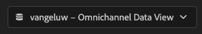
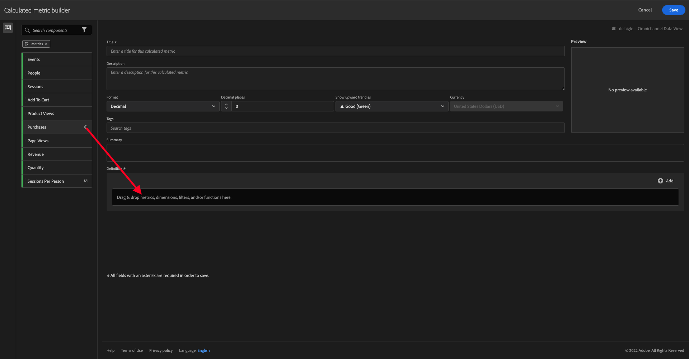

# 4.4 Analysis Workspaceでのデータの準備

## 目標

- CJA でのAnalysis Workspace UI について
- Analysis Workspaceでのデータ準備の概念の理解
- データ計算の実行方法を説明します

## 4.4.1 CJA でのAnalysis Workspace UI

Analysis Workspaceでは、単一の Analytics レポートの一般的な制限をすべて削除します。 堅牢で柔軟なキャンバスで、カスタム分析プロジェクトを作成できます。 任意の数のデータテーブル、ビジュアライゼーションおよびコンポーネント（ディメンション、指標、セグメントおよび時間の精度）をプロジェクトにドラッグ&amp;ドロップします。 即座に分類およびセグメントを作成し、分析用のコホートを作成し、アラートを作成し、セグメントを比較し、フローおよびフォールアウト分析を実行し、レポートをキュレーションおよびスケジュールして、会社の任意のユーザーと共有します。

Customer Journey Analyticsは、このソリューションを Platform データに基づいて実現します。 次の 4 分間の概要ビデオをご覧いただくことを強くお勧めします。

>[!VIDEO](https://video.tv.adobe.com/v/35109?quality=12&learn=on)

Analysis Workspaceを初めて使用する場合は、このビデオをご覧ください。

>[!VIDEO](https://video.tv.adobe.com/v/26266?quality=12&learn=on)

### プロジェクトを作成

次に、最初の CJA プロジェクトを作成します。 CJA 内の「プロジェクト」タブに移動します。
「**新規作成**」をクリックします。

これが見えます 選択 **空のプロジェクト** 次に、 **作成**.

その後、空のプロジェクトが表示されます。

まず、画面の右上隅にある正しいデータビューを選択してください。 この例では、選択するデータビューはです。 `vangeluwe - Omnichannel Data View`.

次に、プロジェクトを保存し、名前を付けます。 次のコマンドを使用して保存できます。

| OS | ショートカット |
| ----------------- |-------------| 
| Windows | Ctrl + S |
| Mac | Command + S |

次のポップアップが表示されます。

次の命名規則を使用してください：

| 名前 | 説明 |
| ----------------- |-------------| 
| `yourLastName - Omnichannel Analysis` | `yourLastName - Omnichannel Analysis` |

次に、「 **保存**.

## 4.4.2 計算指標

データビューのすべてのコンポーネントを整理しましたが、ビジネスユーザーが分析を開始できるように、一部のコンポーネントを調整する必要があります。 また、分析中に計算指標を作成して、インサイトの発見をさらに深くすることもできます。

例として、計算指標を作成します。 **コンバージョン率** の使用 **購入** データビューで定義した指標/イベント。

### コンバージョン率

計算指標ビルダーを開きましょう。 をクリックします。 **+** をクリックして、Analysis Workspaceで最初の計算指標を作成します。

この **計算指標ビルダー** が表示されます。

次を検索： **購入** をクリックします。 の下 **指標** クリック **すべて表示**

次に、 **購入** 指標を追加します。

通常、コンバージョン率はを意味します。 **コンバージョン/セッション**. 計算指標の定義キャンバスでも同じ計算を行います。 次を検索： **セッション** 指標をドラッグし、定義ビルダーの「 **購入** イベント。

除算演算子が自動的に選択されることに注意してください。

通常、コンバージョン率はパーセンテージで表されます。 形式をパーセンテージに変更し、2 桁の小数も選択します。

最後に、計算指標の名前と説明を変更します。

| タイトル | 説明 |
| ----------------- |-------------| 
| コンバージョン率 | コンバージョン率 |

画面には次のような内容が表示されます。

忘れずに **保存** 計算指標。

## 4.4.3 計算Dimension:フィルター（セグメント化）と日付範囲

### フィルター：計算Dimension

計算は指標にのみ使用するものではありません。 分析を開始する前に、いくつかを作成するのも興味深い作業です。 **計算Dimension**. これは基本的に、 **セグメント** Adobe Analyticsに戻る Customer Journey Analyticsでは、これらのセグメントは **フィルター**.

フィルターを作成すると、ビジネスユーザーは、役立つ計算ディメンションを使用して分析を開始できます。 これにより、いくつかのタスクを自動化し、導入部分を支援します。 次に例を示します。

1. 所有メディア、有料メディア、
2. 新規訪問と再訪問
3. 買い物かごを放棄した顧客

これらのフィルタは、解析パーツの前または中に作成できます（次の演習で作成します）。

### 日付範囲：計算時間Dimension

時間Dimensionは、別のタイプの計算ディメンションです。 既に作成済みのものもありますが、データ準備段階で独自のカスタム時間Dimensionを作成することもできます。

これらの計算時間Dimensionは、アナリストやビジネスユーザーが重要な日付を記憶し、それらを使用してレポート時間をフィルタリングおよび変更するのに役立ちます。 分析を行う際に頭に浮かぶ典型的な質問や疑問：

- 昨年のブラック・フライデーはいつでしたか？ 21、29 日？
- 私たちは 12 月にいつそのテレビキャンペーンを行いましたか？
- 2018 年のサマーセールはいつからいつまで行われましたか。 私は 2019 年と比べたい。 ところで、2019 年の正確な日は分かりますか？

これで、CJA Analysis Workspaceを使用したデータ準備の演習が完了しました。

次のステップ： [4.5Customer Journey Analytics](./ex5.md)

[ユーザーフローに戻る 4](./uc4.md)

[すべてのモジュールに戻る](./../../overview.md)
