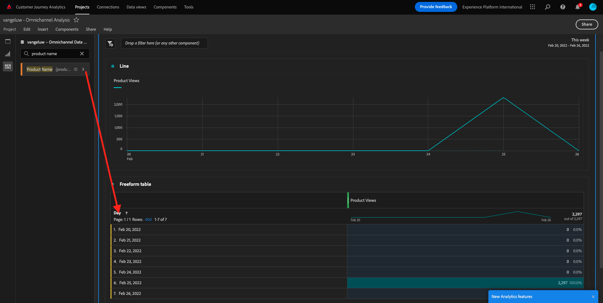
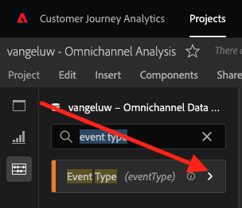
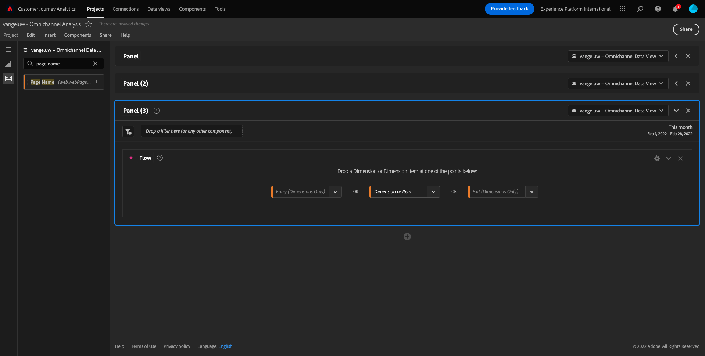
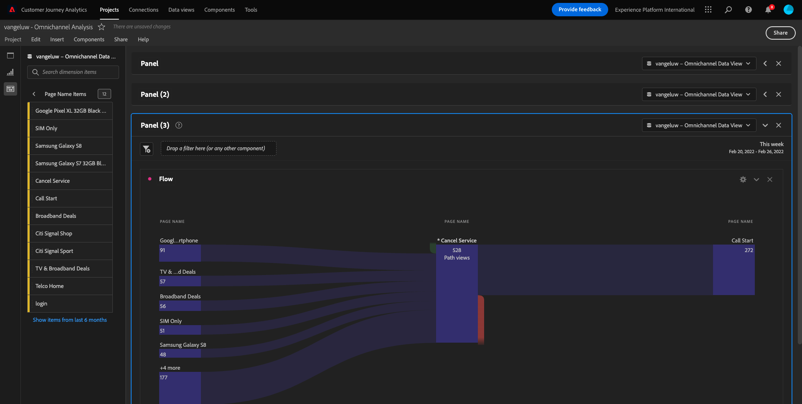
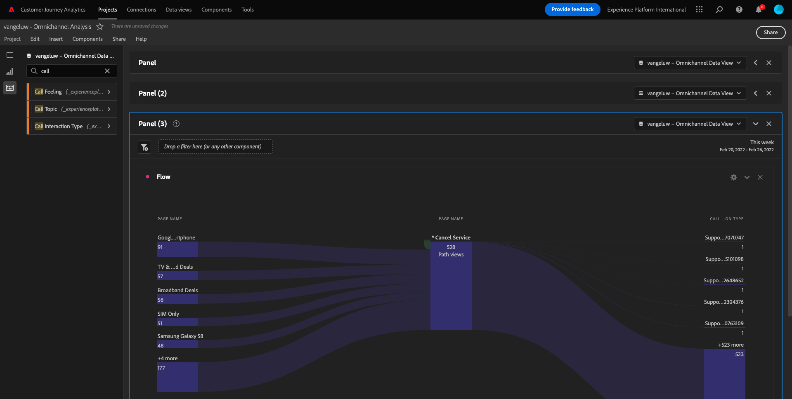
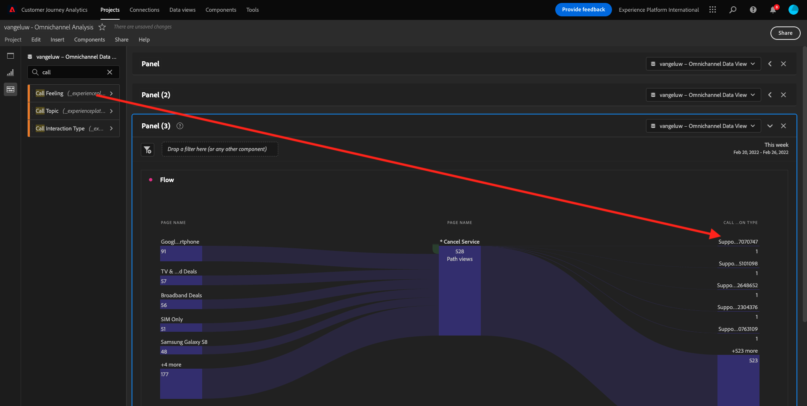
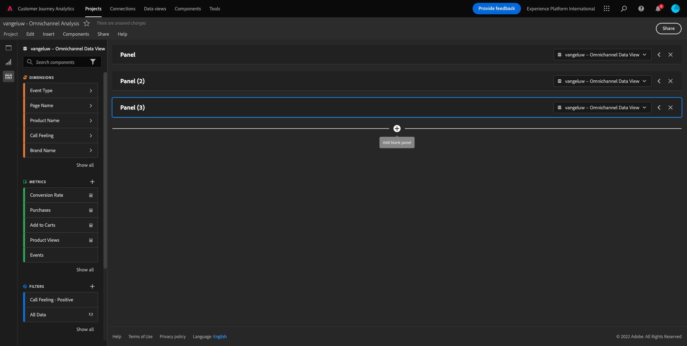

# 4.5Customer Journey Analytics

## 目標

- Analysis Workspace UI について
- Analysis Workspaceをそれほど異なるものにする機能を学びましょう。
- Analysis Workspaceを使用した CJA での分析方法を説明します

## コンテキスト

この演習では、CJA 内でAnalysis Workspaceを使用して、製品ビュー、製品ファネル、チャーンなどを分析します。

で作成したプロジェクトを使用します。 [4.4 Analysis Workspaceでのデータの準備](./ex4.md)に移動します。 [https://analytics.adobe.com](https://analytics.adobe.com).

プロジェクトを開く `yourLastName - Omnichannel Analysis`.

プロジェクトを開き、データビューで `CJA Bootcamp - Omnichannel Data View` 選択した場合、最初のビジュアライゼーションの作成を開始する準備が整いました。

## 毎日の製品表示数

まず、データを分析する適切な日付を選択する必要があります。 キャンバスの右側にあるカレンダードロップダウンに移動します。 該当する日付範囲をクリックして選択します。

>[!IMPORTANT]
>
>利用可能な最新のデータが19/09/2022に取り込まれました。この日付を含む日付範囲を選択してください。

左側のメニュー（コンポーネント領域）で、計算指標を探します。 **製品表示**. それを選択し、フリーフォームテーブル内の右上にあるキャンバスにドラッグ&amp;ドロップします。

自動的にディメンションを **日** が追加され、最初のテーブルを作成します。 これで、あなたの質問が即座に答えられたのが見えます。

次に、指標の概要を右クリックします。

クリック **視覚化** 次に、 **線** ビジュアライゼーションとして。

日別に製品ビューが表示されます。

時間範囲は、 **設定** を選択します。

の隣の点をクリックします。 **線** から **データソースを管理**.

次に、「 **選択をロック** を選択し、 **選択した項目** このビジュアライゼーションをロックして、常に製品表示のタイムラインを表示する場合。

## 閲覧された上位 4 件の製品

上位 4 件の製品は何を閲覧したか。

時々必ずプロジェクトを保存してください。

| OS | ショートカット |
| ----------------- |-------------| 
| Windows | Ctrl + S |
| Mac | Command + S |

閲覧された上位 4 件の製品の検索を開始します。 左側のメニューで、 **製品名** -Dimension。

今すぐドラッグ&amp;ドロップ **製品名** 交換する **日** ディメンション：

これが結果です

次に、いずれかの製品をブランド名で分類します。 を検索 **brandName** 最初の製品名の下にドラッグします。

次に、ロイヤルティレベルを使用して分類を実行します。 を検索 **ロイヤルティレベル** ブランド名の下にドラッグします。

次の内容が表示されます。

最後に、さらにビジュアライゼーションを追加できます。 左側のビジュアライゼーションで、を検索します。 `Donut`. テイク `Donut`をクリックし、キャンバスの下の **線** ビジュアライゼーション。

次に、テーブルで、 **ロイヤルティレベル**  行を **Google Pixel XL 32GB ブラックスマートフォン** > **シティ信号**. 3 行を選択する際、 **CTRL** ボタン（Windows の場合）または **コマンド** ボタン (Mac)

ドーナツグラフは次のように変化します。

また、 **線** グラフおよび **ドーナツ** は、互いに隣り合うように少し小さくグラフ化します。

の隣の点をクリックします。 **ドーナツ** から **データソースを管理**.
次に、「 **選択をロック** このビジュアライゼーションをロックして、常に製品表示のタイムラインを表示する場合。

Analysis Workspaceを使用したビジュアライゼーションの詳細については、こちらを参照してください。

- [https://experienceleague.adobe.com/docs/analytics/analyze/analysis-workspace/visualizations/freeform-analysis-visualizations.html?lang=ja](https://experienceleague.adobe.com/docs/analytics/analyze/analysis-workspace/visualizations/freeform-analysis-visualizations.html?lang=ja)
- [https://experienceleague.adobe.com/docs/analytics/analyze/analysis-workspace/visualizations/t-sync-visualization.html](https://experienceleague.adobe.com/docs/analytics/analyze/analysis-workspace/visualizations/t-sync-visualization.html)

## 表示から購入まで、製品インタラクションファネル

この質問を解決する方法は多数あります。 その 1 つは、製品のインタラクションタイプを使用し、フリーフォームテーブルで使用することです。 別の方法は、 **フォールアウトビジュアライゼーション**. 視覚化と分析を同時に行う際に、最後のものを使いましょう。

ここをクリックして、現在のパネルを閉じます。

新しい空のパネルを追加するには、 **+空のパネルを追加**.

ビジュアライゼーションをクリック **フォールアウト**.

前の演習と同じ日付範囲を選択します。

これが見えます

ディメンションを検索 **イベントタイプ** 左側のコンポーネントの下：

矢印をクリックして、次の寸法を開きます。

使用可能なイベントタイプがすべて表示されます。

項目を選択 **commerce.productViews** をクリックし、 **タッチポイントを追加** 中のフィールド **フォールアウトビジュアライゼーション**.

同じ操作を **commerce.productListAdds** および **commerce.purchases** をクリックし、 **タッチポイントを追加** 中のフィールド **フォールアウトビジュアライゼーション**. ビジュアライゼーションは次のようになります。

ここでは多くのことができます。 次に例を示します。時間の経過と共に比較し、各ステップをデバイスごとに比較したり、ロイヤルティ別に比較したりします。 ただし、買い物かごに品目を追加した後に顧客が購入しない理由など、興味深いものを分析したい場合は、CJA で最適なツールを使用できます。右クリックします。

タッチポイントを右クリックします。 **commerce.productListAdds**. 次に、 **このタッチポイントでのフォールアウトを分類**.

新しいフリーフォームテーブルが作成され、訪問者が購入しなかった場合の行動を分析します。

を **イベントタイプ** 作成者 **ページ名**、新しいフリーフォームテーブルで、購入確認ページの代わりにどのページに移動するのかを確認できます。

## [ サービスのキャンセル ] ページに到達する前に、サイト上でのユーザーの行動を教えてください。

この分析を実行する方法は多数あります。 フロー分析を使用して、検出部分を開始します。

ここをクリックして現在のパネルを閉じます。

新しい空のパネルを追加するには、 **+空のパネルを追加**.

ビジュアライゼーションをクリック **フロー**.

次の内容が表示されます。

前の演習と同じ日付範囲を選択します。

ディメンションを検索 **ページ名** 左側のコンポーネントの下：

矢印をクリックして、次の寸法を開きます。

表示されたすべてのページが表示されます。 ページ名を検索します。 **サービスをキャンセル**.
ドラッグ&amp;ドロップ **サービスをキャンセル** を中央のフィールドの「フロービジュアライゼーション」に変更します。

次の内容が表示されます。

次に、 **サービスをキャンセル** Web サイト上のページはコールセンターとも呼ばれ、結果は何かを示します。

ディメンションの下で、戻って、を探します。 **呼び出しインタラクションタイプ**.
ドラッグ&amp;ドロップ **呼び出しインタラクションタイプ** 右側の最初のインタラクションを **フロービジュアライゼーション**.

現在、 **サービスをキャンセル** ページ。

次に、ディメンションで、を検索します。 **通話感**.  ドラッグ&amp;ドロップして、 **フロービジュアライゼーション**.

次の内容が表示されます。

ご覧のように、フロービジュアライゼーションを使用してオムニチャネル分析を実行しました。 お客様の中には、サービスをキャンセルしようと思うお客様が、コールセンターに電話をかけた後にポジティブな気持ちを持っていたようです。 プロモーションで考えを変えたのか？

## ポジティブコールセンターの連絡先を持つお客様は、メイン KPI に対してどのように実行されますか。

最初にデータをセグメント化して、でユーザーのみを取得します。 **陽性** 呼び出し。 CJA では、セグメントをフィルターと呼びます。 コンポーネント領域内（左側）のフィルターに移動し、 **+**.

フィルタービルダー内で、フィルターに名前を付けます

| 名前 | 説明 |
| ----------------- |-------------| 
| 通話感 — ポジティブ | 通話感 — ポジティブ |

（フィルタービルダー内の）コンポーネントの下で、を探します。 **通話感** をクリックし、フィルタービルダー定義にドラッグ&amp;ドロップします。

今すぐ選択 **陽性** をフィルターの値として使用します。

範囲を **人物** レベル。

終了するには、 **保存**.

その後、戻ってきます。 まだ終わっていない場合は、前のパネルを閉じます。

新しい空のパネルを追加するには、 **+空のパネルを追加**.

前の演習と同じ日付範囲を選択します。

クリック **フリーフォームテーブル**.

作成したフィルターをドラッグ&amp;ドロップします。

指標を追加する時間。 開始 **製品表示**. フリーフォームテーブルにドラッグ&amp;ドロップします。 また、 **イベント** 指標。

同じ操作を **人**,  **買い物かごに追加** および **購入**. こんなテーブルになる。

最初のフロー分析のおかげで、新しい質問が思い浮かびました。 そこで、このテーブルを作成し、セグメントに対する KPI を確認して、その質問に答えることにしました。 ご覧のように、インサイトを見る時間は、SQL や他の BI ソリューションを使用する場合に比べてはるかに高速です。

## Customer Journey AnalyticsとAnalysis Workspaceのまとめ

このラボで学習したように、Analysis Workspaceはすべてのチャネルのデータを結び付け、完全なカスタマージャーニーを分析します。 また、ジャーニーに結び付けられていないのと同じワークスペースにデータを取り込むこともできます。
切り離されたデータを分析に取り込んで、ジャーニーにコンテキストを提供すると非常に役立ちます。 例としては、NPS データ、調査、Facebook Ads イベント、オフラインインタラクション（識別されていないもの）などがあります。

次のステップ： [4.6 インサイトから行動へ](./ex6.md)

[ユーザーフローに戻る 4](./uc4.md)

[すべてのモジュールに戻る](./../../overview.md)
