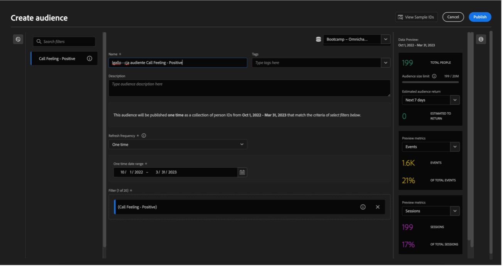

# 4.6 インサイトからアクションへ

## 目標

- Customer Journey Analyticsで収集されたビューに基づいてオーディエンスを作成する方法を理解する
- このオーディエンスをReal-Time CDPとAdobe Journey Optimizerで使用します

## 4.6.1 オーディエンスを作成して公開する

プロジェクトで、「コールフィーリング **というフィルターを作成し**、コールセンターへの通話が **肯定的** に分類されたユーザーの数を表示できました。 これで、これらのユーザーでセグメントを作成し、それらをジャーニーまたは通信チャネルでアクティベートできるようになります。

最初の手順は次のとおりです。前の演習で作成したパネルで、行 **1 を選択します。 呼び出し時のフィーリング – ポジティブ** を選択し、右クリックして「**選択からオーディエンスを作成**」オプションを選択します。

次に、モデルに従って、オーディエンスに名前を付けます **yourLastName - CJA オーディエンス呼び出しは肯定的だと感じています**。

作成されているオーディエンスのプレビューを表示することもできます。

最後に、「**Publish**」をクリックします。

## 4.6.2 オーディエンスをセグメントの一部として使用する

Adobe Experience Platformに戻り、**セグメント/参照** に移動すると、CJA で作成されたセグメントがアクティベーションやジャーニーで使用できる状態になっていることが確認できます。

次に、このセグメントをFacebook アクティベーションとカスタマージャーニーで使用します。

## 4.6.3 リアルタイムでのReal-Time CDPでのセグメントの使用

Adobe Experience Platformで、**セグメント/参照** に移動し、CJA で作成したオーディエンスを見つけます。

セグメントをクリックし、「**宛先に対してアクティブ化**」をクリックします。

**bootcamp-facebook** という名前の宛先を選択して、「次へ **をクリックし** す。

もう一度 **次へ** をクリックします。

「**オーディエンスの接触チャネル**」オプションを選択し、「**顧客から直接**」に設定して、「**次へ**」をクリックします。

「**完了**」をクリックします。

これで、セグメントがFacebookのカスタムオーディエンスに接続されました。 次に、Adobe Journey Optimizerで同じセグメントを使用します。

## 4.6.4 Adobe Journey Optimizerでのセグメントの使用

Adobe Experience Platformで **Journey Optimizer** をクリックし、左側のメニューで **ジャーニーをクリックして** 「ジャーニーを作成 **をクリックしてジャーニーの作成を開始し** す。

次に、左側のメニューの **イベント** で、「**セグメントの選定** を選択して、ジャーニーにドラッグします。

「セグメント」で、「**編集** をクリックしてセグメントを選択します。

以前に CJA で作成したオーディエンスを選択し、「**保存**」をクリックします。

準備完了！ ここから、このセグメントに該当する顧客のジャーニーを作成できます。

[ユーザーフロー 4 に戻る](./uc4.md)

[Voltar para todos os módulos （オオマルドゥロス山）](./../../overview.md)
