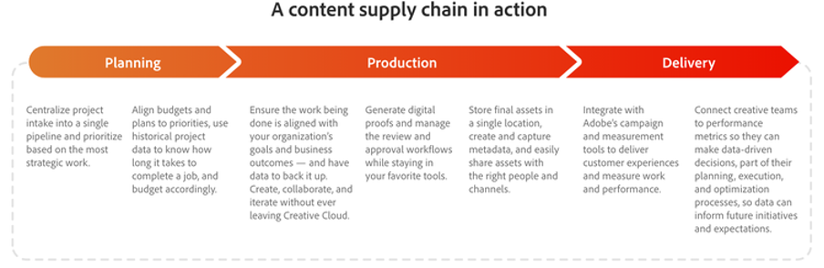

# コンテンツのサプライチェーンを 4 段階に分けて

世界は今やデジタルを第一に考えています。 企業が折り合いを付けざるを得ない現実であり、近い将来に実現するわけではありません。 このデジタル世界の一部として、私たちは、より多くの人々がソーシャルメディアを閲覧し、デジタルスペースに時間を費やし、リモートで作業することによって推進される [ コンテンツの巨大なサージ ](https://www.prnewswire.com/news-releases/content-marketing-market-size-to-grow-by-usd-487-24-billion--by-objective-platform-end-user-and-geography---forecast-and-analysis-2022-2026--301562808.html) に直面しています。

つまり、コンテンツを配信するチャネル、市場、形式が増え、そのコンテンツを動的かつ最適化する必要性が高まっているということです。

_Source:_ [_Deloitte デジタル_](https://www2.deloitte.com/content/dam/Deloitte/uk/Documents/consultancy/deloitte-uk-future-of-experience-time-to-market.pdf)

ありがたいことに、コンテンツの需要に追いつくことは困難ですが、コンテンツをより迅速かつ簡単に計画、作成、配信する方法があります。 **コンテンツサプライチェーン** と呼ばれます。 また、スムーズなプロセス、強力な戦略、確かなプラクティスを使用してコンテンツを運用できれば、コンテンツのライフサイクル全体を合理化できます。

## Collaborationは、コンテンツサプライチェーンをスムーズにするための鍵となります

コンテンツのサプライチェーンとは、人物、ツール、ワークストリームを統合して、コンテンツを効果的に計画、作成、管理および配信するプロセスです。 顧客はますます速いペースでより多くの優れたエクスペリエンスを求めているので、後ではなく、現時点でコンテンツを適切に取得する必要があります。 そうすることで、サイロを解消し、ワークフローを統合して、すべてのチームにプレッシャーをかけずに済みます。 また、テクノロジーへの投資からより多くの価値を引き出し、効率と価値の向上を支援します。

理論的には、あらゆる場所の企業がコンテンツをより迅速に提供できるようにするプロセスです。 しかし実際には、部門横断的なコンテンツのライフサイクルの自然な仕組みにより、ほとんどのサプライチェーンが機能しなくなっています。 残念ながら、これらのチェーンが壊れると、内部のミスアライメントが生じ、予算が減り、従業員が消耗し、市場に重要なメッセージを届ける速度が遅くなる可能性があります。

### コンテンツのサプライチェーンを破壊しているのは何ですか。

- [**70%**](https://business.adobe.com/resources/reports/future-creative-experiences.html) の時間が非コア作業に費やされ、役割間の異なるシステムで手動タスクを管理しています。
- クリエイティブ担当者の [**21%**](https://business.adobe.com/resources/reports/future-creative-experiences.html) が、効果的なエクスペリエンスを作成するための課題として、コンテンツプロセス全体でボトルネックを特定しました。
- クリエイティブやマーケターの [**31%**](https://www.fotoware.com/blog/dam-industry-trends-by-fotoware) は、複数の関係者とアセットを共有できないことが最大の課題であると述べています。

破損したコンテンツサプライチェーンの背後にある一般的な原因をより深く理解するために、次の 3 つの大まかな段階のそれぞれを見ると役に立ちます。

1. **計画** フェーズでは、均一なプロジェクトプロセスまたはリソースを追跡する一元化された方法がない場合、複数の改訂、過剰なコスト、高価な遅延、および作業のバランスの取れなくなる原因となります。 さらに、チームメンバー間の接続が切断されると、サイクルが無駄になり、優先度の変更が遅くなります。
2. **実稼動環境** では、サイロ化されたシステムと切断されたワークフローにより、ライブコラボレーション、アセットの検索、遅延、バーンアウトが制限されます。 また、クリエイティブ担当者は、タスクとアセットを手動で追跡し、繰り返しタスクを手動で実行する必要があるので、最終的にはコストが高くなり、エラーが増えます。
3. **配信** の時期が来ると、一元的なアセット管理システムを持たず、コンテンツを拡張するための自動化を限定的に行うことで、チームがチャネルをまたいで、パーソナライズされた包括的なエクスペリエンスを開始する能力を低下させます。 そのうえ、配信ツールとデータが断片化されると、アセットのパフォーマンスの正確な測定が制限されます。

## コンテンツのサプライチェーンを見直す時期です

間違いやミスコミュニケーションに苦しんでいるものは何でも、プロセスを改善する方法は常にあります。 これらの同じ 3 つのフェーズに続いて、ビジネスにとって優れたコンテンツサプライチェーンがどのように見えるかを詳しく説明します。

### 効率化された計画によるオペレーションの最適化

マーケティングチームが、部門横断的なコラボレーションを可能にし、プロジェクトを計画されたデータ駆動型の結果に結び付ける作業管理ソリューションを使用するのが理想的です。 また、マーケティングチームが戦略的に作業の優先順位を付け、それらの優先順位をクリエイティブチームに通知できるようにする必要もあります。 そこから、クリエイティブブリーフ、コンテンツバージョン、フィードバックを各プロジェクト内で結び付ける必要があります。これにより、チームが探しているものを見つけるために古いメールを検索する必要がなくなります。

クリエイティブチームは、クリエイティブおよび作業管理ツールと統合された [ 優れたデジタルアセット管理 ](https://business.adobe.com/products/experience-manager/assets/digital-asset-management.html) [ （DAM） ](https://business.adobe.com/products/experience-manager/assets/digital-asset-management.html) [ システム ](https://business.adobe.com/products/experience-manager/assets/digital-asset-management.html) をセットアップする必要があります。 これにより、顧客は関連するアセットを簡単に検索、使用、更新または再利用できます。 これらをすべて行うことで、市場投入のスピードを向上させ、内部の運用とプロセスを簡素化できます。

### シームレスなワークフローにより、実稼動環境の効率を高めます

計画を立てた後、優れた実稼動フェーズは、作業管理アプリケーションと共にすべてのシステムにわたってメタデータを同期する、統合されたアセット管理ソリューションを中心とします。 これにより、繰り返しの書式設定タスクを自動化できるので、品質を損なうことなく出力を高速化できます。 作業管理ソリューションをクリエイティブツールと統合すると、クリエイティブチームはリクエスト、ワークフロー、レビューを管理できるだけでなく、既に作業しているツール内のすべてのコンテンツを承認して最終処理することもできます。

次に、人工知能（AI）をコンテンツワークフローに追加すると、顧客の関心に合わせてパーソナライズされたコンテンツを、すべて自動的に大規模に作成できます。 つまり、チームは全員、最善を尽くすことができます。クリエイティブは魅力的なコンテンツを作成でき、マーケターはインサイトを使用してそのコンテンツをカスタマイズできます。 そうすれば、素晴らしいエクスペリエンスの提供を始めることができます。

### アセットの配信とコンテンツの効率の測定

コンテンツを配信する時期が来たら、関係するすべての重要なユーザーやチームが、必要なコンテンツにアクセスできることが重要です。 DAM がニーズを満たすように構築されていること、およびチームがタイプまたは選択した他のタグ別にアセットをカタログ化、追跡および検索できることを確認してください。 顧客の移動は速く、チームはビデオ、インフォグラフィック、写真、メッセージングなどを瞬時に見つけるために、さらに迅速に移動する必要があります。

さらに、真に優れたコンテンツサプライチェーンでは、画像のサイズ変更、バージョン管理の管理、複数の地域にまたがる重複の回避を自動的に行える DAM を使用します。 また、クリエイティブツール、作業管理ソリューション、コンテンツ管理システムを含むテクニカルスタック全体に統合する必要があるため、チームは新しいコンテンツをすばやく簡単に作成し、任意のチャネルに配信できます。 また、AI を使用すると、顧客の場所、興味、行動に適応する、関連性の高いコンテンツを自動的に生成できます。

## Adobeでは、クラス最高のコンテンツサプライチェーンを構築しています

アドビ独自の [Adobe Experience Cloud ビジネスは ](https://business.adobe.com/) キャンペーンに活気を与え、複数のセグメントをサポートするために、前に概要を説明した手順に従うことに焦点を当てています。 アドビのビジョンは、キャンペーンのフレームワークやメッセージに沿った、魅力的なコンテンツをグローバルに提供することです。

エンドツーエンドのコンテンツ作成プロセスの鍵は、[Adobe Workfront&rbrace; と ](https://business.adobe.com/products/workfront/main.html)2&rbrace;Adobe Experience Manager Assets[&#128279;](https://business.adobe.com/products/experience-manager/assets/aem-assets.html) を組み合わせることです。 同じ 3 つのフェーズで、どのようにプロセスにアプローチしたかを見てみましょう。

まず **プランニング** から始めます。ここでは、ビジネス全体から数百ものコンテンツ・リクエストを取り込み、四半期ごとの優先順位に基づいて優先順位を付けます。 次に、Workfrontのコンテンツ提案ダッシュボードを使用して透明性を提供し、関係者と連携して、マーケティング、クリエイティブ、web、営業の各チーム間ですばやく承認を得ることができます。 これにより、四半期の目標の記録を作成し、クリエイティブチームと web チームにリクエスト量の合計を可視化して、リソースの計画を立てることができます。 さらに、マネージャーはチームのワークロードを簡単に監視できます。

**実稼動** に移行すると、承認されたリクエストは、クリエイティブブリーフ、web ランディング場所、プロモーション要件など、クリエイティブチームにより詳細な情報を提供するプロジェクトに変わります。 その後、コンテンツ戦略担当者は、Workfrontの関係者やクリエイティブと協力して、コンテンツをレビューし、期限に間に合わせます。 Workfrontでこれらをすべて行うので、重複した手順、不要なメール、複数のフォーム入力を排除し、アセットタイプ別に実稼動サイクルをトラッキングし始めています。 これにより、プロジェクトデータを詳細に調べることで、スタッフのリソースのバランスを取り、必要に応じて優先順位を再設定できます。

コンテンツを **配信** する準備ができたら、[ オファー、アセットおよびプロモーションコンテンツをExperience Manager Assetsに公開 ](https://business.adobe.com/customer-success-stories/adobe-content-hub-case-study.html) します。 特に、すべては社内のマーケティングハブに送られ、社内の誰もが必要なときに必要なコンテンツの正確な部分をすばやく見つけることができます。

コンテンツの実用的なサプライチェーンを構築することで、大きな成果が得られたと思います。 具体的には、1 つの作業管理システムに移行することで、重複データのエントリを半分に減らしました。 常に改善の余地があるとは言え、顧客の期待に一歩先んじて取り組むためのプロセスに向かう準備が整っていることを我々は理解しています。

>[!NOTE]
>
> この記事は当初、[_Adobe Experience Cloudのブログ_](https://business.adobe.com/blog/how-to/create-a-content-supply-chain-that-will-stand-the-test-of-time) で公開されました。

## 第 4 段階：インサイト

コンテンツサプライチェーンは、すべての問題に魔法のような解決策ではありません。 これは、顧客に提供したいすべてのエクスペリエンスをより効率的に管理できる作業方法です。 あなたは歩いて最終的に実行することができます前に、クロールする必要があります。

そして、最後に立ち上げて運用したら、エンドツーエンドのコンテンツサプライチェーンから引き出すことができる追加の事項、つまりインサイトが必要になります。 実際、しばらくすると、特定のアクションが時間、予算にどのように影響するかを調べることができます。これについては、ブートキャンプの最後でも説明します。

次の手順：[ クリエイティブブリーフ ](./creative-brief.md)

[すべてのモジュールに戻る](./overview.md)
