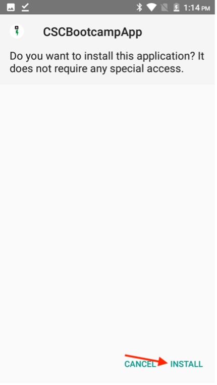

# モバイルアプリの検証

## Android

- Android デバイスに [&#x200B; こちら &#x200B;](https://tinyurl.com/CSCBootcampApp) からモバイルアプリをダウンロードします。 [Android エミュレーター &#x200B;](https://developer.android.com/studio/run/emulator) または物理Android デバイスにダウンロードできます。

- ファイルをタップして開きます。

- ポップアップで、インストールボタンをクリックしてから、「とにかくインストール」をクリックして確認してください。

- アプリが正常にインストールされたら、「開く」ボタンをクリックして開きます。

。

## iOS

>[!WARNING]
>
> Bootcamp Wifi ネットワークに接続されていることを確認してください。 アプリは同じ Wi-Fi ネットワーク上にある場合にのみ機能するので、これは不可欠です。

これは公式に配布されているアプリではないので、iOSの設定は、以前とは多少異なります。

- [App Store](https://itunes.apple.com/app/apple-store/id982107779) から Expo Go アプリをダウンロードします。

- iPhone カメラアプリで、Adobeチームがブートキャンプで投影する QR コードをスキャンします。 プロンプトが表示されたら、表示されるボタンをクリックします。

- これにより、iPhoneでアプリを開くための web ページが読み込まれます。 「Expo Go」ボタンをクリックして、ダウンロードしたアプリで開きます。

- ポップアップ表示されるダイアログで「開く」を選択すると、Expo Go アプリに正しい情報が読み込まれます。

- Expo Go アプリが開かれると、ローカルネットワーク上のデバイスを見つけるように求められます。 前述のように、これは必要です私たちは、私たちのAdobe機器からあなたの携帯電話にアプリをダウンロードすることができます。 「許可」をクリックしてこれを読み込みます。

- 最初にエラーページが表示される場合があります。 「もう一度試す」ボタンをクリックするだけで、デバイスにアプリを読み込むことができます。 Expo Go アプリを閉じるか、Wi-Fi ネットワークからデバイスを切断すると、アプリが応答しなくなります。

## アプリのナビゲーション

アプリで、ドロップダウンからチームを選択できます。 これにより、AEMで作成したコンテンツに動的に読み込まれます。 コンテンツに満足できない場合は、前に作成したコンテンツフラグメントでコンテンツをいつでも更新して、コンテンツを再公開できます。 変更がアプリに反映されているのが確認できます。

次の手順：[&#x200B; フェーズ 3 – 配信：AEMでページを作成 &#x200B;](./page-in-aem.md)

[フェーズ 2 に戻る – 実稼動：モバイルアプリコンテンツの作成](../production/app.md)

[すべてのモジュールに戻る](../../overview.md)
