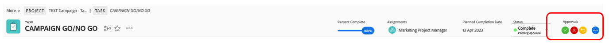

# キャンペーン開始/終了

## Adobe Workfrontでのキャンペーンの承認

これですべてのタスクが完了し、結果としてすべてのタスクを 100%に設定したので、キャンペーンをパブリッシュするには、「キャンペーンの開始/終了」（レビューおよび承認タスク）だけが必要です。

もちろんキャンペーンの承認中なので、タスク 20 の「キャンペーン実行/中止」を 100%完了に設定します。 これにより、レビューとトリガーのプロセスが自動的に承認されます。

我々が実施しているプロセスを見てみましょう。 タスク 20 の名前「キャンペーン開始/終了」をクリックします。

次に、承認の節を見てみましょう。

私、Petra、または誰かが最初のステップとしてこの go/no go をレビュー/承認する必要がある 2 つのステップのプロセスであり、その後、Olivia( マーケティングオペレーションのDirector) が彼女の最後の go を与えることができます。

したがって、右上に承認ボタンが表示され、最初のステップでこの「移動」を承認できるようになりました。 緑のチェックマークをクリックして承認します。

我々の全てのプロジェクトは、現在、Olivia の承認待ちです。 承認後、（もちろん）Campaign を公開できます。

## ソーシャルメディアキャンペーンを開始

キャンペーンの開始準備が整い、自転車の販売を開始する準備が整ったので、今こそ盛り上がりを見せています。 ソーシャルメディアの投稿を使った方が良いでしょうか？

既にソーシャルメディア投稿を作成して承認しているので、デモInstagramアカウントに投稿できます。

>[!WARNING]
> 家事管理に関する規則をいくつか
> 
> これは、われわれの海賊版の話を完成させるために作られた記事だ。 これは **共有される、従う、または公にされることを意図しない**. 掲示を守って下さい **敬意と専門家**. **資格情報を共有しない** 密告して下さい **すべてのデバイスがログアウトされます** この練習の後。

- 「csc_bootcamp_emea」というInstagramアカウントのパスワードが入手されます。
- 新しい投稿を作成します。キャプションの最後の部分に、参加する場所、日付、チーム番号を追加します。
- 他のチームが同じ素材で何らかの芸術的な自由をとっている様子を見るには、自由に様々な投稿にスクロールしてみてください。

## おめでとうございます。キャンペーンが公開されました。

次のステップ： [フェーズ 4 — インサイト：概要](../insights/overview.md)

[フェーズ 3 に戻る — 配信：AEMでページを作成](./app.md)

[すべてのモジュールに戻る](../../overview.md)
