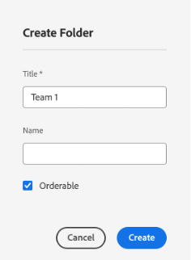

# AEMでページを作成

AEMでは、次の 2 つの環境を提供します。オーサー環境とパブリッシュ環境 これらが相互に作用するので、コンテンツを Web サイト上で利用でき、訪問者が体験できるようになります。

オーサー環境は、コンテンツを作成、更新し、実際に公開する前にレビューするためのメカニズムを提供します。

- 作成者は、コンテンツ（ページ、アセット、パブリケーションなどの様々な種類のコンテンツ）を作成およびレビューします。
- このコンテンツが、ある時点で web サイトに公開されます。

作成者は、AEM内で Web サイトを整理する必要があります。 これには、次の目的でコンテンツページを作成し、名前を付ける必要があります。

- 作成者がオーサー環境でコンテンツページを容易に検索できるようにする
- サイトへの訪問者がパブリッシュ環境でコンテンツページを容易に閲覧できるようにする

Web サイトの構造は、コンテンツページを保持する「ツリー構造」と見なすことができます。これらのコンテンツページの名前を使用して URL を生成します。一方でタイトルは、ページコンテンツを閲覧したときに表示されます。以下の例では、ページのアクセス可能な URL は/content/adobike/language-masters/en.htmlです

既存の Web サイトに新しいページを追加する方法と、コンテンツを再利用する方法について説明します。

## ホームページの作成

前の節で説明したように、AEMのページ階層はツリー構造として機能します。 つまり、最上位レベルのページから開始します。ホームページ

- でAEM作成者に移動します。 [https://author-p71057-e991028.adobeaemcloud.com/](https://author-p71057-e991028.adobeaemcloud.com/) をクリックし、指定した資格情報を使用してログインします。

- AEM Start メニューから、 Navigation / Sites を選択します。

- まず、既存のツリー構造を、ホームページを作成する場所に移動します。 最初の列で「Adobike」を選択し、2 番目の列で「Bootcamp」を選択してツリー構造をナビゲートします。 次に、このページの下にページを作成するには、「作成」ボタンをクリックし、ポップアップメニューの「ページ」を選択します。

- 新しい画面が開き、新しいページを設定します。 まず、ページテンプレートを選択します。 AEMのページテンプレートを使用すると、ページの構造を定義したり、このページで使用できるコンテンツを定義したりできます。 ホームページ（ランディングページ）を作成する場合は、ランディングページテンプレートを選択し、「次へ」ボタンをクリックして続行します。

- 次の画面で、ページに初期情報を入力できます。 最も重要な情報は、タイトル（必須プロパティで、 \*が付く）です。これは、ページに意味のある名前を付けることを目的としています。 「名前」を入力しない場合、AEMは、SEO のベストプラクティスに従って、ページが利用可能になる URL を自動的に生成します。 この場合、このフィールドを空のままにできます。 他のプロパティも入力できますが、他のタブを調べてみることもできますが、この bootcamp の目的のためには、まだ他のプロパティを入力していません。 ページを作成する準備が整ったら、「作成」ボタンをクリックします。

- AEMがページを作成します。 完了したら、ポップアップが表示され、「開く」ボタンをクリックして新しく作成したページを開くことができます。

- AEM Editor が表示されます。 これは、「表示される内容」（または WYSIWYG）エディターで、ページにコンポーネントをドラッグ&amp;ドロップしてページを作成できます。 ナビゲーションを見てみましょう。
   
   - 左側には、ページで使用できるアセットを含むサイドパネル、このページで使用できるコンポーネント（または構築ブロック）、ページの構造を示す便利なツリービューがあります。 これらのアイコンのいずれかをクリックして、ビューを開きます。
   - 右側には、「レイアウトコンテナ」が表示されます。 これは、目的のコンポーネントをドロップできる領域です。
   - 次に、ページにコンテンツを入力します。 必要に応じて、自由にホームページを設定できます。 次の例では、製品ページにリンクする画像コンポーネントと、2 つのティーザーコンポーネントを使用しました。

## エクスペリエンスフラグメントを活用したエクスペリエンスの再利用

ホームページを作成し、Adobeike のローンチの準備が整いました。 ただし、自転車のユニークな販売ポイントなど、そこにあるコンテンツの一部は、複数のページで再利用できます。

理想的には、この独自のセールスポイントエクスペリエンスを 1 回だけ作成して、一元的に管理し、パーソナライズされた一貫性のあるエクスペリエンスを確保したいと考えています。 AEMでは、「エクスペリエンスフラグメント」を使用してこれを実行できます。 エクスペリエンスフラグメントは、ページ内で参照できるコンテンツとレイアウトを含む 1 つまたは複数のコンポーネントからなるグループです。任意のコンポーネントを含めることができます。

次に、をすぐに使用する場合について説明します。

- でAEM作成者に移動します。 [https://author-p71057-e991028.adobeaemcloud.com/](https://author-p71057-e991028.adobeaemcloud.com/) をクリックし、指定した資格情報を使用してログインします。

- AEM Start メニューで、 Navigation / Experience Fragments を選択します。

- 次の画面で、チームが再利用可能なエクスペリエンスを保存するために使用できるフォルダーを作成します。 列表示で、 Adobeike / Bootcamp に移動し、「作成」ボタン/「フォルダー」ボタンをクリックします。

- モーダルポップアップが表示されたら、フォルダーにチームの名前を付けます。 「名前」フィールドは空のままにすることができます。AEMによって自動的に生成されます。 フォルダーに名前を付けたら、「作成」ボタンをクリックしてフォルダーを作成します。

- これで、フォルダーがポップアップ表示されます。 クリックし、「作成」ボタン/「エクスペリエンスフラグメント」ボタンをクリックします。

- まず、エクスペリエンスフラグメントテンプレートを選択します。 ページと同様に、エクスペリエンスフラグメントも複数のテンプレートに基づくことができ、それぞれが事前定義済みのエクスペリエンスを予測します。 ここでは、Web サイトのコンテンツを再利用するので、左上のチェックボックスを選択し、「次へ」ボタンをクリックして、「エクスペリエンスフラグメント Web バリエーションテンプレート」を選択します。

- エクスペリエンスフラグメントに意味のあるタイトルを付けます（例： ）。「Adobike USPs」を選択し、「作成」ボタンをクリックします。

- エクスペリエンスフラグメントを作成したら、モーダルの「開く」ボタンをクリックして、エクスペリエンスフラグメントにコンテンツを追加できます。

- ページの編集時と同様に、レイアウトコンテナを表示し、そこにコンテンツを追加できます。

- ここでは、ホームページからコンポーネントをコピーします。 新しいタブで、前の章で説明したようにホームページに移動し、コピーするコンポーネントを選択して、コピーアイコンをクリックします。

- 次に、エクスペリエンスフラグメントに戻り、レイアウトコンテナをクリックして、貼り付けボタンをクリックします。

>[!NOTE]
>
> ヒント：AEMを使用すると、任意のページまたはエクスペリエンスフラグメントで「レイアウトモード」を使用できます。 これにより、コンポーネントのサイズを変更したり、あらゆるデバイスのエクスペリエンスを最適化したりできます。

- 上部のメニューから、ドロップダウンを開き、「レイアウト」を選択してレイアウトモードに入ります。

- 次に、任意のコンポーネントを選択し、コンポーネントの両側のハンドルをドラッグするだけで、画面に表示される列にスナップして、サイズを変更できます。

- デフォルトでは、すべてのブレークポイントに対して編集を行っています。 ただし、特定のブレークポイントに対して編集を行う場合は、ページ上部のツールバーから一致するデバイスを選択できます。 次に、作成するブレークポイントがハイライト表示されます。

- ご覧のように、モバイルの 2 列レイアウトは適切に表示されません。 モバイルで 1 列のレイアウトを作成します。 デスクトップで確認できるように、エクスペリエンスも変わりませんが、モバイルでは、コンテンツの 1 列しかない、より優れたエクスペリエンスが得られるようになりました。

- 最後に、ホームページでこのエクスペリエンスを再利用できます。 コンテンツを表示する場所のページ上に「エクスペリエンスフラグメント」コンポーネントをドラッグ&amp;ドロップします。 エクスペリエンスフラグメントからコピーしたコンテンツを使用するので、コピーしたコンテンツは削除できます。

- エクスペリエンスフラグメントコンポーネントの設定ダイアログを開き、パスピッカーを使用してエクスペリエンスフラグメントを作成した場所を選択します。

- 最後に、ページで再利用可能なエクスペリエンスが得られました。

## 製品ページの作成

AEMと統合されたAdobe Commerceを使用する場合、生成された概要からサイトを移動する際に使用する、一般的な製品の詳細ページを用意できます。 ただし、製品固有のコンテンツとインスピレーションを与えるコンテンツを組み合わせたインスピレーションを与えるページも見たいと思う場合があります。 事前に作成したとおりに店舗をコピーしてから、感動的な製品ページを作成しましょう。

- でAEM作成者に移動します。 [https://author-p71057-e991028.adobeaemcloud.com/](https://author-p71057-e991028.adobeaemcloud.com/) をクリックし、指定した資格情報を使用してログインします。

- AEM Start メニューから、 Navigation / Sites を選択します。

- 列の概要で、事前作成済みの Web サイトをショップに移動します。アドビケ/言語マスター/アドビケ/ショップ 次に、チェックボックスを含むショップページを選択し、作成/ライブコピーをクリックします。 多くの詳細を入力しすぎずに、サイトで使用できるページのコピーが作成されます。これにより、AEM Multi Site Manager を使用して、既存のページとコンテンツを再利用できます。

- ポップアップ表示される画面で、チーム名の横にあるチェックボックスをオンにして、チームのサイトを宛先として選択します。 次に、「次へ」ボタンをクリックします。

- Multi Site Manager の詳細には触れませんが、この設定を引き継ぐだけで済みます。\
   タイトル：ショップ\
   名前：店\
   ロールアウトの設定：標準のロールアウト設定\
   ライブコピーを設定したら、「作成」ボタンをクリックします。

>[!NOTE]
>
> ライブコピーの詳細については、 チェックアウト [「ライブコピーの作成と同期」](https://experienceleague.adobe.com/docs/experience-manager-cloud-service/content/sites/administering/reusing-content/msm/creating-live-copies.html?lang=en)

- 完了すると、Web サイトで利用可能なストアが表示されます。 これを選択し、「作成」\>「ページ」をクリックして、インスピレーションを得られる製品ページを作成します。

- ここでは、ページに製品情報を表示するので、製品ページテンプレートを使用してページを作成します。 選択し、「次へ」ボタンをクリックします。

- ページのメタデータを入力し、ホームページと同様に、「作成」ボタンをクリックします。 作成したら、「開く」ボタンをクリックしてページを開くことができます。 ご覧のように、製品の詳細コンポーネントが既に設定されています。

- まず、先ほど作成したエクスペリエンスフラグメントを追加します。 その後、引き続きページに必要なコンテンツを追加できます。 最後に、設定ダイアログで製品ファインダーを選択し、アドビのカテゴリを選択して、製品の横にあるボックスをオンにすることで、アドビの製品を表示するように製品詳細コンポーネントを設定します。 次に、「追加」ボタンをクリックします。

- 一元的に管理されるコンテンツやAdobe Commerceからの製品情報など、最大限のインスピレーションを得られるページが作成されました。

次のステップ： [フェーズ 3 — 配信：キャンペーン開始/終了](./go-nogo.md)

[フェーズ 3 に戻る — 配信：モバイルアプリを検証](./app.md)

[すべてのモジュールに戻る](../../overview.md)
