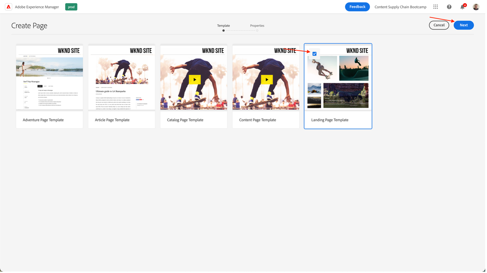

# AEMでページを作成

AEMには 2 つの環境（オーサー環境とPublish環境）があります。 これらのやり取りを使用すると、web サイトでコンテンツを公開できるので、訪問者はコンテンツを体験できます。

オーサー環境は、実際にコンテンツを公開する前に、このコンテンツを作成、更新、レビューするためのメカニズムを提供します。

- 作成者は、コンテンツ（ページ、アセット、パブリケーションなどの様々なタイプのコンテンツ）を作成およびレビューします。
- このコンテンツが、ある時点で web サイトに公開されます。

作成者は、AEM内で web サイトを整理する必要があります。 この作業では、次の目的でコンテンツページを作成して名前を付けます。

- 作成者は、オーサー環境でコンテンツページを容易に見つけることができます
- サイトへの訪問者がパブリッシュ環境でコンテンツページを容易に参照できるようにする

Web サイトの構造は、コンテンツページを保持する「ツリー構造」と見なすことができます。 これらのコンテンツページの名前は、URL の形成に使用されます。一方でタイトルは、ページコンテンツを表示したときに表示されます。 次の例では、ページのアクセス可能な URL は/content/adobike/language-masters/en.htmlになります。

既存の web サイトに新しいページを追加する方法と、一部のコンテンツを再利用する方法を見てみましょう。

## ホームページの作成

前の節で説明したように、AEM ページ階層はツリー構造として機能します。 つまり、最上位レベルのページ（ホームページ）から開始します。

- [https://author-p71057-e991028.adobeaemcloud.com/](https://author-p71057-e991028.adobeaemcloud.com/) のAEM オーサーに移動し、提供された資格情報を使用してログインします。

- AEMの [ スタート ] メニューから、[ ナビゲーション ] \> [ サイト ] を選択します。

- まず、既存のツリー構造を、ホームページを作成する場所に移動します。 最初の列で「Adobike」を選択し、2 番目の列で「Bootcamp」を選択して、ツリー構造に移動します。 次に、このページの下にページを作成するには、「作成」ボタンをクリックして、ポップアップ表示されるメニューで「ページ」を選択します。

- これにより、新しい画面が開き、新しいページを設定します。 まず、ページテンプレートを選択します。 AEMのページテンプレートを使用すると、ページの構造を定義したり、このページで使用できるコンテンツを定義したりできます。 ランディングページであるホームページを作成する場合は、ランディングページテンプレートを選択し、「次へ」ボタンをクリックして続行します。

- 次の画面で、ページに初期情報を入力できます。 最も重要な情報はタイトル（必須プロパティで、\*で示されます）です。これは、ページにわかりやすい名前を付けることを目的としています。 「名前」に入力しない場合、AEMは SEO のベストプラクティスに従って、ページが使用可能な URL を自動的に生成します。 この場合、このフィールドは空のままにすることができます。 他のプロパティも入力できますが、他のタブを調べる場合もありますが、このブートキャンプの目的では、まだ他のプロパティは入力しないでください。 ページを作成する準備ができたら、「作成」ボタンをクリックするだけです。

- AEMでページが作成されます。 完了すると、ポップアップが表示され、「開く」ボタンをクリックして新しく作成したページを開くことができます。

- これで、AEM Editor に移動します。 これは、「表示されているものこそ」（または WYSIWYG）エディターで、コンポーネントをページにドラッグ&amp;ドロップしてページを作成できます。 ナビゲーションを見てみましょう。
  
   - 左側には、ページで使用できるアセット、このページで使用できるコンポーネント（または構築ブロック）を含むサイドパネルと、ページの構造を示す便利なツリービューがあります。 これらのアイコンのいずれかをクリックして、表示を開きます。
   - 右側には、「レイアウトコンテナ」が表示されます。 これは、目的のコンポーネントをドロップできる領域です。
   - ページにコンテンツを入力しましょう。 自由にホームページに入力してください。 以下の例では、製品ページにリンクする画像コンポーネントと 2 つのティーザーコンポーネントを使用しました。

## エクスペリエンスフラグメントを活用したエクスペリエンスの再利用

これで、Adobike のローンチに完全に対応するホームページを作成しました。 しかし、そこに掲載されているコンテンツの一部、例えば私たちの自転車のユニークなセールスポイントは、複数のページで再利用することができます。

理想的には、この独自のセールスポイントエクスペリエンスを 1 回だけ作成して、一元的に管理し、パーソナライズされた一貫性のあるエクスペリエンスを確保できるようにします。 AEMでは、「エクスペリエンスフラグメント」を使用してこれを行うことができます。 エクスペリエンスフラグメントは、ページ内で参照できるコンテンツおよびレイアウトを含む 1 つ以上のコンポーネントのグループです。 任意のコンポーネントを含めることができます。

すぐに使用できるように配置しましょう。

- [https://author-p71057-e991028.adobeaemcloud.com/](https://author-p71057-e991028.adobeaemcloud.com/) のAEM オーサーに移動し、提供された資格情報を使用してログインします。

- AEM スタートメニューから、「ナビゲーション \> エクスペリエンスフラグメント」を選択します

- 次の画面で、チームが再利用可能なエクスペリエンスを保存するために使用できるフォルダーを作成します。 列表示で、Adobike \> Bootcamp に移動し、「作成\> フォルダー」ボタンをクリックします。

- モーダルがポップアップ表示されたら、フォルダーにチームの名前を付けます。 「名前」フィールドは空のままにすることができます。AEMによって自動的に生成されます。 フォルダーに名前を付けたら、「作成」ボタンをクリックしてフォルダーを作成します。

- これで、フォルダーのポップアップが表示されます。 エクスペリエンスフラグメントを作成ボタンをクリックしてから、作成\> エクスペリエンスフラグメント ボタンをクリックします。

- まず、エクスペリエンスフラグメントのテンプレートを選択します。 ページと同様に、エクスペリエンスフラグメントは複数のテンプレートに基づくことができ、それぞれが事前定義されたエクスペリエンスを予測します。 この場合は、web サイトでコンテンツを再利用するので、左上隅のチェックボックスをオンにして「次へ」ボタンをクリックし、「エクスペリエンスフラグメント web バリエーションテンプレート」を選択します。

- エクスペリエンスフラグメントに「Adobike USPs」などの意味のあるタイトルを付け、「作成」ボタンをクリックします。

。

- エクスペリエンスフラグメントを作成したら、モーダルの「開く」ボタンをクリックして、エクスペリエンスフラグメントにコンテンツを追加します。

![[ 開く ] をクリック ](./images/delivery-web-create-xf-success.png)

- ページの編集時と同様に、コンテンツを追加できるレイアウトコンテナが表示されます。

- 次に、ホームページからコンポーネントをコピーします。 新しいタブで、前の章で説明したようにホームページに移動し、コピーするコンポーネントを選択して、コピーアイコンをクリックします。

- 次に、エクスペリエンスフラグメントに戻り、レイアウトコンテナをクリックして、貼り付けボタンをクリックします。

>[!NOTE]
>
> ヒント：AEMでは、任意のページまたはエクスペリエンスフラグメントで「レイアウトモード」を使用できます。 これにより、コンポーネントのサイズを変更し、任意のデバイスに対してエクスペリエンスを最適化できます。

- トップメニューからドロップダウンを開き、「レイアウト」を選択してレイアウトモードに入ります。

- 次に、任意のコンポーネントを選択し、コンポーネントの両側にあるハンドルをドラッグするだけで、そのコンポーネントのサイズを画面に表示される列にスナップできます。

- デフォルトでは、すべてのブレークポイントに対して編集を行います。 ただし、特定のブレークポイントについて編集する場合は、ページ上部のツールバーから一致するデバイスを選択できます。 オーサリングするブレークポイントがハイライト表示されます。

- ご覧のように、モバイル上の 2 列のレイアウトは見栄えがありません。 モバイルで 1 列のレイアウトを作成しましょう。 デスクトップでのエクスペリエンスは同じですが、モバイルの方がコンテンツの列が 1 つだけなので、エクスペリエンスが向上します。

- 最後に、ホームページでこのエクスペリエンスを再利用できるようになりました。 「エクスペリエンスフラグメント」コンポーネントを、コンテンツを表示する場所のページにドラッグ&amp;ドロップします。 エクスペリエンスフラグメントから使用するので、コピーしたコンテンツを削除できます。

- エクスペリエンスフラグメントコンポーネントの設定ダイアログを開き、パスピッカーを使用して、エクスペリエンスフラグメントを作成した場所を選択します。

- 最後に、ページで再利用可能なエクスペリエンスを提供します。

## 製品ページの作成

Adobe CommerceをAEMと統合して使用する場合、生成された概要からサイトを移動する際に使用する一般的な製品詳細ページを作成できます。 ただし、製品固有のコンテンツと感動的なコンテンツを組み合わせた感動的なページを予測したい場合もあります。 私たちが事前に作成したように店の上にコピーしましょう、それから感動的な製品ページを作成しましょう。

- [https://author-p71057-e991028.adobeaemcloud.com/](https://author-p71057-e991028.adobeaemcloud.com/) のAEM オーサーに移動し、提供された資格情報を使用してログインします。

- AEMの [ スタート ] メニューから、[ ナビゲーション ] \> [ サイト ] を選択します。

- 列の概要で、事前に作成された web サイトをショップに移動します（Adobike \> 言語マスター\> Adobike \> ショップ）。 次に、チェックボックスのあるショップページを選択し、「作成\> ライブコピー」をクリックします。 あまり詳細に立ち入ることなく、ページのコピーを作成してサイトで使用できます。これにより、AEM Multi Site Manager を使用して既存のページやコンテンツを再利用できます。

- ポップアップ表示される画面で、名前の横にあるチェックボックスをオンにして、チームのサイトを宛先として選択します。 次に、「次へ」ボタンをクリックします。

- マルチサイトマネージャーの詳細については説明しないので、この設定は引き継ぐことができます。\
  タイトル：ショップ\
  名前：shop\
  ロールアウト設定：標準のロールアウト設定\
  ライブコピーを設定したら、「作成」ボタンをクリックします。

>[!NOTE]
>
> ライブコピーの詳細については、 「ライブコピー [ 作成と同期」を参照してください ](https://experienceleague.adobe.com/docs/experience-manager-cloud-service/content/sites/administering/reusing-content/msm/creating-live-copies.html?lang=ja)。

- 完了すると、web サイトで使用可能なストアが表示されます。 選択して作成\> ページをクリックし、インスピレーションを得る製品ページを作成します。

- ページ上に商品情報を表示する場合は、商品ページテンプレートを使用してページを作成します。 選択したら、「次へ」ボタンをクリックします。

- ページのメタデータを入力し、ホームページの場合と同様に「作成」ボタンをクリックします。 作成されたら、「開く」ボタンをクリックしてページを開くことができます。 ご覧のように、製品の詳細コンポーネントが既に入力されています。

- まず、前に作成したエクスペリエンスフラグメントを追加します。 次に、ページに必要なコンテンツを追加します。 最後に、Adobike 製品を表示するように製品詳細コンポーネントを設定します。設定ダイアログで製品ファインダーを選択し、Adobike カテゴリを選択して、製品の横にあるボックスをオンにします。 次に、「追加」ボタンをクリックします。

- Adobe Commerceから提供されるコンテンツや商品に関する情報を一元的に管理できるページが用意されました。

次の手順：[ フェーズ 3 – 配信：キャンペーンは開始/終了 ](./go-nogo.md)

[フェーズ 3 に戻る – 配信：モバイルアプリの検証](./app.md)

[すべてのモジュールに戻る](../../overview.md)
