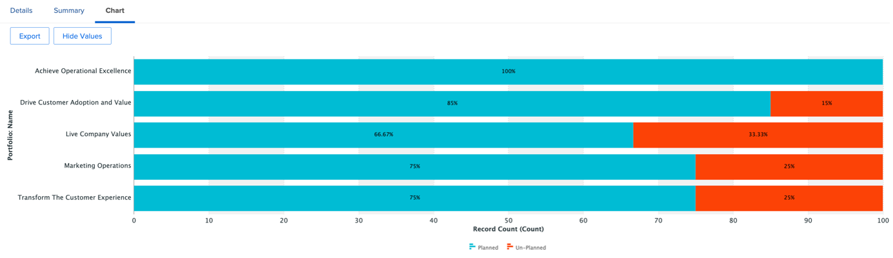

# マーケティングマネージャーのインサイト

## プロジェクト リーダーの週単位ビュー

左側の列で、「プロジェクトリーダーの週別表示」をクリックします。

これには、豊富なレポートが含まれ、常にクリック可能またはアクションにつながる方法で詳細を確認できます。

- **プロジェクト別の今週が期限のタスク**

- **プロジェクト管理の今後のマイルストーン**:

- **優先度別のオープン問題**

- **部門別の遅延タスク**

- **個人ごとの遅延タスク**

## スクラム関連のインサイト

左側の列で、「反復ステータス」をクリックします

チームがスクラム手法を使用している場合、これは興味深い管理レポートセットです。

- **反復による速度**

- **チーム別平均速度**

- **現在の反復の完了時間の合計（担当者別）**

- **チーム別イテレーション**

## 効率レポート

左側の列に残り、「効率性」をクリックします。

- **計画/未計画の比率** （完了した作業の）

- **完了したリクエスト （週別）**

## 進行中のプロジェクトインサイト

左側の列のまま、「マーケティング – プロジェクトが進行中」をクリックします。

- **作業中の事業の状況**

- **プロジェクト （状況別、月別）**

- **進行中のプロジェクト** のリスト、進捗状況および財務の詳細

## （プロジェクト間の）依存関係の視覚化

「PIN」ラインに戻り、「Portfolioの切り子面」をクリックします。

ここでは、プロジェクト間で考えられる依存関係（先行タスク）を含む **プロジェクトのグループの** ガント チャート ビュー）を示します

## サードパーティの統合インサイト

>[!NOTE]
>
> これは、サードパーティのソフトウェアとの統合の例です。 これは、例としてAdobe Campaignとの統合です。 完了したキャンペーンの結果を Adobe Campaigns に読み込みます。

「PIN」行で「キャンペーンの概要」をクリックします。

- **Adobe Campaignの概要**

- **Adobe Campaignが開封数に送信されました**

- **Adobe Campaignの開封数**

次のステップ：[ まとめ ](../../conclusion.md)

[フェーズ 4 - プロジェクトマネージャーのインサイトに戻る](./project-manager.md)

[すべてのモジュールに戻る](../../overview.md)
