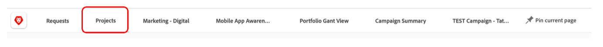
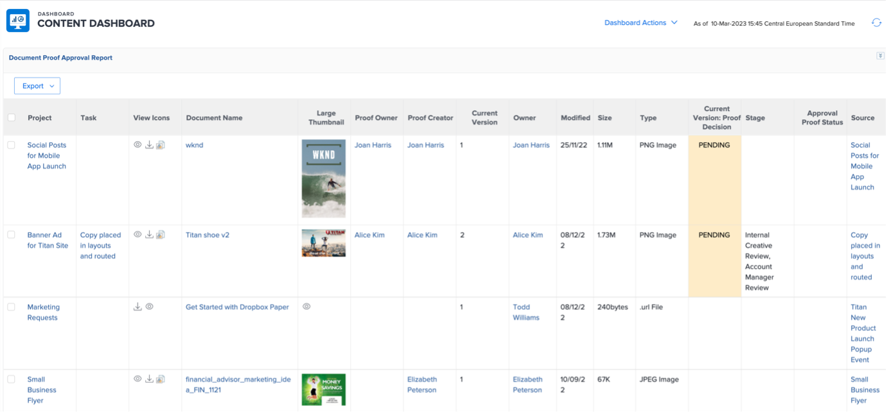

# プロジェクトマネージャーのインサイト

## インタラクティブなプロジェクトの進行状況レポート

「PIN」行で、「モバイルアプリ認識」をクリックし、「指標」をクリックします。

ここでは、1 つのプロジェクト/キャンペーンのステータスをグラフィカルに表示します。

>[!NOTE]
>
> 各領域で詳細を確認できます。Workfrontのほとんどのインサイトでは、このようになります。 やれ！

## キャンペーン固有のレポート

「PIN」行で、「プロジェクト」をクリックします。

左側の列で、「キャンペーンのステータス」をクリックします。

上部には、1/キャンペーンに関する 1 つのキャンペーンに関するインサイトが表示されます **計画対実績** 滞在時間と 2/ **キャンペーン条件** 各チャネルの

下部には、 **キャンペーンの成果物** ステータス：

## 複数のプロジェクトに基づくインサイト

左の列で、「監視」をクリックします。

上部には、プロジェクトのグループのステータスに関するインサイトが表示されます ( 両方とも **タスクのステータス** 視点と視点 **プロジェクト条件** 視点：

下部には、すべてが表示されます **危険な承認を受けて** そして追いかける必要があるだろう

## コンテンツダッシュボード

左側の列で、「コンテンツダッシュボード」をクリックします。

上部には、 **ドキュメントの配達確認の承認** ステータス（承認済みか、必要なバージョン数など）

下部は **配達確認の承認レビュー** これは、配達確認の承認ステータスに別の視角を与えます。

次のステップ： [フェーズ 4 — マーケティングマネージャーのインサイト](./marketing-manager.md)

[フェーズ 4 に戻る — インサイト：概要](./overview.md)

[すべてのモジュールに戻る](../../overview.md)
