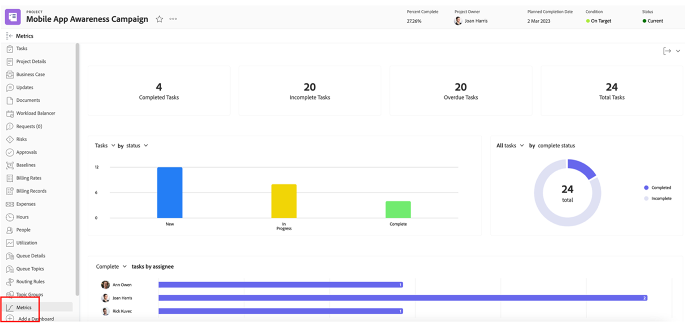

# プロジェクトマネージャーのインサイト

## インタラクティブなプロジェクト進捗レポート

「PIN」行で「モバイルアプリの認識」をクリックし、「指標」をクリックします。

ここには、1 つのプロジェクト/キャンペーンのステータスがグラフィカルに表示されます。

>[!NOTE]
>
> 各領域をクリックすると詳細を確認できます。これは、Workfrontのほとんどのインサイトに当てはまります。 試してみろ。

## キャンペーン固有のレポート

「PIN」行で、「プロジェクト」をクリックします。

左側の列で「キャンペーンステータス」をクリックします。

上部では、1 つの単一キャンペーンに関して、各チャネルの 1/キャンペーン **予定対実際** 滞在時間および 2/**キャンペーン条件** について次のインサイトを提供します。

下部では、**キャンペーン成果物** ステータスに関するインサイトが提供されます。

## 複数のプロジェクトに基づくインサイト

左側の列で、「監視」をクリックします。

上部では、**タスクのステータス** という視点と、**プロジェクトの状態** という視点の両方から、プロジェクトのグループのステータスに関するインサイトを提供します。

下部には、すべての **危険な承認** が表示され、追跡が必要になります。

## コンテンツダッシュボード

左側の列のまま、「コンテンツダッシュボード」をクリックします。

上部では、すべての **ドキュメントのプルーフの承認** ステータス（承認済みか、必要なバージョンの数など）について優れたインサイトが得られます。

下部は **プルーフ承認のレビュー** であり、プルーフ承認のステータスに対する別の角度からのビジョンを提供します。

次の手順：[&#x200B; フェーズ 4 - マーケティングマネージャーのためのインサイト &#x200B;](./marketing-manager.md)

[フェーズ 4 - インサイト：概要に戻る](./overview.md)

[すべてのモジュールに戻る](../../overview.md)
