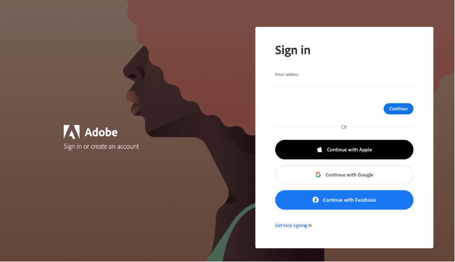
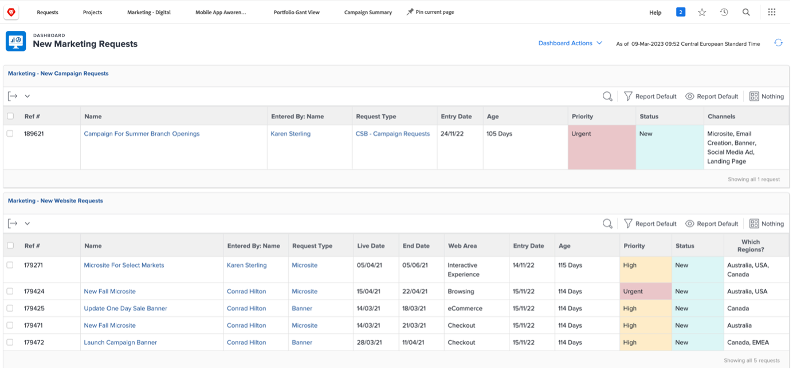
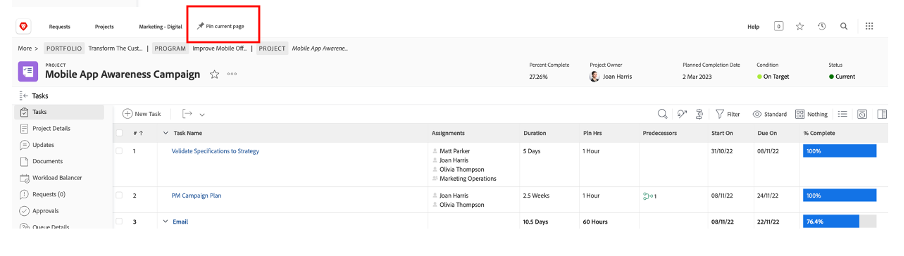
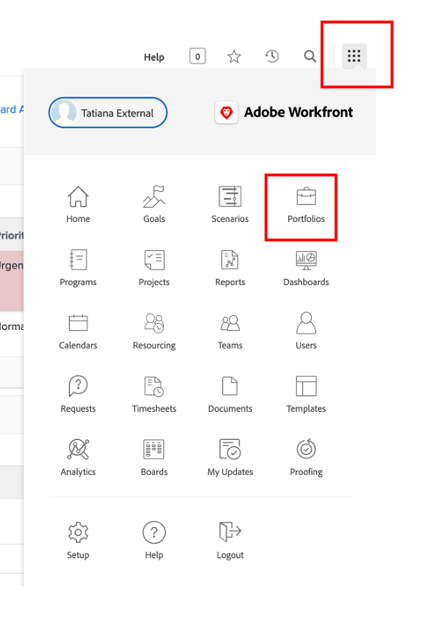
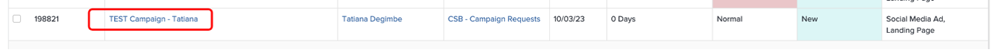

# 計画

>[!NOTE]
>
> Bootcamp の期間中は、リクエスター、プロジェクトマネージャー、Designer、Upper Management など、いくつかの役割を担います。 これにより、各プロファイルのユーザーエクスペリエンスが一目でわかります。

それでは、Work Management Platform のAdobe Workfrontを見てみましょう。 Workfrontを使用すると、組織全体で目標を可視化できるので、全員が作業の優先順位を戦略的に付け、進捗を追跡し、結果を測定できます。 目標が大きくなると、Workfrontは現場で作業を行うチームに情報をカスケードします。 結果は？ 整合性、フォーカス、スピードが向上し、成功を収めます。

[adobebootcampemea-02032301.testdrive.workfront.com](https://adobebootcampemea-02032301.testdrive.workfront.com) にアクセスし、Adobeチームから提供された資格情報を使用してログインすることで、Workfront プロファイルにログオンします。

このログインページが表示されます。  Bootcamp に登録しているプロのメールアドレスで、ユーザー名としてログインします。

ログインに成功すると、次のホームページが表示されます。

## 使用するWorkfrontの準備

次に、Workfrontを定期的に使用する場合と同様にホームページを作成します。  つまり、後のワークフローに関連するページを取得して、ホームページの上に固定します。

まず、チームのワークロードページを表示します。  右上のワッフルをクリックして、「チーム」を選択します

チーム（マーケティング/デジタル）が画面に表示されたら、上部のリボンに「ピン留め」します。

上部のリボンは次のようになります。

次に、後で詳しく分析するプロジェクトをピン留めしましょう。  プロジェクトのピン留めページをクリックし、検索ボタンをクリックします。  「モバイルアプリ認識キャンペーン」と入力し、プロジェクト名をクリックします。

プロジェクトが画面に表示されたら、以前と同様にトップリボンにピン留めします。

上部のリボンは次のようになります。

最後に、右上のワッフルをもう一度クリックして、「PORTFOLIO」を選択します。

検索ボタンをクリックして「TRANSFORM」と入力します。  「カスタマーエクスペリエンスを変革」Portfolioをクリックして開きます。

Portfolioを開いたら、上部のリボンにピン留めします。

上部のリボンは次のようになります。

これで、定期的に必要なものを正確に示すインターフェイスでワークフローを開始する準備が整いました。

## 依頼者

次に、リクエスターの帽子を使用して、実際の作業の取り込みを開始します。 リクエスター（製品マネージャーなど）：新しい AdobeIke キャンペーンのリクエストを正式に作成し、マーケティング概要の情報を提供します。

- 左上の「リクエスト」をクリックします。

- 次に、「新しいリクエスト」をクリックします。

- リクエストタイプとして、「マーケティングリクエスト」、「CSB - キャンペーンリクエスト」の順に選択します。

- 件名：「Adobike Campaign - \*team\*」（チーム番号を入力）を入力します。 説明や優先度を自由に追加できます。

- 「CSB - マーケティングキャンペーン概要」ヘッダーの下はすべて完全にカスタマイズ可能です。 この場合、これらはすべてカスタムフィールドであり、独自のマーケティング概要のニーズに適応させることができます。 この Bootcamp 用に作成した簡単なフィールドを次に示します。

- 概要を入力してみましょう。

   - 開始日を 2023/01/06 に設定 – 終了日を 2023/30/06 に設定します。

  

   - AEM Assetsを選択します。このキャンペーンで使用できるアセットがそこにあるからです。

  

   - 「新しいコンテンツ」で、「はい」をクリックすると、追加の（条件付き）フィールドが表示され、タイムラインに次の警告が表示されます。

  

   - 締め切りに間に合わないので、選択を「NO」に変更しよう。

  

   - チャネルでは、デフォルトで一部を事前選択することを選択しました。 これらは次の手順で必要になるものです。ここでは変更は不要です。

  

   - Adobe Commerceで「はい」を選択します。

  

- 最後に、「ドキュメント」セクションで、リクエストに関連するドキュメントを追加できます。  ここでは、AEM コネクタを利用して、AEM Assets インスタンスから既存のコンテンツを取得する方法を示します。

   - 「ファイルを追加またはリンク」をクリックし、「experience-manager」から「リンク」を選択します。

  

   - これでAEM Assets フォルダーが表示され、それらを参照して（または検索エンジンを使用して）、リクエストに必要なドキュメントやアセットを取得できます。

  

   - このプロジェクトに関係があると思われるアイテムがあれば、AEM Assetsから自由に添付してください。 完了したら、「リンク」をクリックしてアセットにリンクするか、フォルダーをリンクしていない場合は「閉じる」をクリックします。

  

- リクエストが完了し、送信する準備が整いました。

## プロジェクト管理者

リクエスター（プロダクトマネージャーなど）としてリクエストを送信したので、帽子を変更してプロジェクトマネージャーの 1 つを着用します。

- 「Adobe」ロゴをクリックすると、「新しいマーケティングリクエスト」ページ（これは一般的な「プロジェクト管理者」ホームページ）に移動します。

- 「マーケティング – 新しいキャンペーンリクエスト」セクションで、新しく作成したリクエストを見つけることができます。

- リクエスト名をクリックします。

- 「リクエストの詳細」をクリックします。

- 「CSB - マーケティングキャンペーン概要」セクションまでスクロールして、展開します。

- 要求者の概要のすべての詳細を表示し、この情報を使用して、テンプレートに基づくプロジェクト計画を開始できます。
   - 上部のリクエスト名の横にある 3 つのドットをクリックします。

  

   - 「テンプレートからプロジェクトに変換」をクリックします。

  

   - 「CSB - マーケティングキャンペーン」を選択し、「テンプレートを使用」をクリックします。

  

   - ページ下部の「プロジェクトに変換」をクリックします。

  

- これで、テンプレートに基づいた Campaign プロジェクトのワークフローが作成されました。 後でプロジェクトをピン留めしましょう。 「現在のページをピン留め」をクリックします。

- 次の点に注意してください。

1. 期間の概念 – タスクを完了する機会のウィンドウです。\
   予定時間数の概念 – タスクを完了するために必要な実際の時間です。

1. 先行タスクの概念（依存関係） – これらは、タスクが相互に持つことのできる制約です（通常、このタスクは、このタスクの完了前に開始することはできません）。 これにより、各プロジェクトのクリティカルパスを示す明確なガント チャートを作成できます。 下のアイコンをクリックして、Gant グラフを表示します。
   

1. 割り当ての概念 – プロジェクトが作成された時点では、割り当てはテンプレートから派生しているので、依然として一般主義的です。 担当業務は、ハンマーアイコン（この特定のタスクを完了するスキルを持つユーザーのグループ）で表されるか、チーム（ユーザーの会社グループが定義）で表されます。 今こそ、これらのタスクを個人に割り当てる瞬間です。

- 今日は、チームの事前割り当てと、それらを個人に割り当てる方法に専念します。

- ご覧のように、タスク 11 「ソーシャルメディア広告の作成」は「マーケティング – デジタル」チームに割り当てられています。
  

- これがチームの計画にどのように反映されるかを、リソース管理ページを開いて確認します。 ページ上部の「マーケティング – デジタル」 PIN をクリックします。
  

- これで、次のチーム計画表示が得られました。

1. 一番上の部分は、その特定のチームの未割り当て作業をカバーしています。 チームが割り当てられているプロジェクトのリストが表示され、ここの矢印をクリックすると、プロジェクトでカバーする必要がある正確なタスクが表示されます。
   

1. 下部には、チーム内の個人に割り当てられた作業が表示されますが、実際には、チームの各メンバーの実際のワークロードだけでなく、スケジュール（月 – 金または月 – 土）、休日なども表示されます。
   

- タスクを個人に割り当てるには、上部のタスクを下部の個人の行にドラッグするだけです。Bea のワークロードが調整され、タスク割り当ての詳細が追加された方法を確認します。
  

次の手順：[&#x200B; フェーズ 1 – 計画：その他の事前作業 &#x200B;](./prework.md)

[クリエイティブブリーフに戻る](../../creative-brief.md)

[すべてのモジュールに戻る](../../overview.md)
