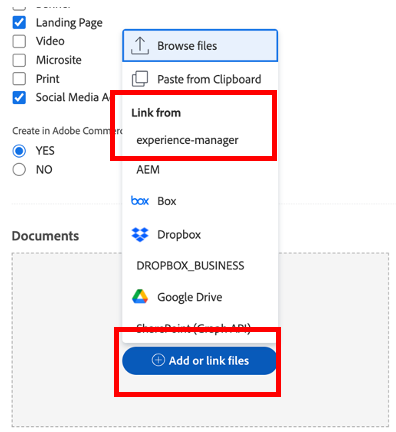

# 計画

>[!NOTE]
>
> ブートキャンプの間、あなたはいくつかの帽子を着用します。要求者、プロジェクトマネージャー、デザイナー、上位管理 これにより、各プロファイルのユーザーエクスペリエンスが一目で確認できます。

次に、作業管理プラットフォーム (Adobe Workfront) を見てみましょう。 Workfrontは、組織全体に目標を表示し、誰もが戦略的に作業の優先順位を付け、進捗状況を追跡し、結果を測定できるようにします。 目標が進むにつれ、Workfrontは現場で作業を行うチームに情報を伝えます。 結果は？ 連携、フォーカス、速度の向上が成功に導きます。

次を参照して、Workfrontプロファイルにログオンします。 [adobebootcampemea-02032301.testdrive.workfront.com](https://adobebootcampemea-02032301.testdrive.workfront.com) およびAdobeチームが提供した資格情報を使用してログインします。

このログインページが表示されます。  bootcamp に登録したプロフェッショナルな電子メールアドレスをユーザー名として使用してログインします。

ログインが成功すると、次のホームページが表示されます。

## Workfrontの使用準備

次に、Workfrontを定期的に使用しているかのように、ホームページを準備します。  つまり、後でワークフローに関連するページを取得し、ホームページの上にそれらを「固定」します。

まず、チームのワークロードページに移動します。  右上のワッフルをクリックし、「チーム」を選択します。

当社のチーム（マーケティング — デジタル）が画面に表示されたら、単にトップリボンに「ピン留め」します。

上部のリボンは次のようになります。

次に、より詳細に分析するプロジェクトをピン留めします。  「プロジェクト固定済み」ページをクリックし、「検索」ボタンをクリックします。  「モバイルアプリ認知キャンペーン」と入力し、プロジェクト名をクリックします。

プロジェクトが画面に表示されたら、前の手順と同様に、一番上のリボンにピン留めします。

上部のリボンは次のようになります。

最後に、右上のワッフルをもう一度クリックし、「PORTFOLIO」を選択します。

検索ボタンをクリックし、「変換」と入力します。  「顧客体験を変換」Portfolioをクリックして開きます。

Portfolioを開いたら、上部のリボンにピン留めします。

上部のリボンは次のようになります。

これで、定期的に必要なものを示すインターフェイスを使用して、ワークフローを開始する準備が整いました。

## 依頼者

次に、リクエスト元の帽子を使って実際の作業の取り込みを開始します。 リクエスト元（例えば、製品マネージャー）は、新しい Adobeike キャンペーンのリクエストを正式に作成し、マーケティング概要の情報を提供したいと考えています。

- 左上で、「リクエスト」をクリックします。

- 次に、「新しいリクエスト」をクリックします。

- リクエストタイプとして、「マーケティングリクエスト」、「CSB — キャンペーンリクエスト」の順に選択します。

- 件名を入力：&quot;Adobeike Campaign - \*team\*&quot; （チーム番号を入力）。 説明と優先度を自由に追加できます。

- 「CSB — マーケティングキャンペーンの概要」ヘッダーの下にあるすべては、完全にカスタマイズ可能です。 この場合、これらはすべてカスタムフィールドで、独自のマーケティング概要のニーズに合わせて調整できます。 この Bootcamp 用に作成した Brief フィールドを次に示します。

- 概要の入力を開始します。

   - 開始日を「01/06/2023」に設定します。終了日を「30/06/2023」に設定します。

   

   - AEM Assetsを選択します。このキャンペーンで使用できるアセットがいくつかあるので、ここで選択します。

   

   - 「新しいコンテンツ」で「はい」をクリックすると、追加の（条件付き）フィールドがタイムライン警告付きで表示されます。

   

   - 締め切りに間に合うので、「いいえ」に変更します。

   

   - チャネルでは、デフォルトで一部を事前に選択するように選択しました。 次のステップに必要なものはこれですので、ここでは変更は必要ありません。

   

   - Adobe Commerce、はいを選択します。

   

- 最後に、ドキュメントセクションで、要求に関連するドキュメントを追加できます。  ここでは、AEMコネクタを使用して、AEM Assetsインスタンスから既存のコンテンツを取得する方法を示します。

   - 「ファイルを追加またはリンク」をクリックし、「experience-manager」から「リンク」を選択します。

   

   - これで、AEM Assetsフォルダーが表示され、それらを参照（または検索エンジンを使用）して、リクエストに必要なドキュメントやアセットを取得できます。

   

   - このプロジェクトに関連すると思われるAEM Assetsの項目があれば、自由に添付できます。 完了したら、「リンク」をクリックしてアセットにリンクするか、「閉じる」をクリックしてフォルダーをリンクしない場合は「閉じる」をクリックします。

   

- これでリクエストが完了し、送信する準備が整いました。

## プロジェクトマネージャー

リクエストを「依頼者」（例：製品マネージャー）として送信したので、帽子を変更し、プロジェクトマネージャーの 1 つを着用します。

- 「Adobe」ロゴをクリックすると、「新規マーケティングリクエスト」ページに移動します（これは一般的な「プロジェクトマネージャー」ホームページです）。

- 「マーケティング — 新しいキャンペーンリクエスト」セクションでは、新しく作成したリクエストを見つけることができます。

- リクエスト名をクリックします。

- 「リクエストの詳細」をクリックします。

- 下の「CSB - Marketing Campaign Brief」セクションまでスクロールし、それを展開します。

- 要求者の概要のすべての詳細が表示され、この情報を使用して、テンプレートに基づいてプロジェクト計画を開始できます。
   - 上部の「リクエスト名」の横にある 3 つのドットをクリックします。

   

   - 「テンプレートからプロジェクトに変換」をクリックします。

   

   - 「CSB — マーケティングキャンペーン」を選択し、「テンプレートを使用」をクリックします。

   

   - ページ下部の「プロジェクトに変換」をクリックします。

   

- これで、テンプレートに基づく Campaign プロジェクトワークフローが作成されました。 後でプロジェクトを固定しましょう。 「現在のページを固定」をクリックします。

- 注意事項の一部を次に示します。

1. 期間の概念 — タスクを完了する機会の窓です。\
   計画時間の概念 — タスクの完了に必要な実際の時間です。

1. 先行タスク（依存関係）の概念 — 互いに制約タスクを持つことができます（通常、このタスクを完了する前にこのタスクを開始することはできません）。 これにより、各プロジェクトのクリティカルパスを含む明確なガントチャートを作成できます。 以下のアイコンをクリックして、Gant チャートを表示します。
   

1. 割り当ての概念 — プロジェクトの作成時には、割り当てはテンプレートから取得されるので、依然として一般的です。 これらは、ハンマーアイコン（この特定のタスクを完了するスキルを持つ人のグループ）で表される役割またはチームに対して、人のアイコン（会社の人のグループで定義される）で表される役割のどちらかに対して作成されます。 今こそ、個人にタスクを割り当てる時です。

- 今日は、チームの事前割り当てと、それらを個人に割り当てる方法に集中します。

- ご覧のように、タスク 11 の「ソーシャルメディア広告を生成」が「マーケティング — デジタル」チームに割り当てられています。
   

- このチームの計画にどのように影響するかを、「リソース管理」ページを開いて確認します。 ページ上部の「マーケティング — デジタル」暗証番号 (PIN) をクリックします。
   

- これで、このチームの計画ビューが作成されました：

1. 上部には、その特定のチームの未割り当て作業が表示されます。 チームが割り当てたプロジェクトが一覧表示され、ここの矢印をクリックすると、プロジェクトでカバーする必要のあるタスクを表示できます。
   

1. 下部には、チーム内の個人に割り当てられた作業が含まれますが、次の作業だけではありません。実際には、チームの各メンバーの実際の作業負荷を示すだけでなく、スケジュール（月～金、月～土など）、休日なども示します。
   

- タスクを個人に割り当てるには、上部のタスクを下部の個人の行にドラッグします。Bea のワークロードの調整方法とタスクの割り当ての詳細が追加されていることを確認します。
   

次のステップ： [フェーズ 1 — 計画：その他の事前作業](./prework.md)

[クリエイティブの概要に戻る](../../creative-brief.md)

[すべてのモジュールに戻る](../../overview.md)
