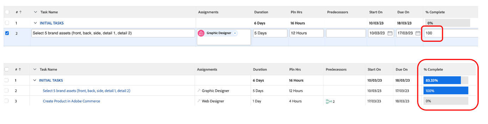
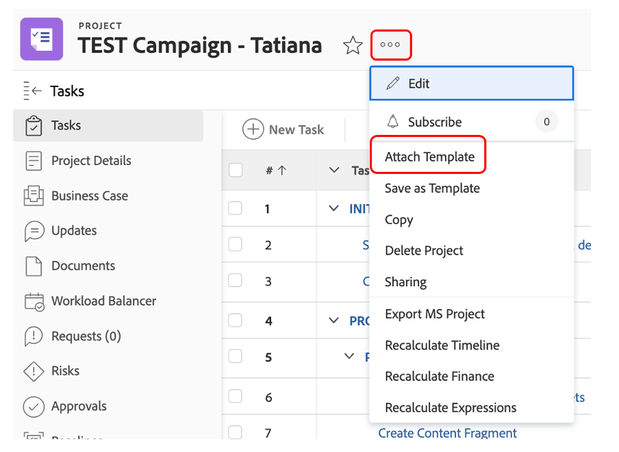

# その他の準備作業

## Brand Assetsを選択します。

クリエイティブ概要に記載されているように、キャンペーンを効果的に開始するために必要なアセットがいくつかあります。 これらのブランドアセットはWorkfrontのキャンペーンに追加されるので、一元的にアクセスできます。

- タスク 1 の「初期タスク」を展開し、タスクをクリックして「5 つのブランドアセット（前面、背面など）を選択」を開きます。

- 「ドキュメント」をクリックしてから「新規追加」をクリックします：

- 「From experience-manager」を選択します。これにより、AEM Assetsで既に使用可能なブランドアセットを選択できます。

- AEM フォルダー階層が表示されたら、次のパスに移動します。experience-manager/Adobike Assets/自転車ショット 5 つのアセットを選択し、「リンク」をクリックします。

- これで、タスクにブランドアセットが追加されました。 つまり、タスク 2 を 100% 完了として設定できます。

## Adobe Commerceのデモ

Adobe Commerceは、最高のデジタルエクスペリエンスを顧客に提供するのに役立つ、Adobe Experience Cloudの数多くの製品の 1 つです。 しかし、ブートキャンプ中は、すべてを一緒に行うには時間が少なすぎました。

このビデオでは、Adobe Commerceの概要と、Bootcamp で使用するために作成した製品について説明します。 実際のシナリオでは、以前に選択したブランドアセットをAdobe Commerceにアップロードして、商品を設定します。

>[!VIDEO](https://video.tv.adobe.com/v/3418945?quality=12&learn=on)

このタスクが完了したら、Workfrontでタスク 3 を 100% 完了としてマークできます。

## 柔軟なキャンペーンが前提条件になります

作業計画を確認しているとき、問題に気がつきました。プロダクトマネージャー（依頼者）が「製品ホームページバナー」のリクエストを忘れたという更新を行っています。  これをプロジェクト計画に追加します。

- タスクリストに移動し、「製品ホームページバナーを作成」タスクをタスク 4 「PRODUCTION」のすぐ下に追加します。 それには、「モバイルアプリのコンテンツを準備」タスクを選択し、「上にタスクを追加」アイコンをクリックします。

- 追加したタスクに意味のある名前を付けます（「製品ホームページバナーを作成」など）。

- タスクを作成したので、コンテンツを追加します。 プロジェクトタイトルの右側にある 3 ドットアイコンをクリックし、「テンプレートを添付」を選択します。

- 「製品ホームページバナーを作成」を選択し、「カスタマイズと添付」をクリックします。

- カスタマイズ画面で、「製品のホームページバナーを作成」タスクを親として指定していることを確認します。

- 最後に、タスク 3 の先行タスクを持つ親タスク「製品のホームページを作成」を、Adobe Commerceで製品を作成するまで実稼動を開始できないようにマークしてください。

これで、キャンペーンが完了し、計画が完了しました。つまり、キャンペーンの制作と配信から始めることができます。

次の手順：[ フェーズ 2 – 実稼動：製品ホームページバナーの作成 ](../production/banner.md)

[フェーズ 1 – 計画：計画に戻ります。](./planning.md)

[すべてのモジュールに戻る](../../overview.md)
