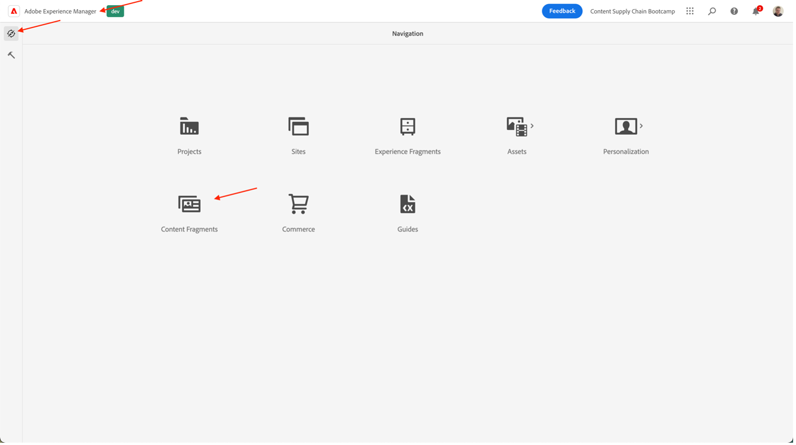

# モバイルアプリコンテンツを作成

## ヘッドレスコンテンツ配信とは

ヘッドレスコンテンツ管理システムでは、バックエンドとフロントエンドが切り離されるようになりました。 ヘッドレス部分はコンテンツバックエンドです。ヘッドレス CMS はバックエンドでのみ使用されるコンテンツ管理システムで、API を介してコンテンツにアクセスし、任意のデバイスで表示できるように、コンテンツリポジトリとして明示的に設計および構築されます。

独立して開発および維持されるフロントエンドは、コンテンツ配信 API（通常は JSON 形式）を使用して、ヘッドレスなバックエンドからコンテンツを取得します。 例えば、Web アプリや、この例ではモバイルアプリケーションです。

通常、ヘッドレス CMS バックエンドでは、モデルやスキーマに基づいてコンテンツを構造化する必要があります。 これにより、クライアントアプリケーションがエクスペリエンスのレンダリングに適したコンテンツを容易に要求できるようになります。 AEMなどの一部の CMS では、構造化コンテンツと非構造化コンテンツの両方を JSON 形式で公開できます。

このトポロジの主な特徴は、ヘッドレス CMS が JSON 形式で提供するコンテンツは、デザインやレイアウトの情報がない、純粋なコンテンツであることです。 ヘッドレス CMS 実装では、すべての書式設定とレイアウトは、切り離されたフロントエンドアプリケーションによって維持されます。

ヘッドレス CMS トポロジの主なメリットは、クライアント側のフロントエンド実装が異なる複数のチャネルでコンテンツを再利用できることです。これにより、フロントエンドの開発プロセスがより効率的になります。ただし、フロントエンドエクスペリエンスの開発プロセスがコードと IT 中心になり、IT が基本的にエクスペリエンスに責任を持つようになる可能性があることも意味します。

## AEMでのヘッドレスコンテンツ配信の仕組み

AEM as a Cloud Service は、次の 3 つの強力な機能を提供することで、ヘッドレス実装モデルの柔軟なツールになっています。

1. コンテンツモデル
   - コンテンツモデルはコンテンツの構造化表現です。
   - コンテンツモデルは、情報アーキテクトが AEM コンテンツフラグメントモデルエディターで定義します。
   - コンテンツモデルはコンテンツフラグメントの基盤となります。
1. コンテンツフラグメント
   - コンテンツフラグメントは、コンテンツフラグメントモデルに基づいて作成されます。
   - コンテンツ作成者が AEM コンテンツフラグメントエディターで作成します。
   - コンテンツフラグメントは AEM Assets に保存され、AEM Assets 管理 UI で管理されます。
1. 配信用のコンテンツ API
   - AEM GraphQL API では、コンテンツフラグメント配信をサポートしています。
   - AEM Assets REST API では、コンテンツフラグメントの CRUD 操作をサポートしています。
   - ダイレクトコンテンツ配信は、[コンテンツフラグメントコアコンポーネントの JSON 書き出し](https://experienceleague.adobe.com/docs/experience-manager-core-components/using/components/content-fragment-component.html?lang=ja)を使用して実行することもできます。

## 演習

このブートキャンプでは、「コンテンツ」の部分に焦点を当てます。結局、それは私たちが求めているコンテンツサプライチェーンです。 重要なことに焦点を当てるために、コンテンツモデルと必要な配信 API については既に予測しています。

まず、コンテンツモデルを見てみましょう。ヘッドレス CMS との「契約」なので、どのコンテンツがどの形式で提供されるかがわかります。

- でAEM作成者に移動します。 [https://author-p105462-e991028.adobeaemcloud.com/](https://author-p105462-e991028.adobeaemcloud.com/) をクリックし、指定した資格情報を使用してログインします。

- AEMのスタートメニューで、ツール/一般/コンテンツフラグメントモデルを選択します。

- 次の画面では、ヘッドレスコンテンツを使用しているすべてのサイトの概要が表示されます。 これにより、複数のヘッドレスサイトにわたるガバナンスを維持し、相互に干渉するのを恐れることなく実現できます。 この例では、アドビのサイトで作業を行っているので、そのモデルを選択します。

- このフォルダーには、アドビの Web サイトで使用している技術的なヘッドレスコンテンツが表示されます。 もっと知りたい？ 自由に手を伸ばせ。 ここでは、次の手順に従う前のタスクに焦点を当てます。モバイルアプリケーション。 「モバイルアプリホームページ」カードの上にマウスポインターを置き、鉛筆アイコンをクリックして、コンテンツモデルを開きます。

- コンテンツフラグメントモデルエディターで、特定のコンテンツモデルの詳細を表示できます。 この例では、モバイルアプリのホームページに Adobeike のロゴ、見出し、オプションのフリーテキスト、オプションの特集製品が表示されます。 これらの項目はすべて設定と更新が容易なので、コンテンツモデルで追加の要素が必要な場合は、CMS 側で開発者の干渉を受けることなく、設定をおこなうことができます。

>[!WARNING]
>
> **コンテンツモデルを変更すると、行の末尾に影響が及ぶことに注意してください**&#x200B;は、モバイルアプリが正しい要素を表示できるように、特定の情報の受信に依存しているので、 フィールドを更新または削除する場合は、フィールドを追加しても影響はありません。

コンテンツの存在を把握したら、コンテンツフラグメントを作成できます。

- 左上隅のAEMロゴをクリックしてナビゲーションを開き、ナビゲーション/コンテンツフラグメントに移動します。

- 次のインターフェイスでは、AEM内のすべての既存コンテンツの概要を把握できます。 特定のコンテンツフラグメントを検索する場合は、左側のフィルターを使用して絞り込むことができます。 新しいコンテンツフラグメントを作成するには、右上の「作成」ボタンをクリックします。

- 開いたモーダルには、一部のフィールドはまだ編集できないことがわかります。 これは論理的です。フラグメントの作成場所に基づいて、様々なモデルを使用できます。
   
   - まず、「場所」フィールドの横にあるフォルダーアイコンをクリックして、フラグメントの作成場所を選択します。 「adobeike」「en」「mobile-app」の順にクリックしてコンテンツツリーを展開し、「選択」ボタンをクリックして選択内容を確定します。
      
   - 「コンテンツフラグメントモデル」フィールドが編集可能になりました。 フィールドの横にある矢印をクリックしてドロップダウンを開き、前述のコンテンツモデルを選択します。「モバイルアプリのホームページ」を参照してください。
   - 次に、コンテンツフラグメントに意味のあるタイトルを付けます ( ヒント：チーム番号を含めて、コンテンツを簡単に見つけ直すことができます )。 「名前」フィールドが自動的に入力されます。これは、ユーザーの人生をより簡単にするためです。フラグメントを識別するためにシステムが使用する名前で、変更しないでください。
   - 最後に、「作成して開く」ボタンをクリックします。このボタンは、名前がコンテンツフラグメントを作成して開き、すぐに編集できるようにします。

- ここでは、モバイルアプリに表示するコンテンツをチームが決定できます。 
   - 後でモバイルアプリでコンテンツを確認できるよう、必ずチーム番号を選択してください。
   - 画像アセットを選択する場合は、フォルダーアイコンをクリックし、AEM Assetsで正しい画像を参照します。
   - 特集商品の場合は、商品参照アイコンをクリックして、「Adobeike 1」のコマース製品を簡単に選択できるようにし、コマース関連の詳細がアプリに読み込まれるようにします。
   - 作成したコンテンツをすべて保存し、変更を公開するには、必ず「保存」ボタンをクリックしてください。
      

これで、コンテンツを含むモバイルアプリが見つかったので、キャンペーンを配信する準備が整いました。

次のステップ： [フェーズ 3 — 配信：モバイルアプリを検証](../delivery/app.md)

[フェーズ 2 — 実稼動に戻る：ソーシャルメディア広告の作成](./social.md)

[すべてのモジュールに戻る](../../overview.md)
