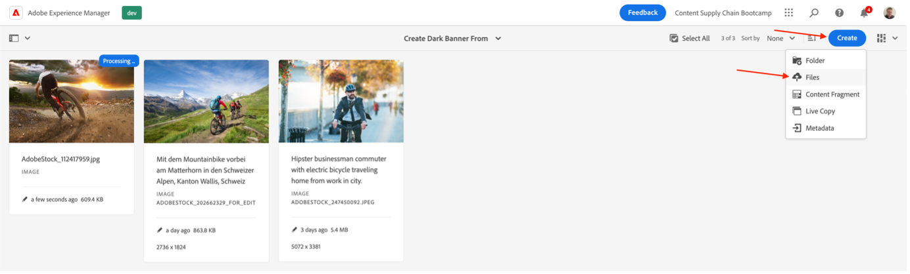
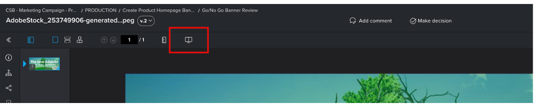

# 製品ホームページバナーを作成

## バナーの作成

コンテンツの自動処理により、Adobe Creative Cloudの機能がExperience Manager Assetsに取り込まれるため、マーケターはアセットの大規模な作成を自動化でき、バリエーションの作成が大幅に高速化します。 これらの機能を使って、ホームページで使用するバナーを生成しましょう。

- [https://author-p105462-e991028.adobeaemcloud.com/](https://author-p105462-e991028.adobeaemcloud.com/) のAEM オーサーに移動し、提供された資格情報を使用してログインします。

- ホームページから、ツール / Assets /処理プロファイルに移動します。

- インターフェイスには、既存のすべての処理プロファイルが表示されます。 これらを使用して、特定の自動化を有効にできます。

- 次の項目に関心があります。
   - Adobike Banner Dark：選択したアセットに基づいて、暗いオーバーレイを含む Adobike バナーを作成します

     
   - Adobike バナーライト：選択したアセットに基づいて、ライトオーバーレイを含む Adobike バナーを作成します

     
   - Adobike バナーグリーン：選択したアセットに基づいて、緑色のオーバーレイを含む Adobike バナーを作成します

     

- 作成するバナーのタイプを選択したら、その処理プロファイルを選択し、「プロファイルをフォルダーに適用」を選択します。

- 次の画面で、AEM Assetsのチームのフォルダーを参照します。 次に、左上から「作成」ボタンを選択して、新しいフォルダーを作成し、意味のある名前を付けます（例：「ダークバナーを作成」）。

- フォルダーを作成したら、その名前の横にあるチェックボックスをオンにし、右上の「適用」ボタンをクリックします。

必要な設定が完了したので、バナーを生成します。

- 左上隅のAEM ロゴをクリックしてナビゲーションを開き、ナビゲーション \> Assets \> ファイルに移動します。

- 「Generated Adobike Assets」フォルダーを見つけ、カードをクリックして開きます。 生成されたバナーは、ここに表示されます。

- 新しいタブを開き、AEM Assetsに再度移動します。 次に、処理プロファイルを適用したフォルダーに移動します。

- フォルダーで、バナーを作成する画像をアップロードします。そのためには、画像をブラウザーにドラッグ&amp;ドロップするか、インターフェイスの右上隅にある「作成\> ファイル」をクリックします。

- アセットが処理されるまでしばらく待ってから、画面をリロードします。 アセットの状態が「新規」の場合は、処理が完了しています。

- 前のタブに戻り、ここでも画面をリロードします。 状態が「New」の新しいアセットがあります。 これは生成されたバナーで、すべて DAM から取得されます。 まだ見てないの？ もう 1 分待ってから、画面をリロードします。

>[!NOTE]
>
> 結果に満足していませんか？ フォルダーに別の処理プロファイルを適用し、アセットを再アップロードして別のバナーを生成します（もちろん、別のアセットをアップロードします）。 再アップロード中に、システムは既存のアセットで何をしたいのかを尋ね、「置換」を選択します。
> 

これで、キャンペーンの配信中に後で使用できる、生成されたバナーが用意されました。 バナーを選択し、リボンの「クイックPublish」ボタンをクリックして公開してください。

## Workfrontでのフォローアップ

Assetsの正式で監査可能なレビューおよび承認プロセスが必要な場合、Workfrontは最適な場所です。

>[!NOTE]
>
> ここでは明示的に言及していますが、タスクの終了後にWorkfrontでタスクを更新することが目的です。 作成/レビュー/承認のフローを常に心がける必要があります。

- プロジェクトに戻り、「Go/No Go Banner Review」アコーディオンを展開し、タスクをクリックして開きます。

- タスクの「ドキュメント」セクション（左の列）をクリックしてから、AEM Assetsにリンクされたフォルダー「最終」をクリックします。 ゾーンをクリックしてアセットを選択し、「配達確認を作成」をクリックします。 プルーフとは、画像、テキスト、ビデオ、web サイトなどのコンテンツを、構造化された連携方法でプルーフする機能です。関連する関係者のコメント、修正、変更を収集し、バージョンと結果を比較して、1 回のクリックで最終的に承認できます。

- 入念な承認プロセスが必要な場合は、「詳細なプルーフ」を選択します。

>[!NOTE]
>
> この Bootcamp でプルーフをレビューまたは承認するユーザーを手動で決定します。 ほとんどの実際のユースケースでは、各タイプのプルーフに対して既に定義されている、承認フローの事前設定テンプレートを使用します。

- デフォルトでは、ワークフロータイプは「basic」で、Workfront Bootcamp スペシャリストをレビュアーおよび承認者として選択します。 Bootcamp Workfront スペシャリストの名前を入力します。この名前には、「受信者を追加するには、連絡先の名前またはメールアドレスを入力してください：

- 「レビュアーおよび承認者」として設定：

- 「プルーフを作成」をクリックします。 Workfrontでプルーフを生成するのにしばらく時間がかかります。

- これで、Workfront スペシャリストに、レビューおよび/または承認するプルーフがあることを知らせる新しい通知が届きます。

- 通知をクリックすると、そのユーザーはプルーフに直面し、コメントを付けたり、このプルーフを承認したりできます。

   - コメントがある場合は、画面上部の「コメントを追加」をクリックできます。

  

   - その後、コメントを追加するだけでなく、小さなポインタツールバーを使用して、変更が必要な領域を明確に定義できます。

  

   - コメントを追加すると、プルーフの新しいバージョンに対して追加の作業を行う必要があることを伝えることができます。 Workfront タブを更新すると、そのことがわかる新しい通知が表示されます。 必要な変更がわかったら、AEMで変更を加えてから、新しいバージョンをこちらにアップロードします。

  

   - 更新したアセットを選択し（bootcamp シナリオで変更が必要ない場合は、同じアセットをもう一度アップロードします）、「リンク」をクリックします。

  

   - 次に、右側の「プルーフを作成」をクリックします。

  

   - プルーフが生成されると（しばらく時間がかかる場合があります）、Workfront スペシャリストに通知が届き、レビューして、この新しいバージョンを承認できるようになります。  例えば、「プルーフ比較」ボタンを使用すると、V1 と V2 と、作成されたすべてのコメントを横に並べて比較できます。

  

  

  

これで、バナーの使用に対する正式な承認が得られました。 プロセスのどの段階にあるかを追跡したり、自動で通知をトリガーに更新したりすることが簡単にできるので、できるだけ効率的に作業できます。

次の手順：[&#x200B; フェーズ 2 – 実稼動：ソーシャルメディア広告の作成 &#x200B;](./social.md)

[フェーズ 1 – 計画：その他の事前作業に戻る](../planning/prework.md)

[すべてのモジュールに戻る](../../overview.md)
