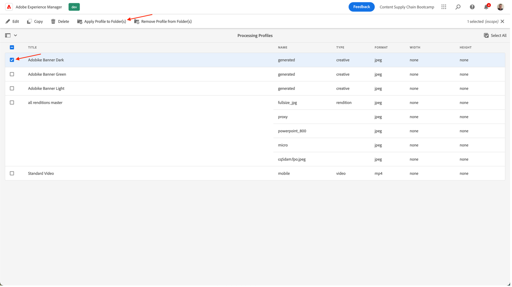
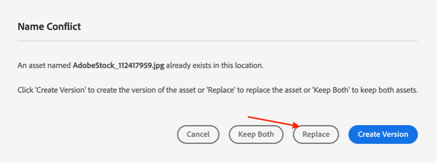

# 製品ホームページのバナーを作成

## バナーの作成

コンテンツの自動化により、Adobe Creative CloudをExperience Manager Assetsに移行し、マーケターはアセットの生産を大規模に自動化し、バリエーションの作成を大幅に高速化できます。 次の機能を使用して、ホームページで使用するバナーを生成しましょう。

- でAEM作成者に移動します。 [https://author-p105462-e991028.adobeaemcloud.com/](https://author-p105462-e991028.adobeaemcloud.com/) をクリックし、指定した資格情報を使用してログインします。

- ホームページで、ツール/アセット/処理プロファイルに移動します。

- インターフェイスに、既存のすべての処理プロファイルが表示されます。 これらは、特定の自動化を有効にするために使用できます。

- 次のものが参考になります。
   - アドビケバナー（暗）:選択したアセットに基づいて、ダークオーバーレイを持つ Adobeike バナーを作成します
      
   - アドビのバナーの光：選択したアセットに基づいて、ライトオーバーレイを持つ Adobeike バナーを作成します
      
   - アドビケバナー緑：選択したアセットに基づいて、緑のオーバーレイを持つ Adobike バナーを作成します
      

- 作成するバナーのタイプを選択したら、その処理プロファイルを選択し、「プロファイルをフォルダーに適用」を選択します。

- 次の画面で、AEM Assetsのチームのフォルダーを参照します。 次に、左上から「作成」ボタンを選択し、新しいフォルダーを作成し、意味のある名前を付けます（例： ）。「ダークバナーを作成」

- フォルダーを作成したら、名前の横にあるボックスをオンにし、右上の「適用」ボタンをクリックします。

必要な設定が完了したので、バナーを生成します。

- 左上隅のAEMロゴをクリックしてナビゲーションを開き、ナビゲーション/アセット/ファイルに移動します。

- 「生成された Adobe Assets」フォルダーを探し、カードをクリックして開きます。 生成されたバナーはここに表示されます。

- 新しいタブを開き、もう一度AEM Assetsに移動します。 次に、処理プロファイルを適用したフォルダーに移動します。

- バナーを作成する画像をフォルダーにアップロードします。それには、バナーをブラウザーにドラッグ&amp;ドロップするか、インターフェイスの右上隅にある作成/ファイルをクリックします。

- アセットが処理されるまで 1 分待ってから、画面を再読み込みします。 アセットの状態が「New」の場合は、処理が完了していることがわかります。

- 前のタブに戻り、ここでも画面をリロードします。 「New」状態の新しいアセットが表示されます。 これが DAM から生成されたバナーです。 まだ表示されていない場合は、 しばらく待ってから、画面を再読み込みします。

>[!NOTE]
>
> 結果に満足していない場合 別の処理プロファイルをフォルダーに適用し、アセットを再度アップロードして別のバナーを生成する（または別のアセットをアップロードする）場合は、自由に選択できます。 再アップロード中に、既存のアセットに対して何を実行するかを尋ねられ、「置換」を選択します。
> 

これで、キャンペーンの配信中に後で使用できるバナーが生成されました。 必ずバナーを選択して公開し、リボンの「クイック公開」ボタンをクリックしてください。

## Workfrontでのフォローアップ

Assets の正式で監査可能なレビューおよび承認プロセスが必要な場合、Workfrontが適しています。

>[!NOTE]
>
> ここで明示的に言及しますが、タスクの完了後にWorkfrontでタスクを更新する必要があります。 常に、作成/レビュー/承認のフローに努める必要があります。

- プロジェクトに戻り、「移動/移動しないバナーのレビュー」アコーディオンを展開して、クリックして該当するタスクを開きます。

- タスクのドキュメントセクション（左の列）をクリックし、AEM Assetsリンクフォルダー「最終」をクリックします。 アセットのゾーンをクリックしてアセットを選択し、「配達確認を作成」をクリックします。 配達確認とは、画像、テキスト、ビデオ、Web サイトなどのコンテンツを構造化された協調的な方法で校正する機能で、関係する関係者のコメント、修正、バージョンおよび結果を 1 回のクリックで比較し、最終承認できます。

- 詳細な承認プロセスが必要な場合は、「Advanced Proof」を選択します。

>[!NOTE]
>
> このブートキャンプで誰が証明をレビューし承認するかを手動で決定します。 ほとんどの実際の使用例では、配達確認のタイプごとに既に定義済みの承認フローの事前設定済みテンプレートを使用します。

- デフォルトでは、ワークフローのタイプは「basic」で、Workfront Bootcamp スペシャリストをレビュー担当者および承認者として選択します。 Bootcamp Workfront Specialist の名前を入力します。ここに、「連絡先名または電子メールアドレスを入力して受信者を追加します：

- レビュー担当者と承認者に設定します。

- 「配達確認を作成」をクリックします。 Workfrontが配達確認を生成するまでに少し時間がかかります。

- これで、Workfrontスペシャリストに、確認や承認を行うための配達確認が届いたことを知らせる新しい通知が届きます。

- 通知をクリックすると、配達確認に対応し、コメントを入力したり、この配達確認を承認したりできます。

   - コメントがある場合は、画面上部の「コメントを追加」をクリックできます。

   

   - その後、コメントを追加するだけでなく、小さなポインターツールバーを使用して、変更が必要な領域を明確に定義することができます。

   

   - コメントを追加すると、配達確認の新しいバージョンに対して追加の作業が必要であることを通知できます。 「 Workfront 」タブを更新すると、その旨を知らせる新しい通知が表示されます。 必要な変更を確認したら、AEMで変更を加え、ここに新しいバージョンをアップロードします。

   

   - 更新したアセットを選択し（bootcamp シナリオで変更が必要ない場合は、同じアセットを再度アップロードします）、「リンク」をクリックします。

   

   - 次に、右側の「配達確認を作成」をクリックします。

   

   - 配達確認が生成されると（しばらく時間がかかる場合があります）、Workfrontスペシャリストに通知が届き、この新しいバージョンを確認して承認できるようになります。  例えば、配達確認の比較ボタンを使用すると、V1 と V2 の比較と、おこなわれたすべてのコメントを並べて確認できます。

   

   

   

バナーの使用に対する正式な承認がおこなわれました。 現在のプロセスの状況や、自動トリガー通知の更新に従うのが簡単なので、できるだけ効率的に作業できます。

次のステップ： [フェーズ 2 — 実稼動：ソーシャルメディア広告の作成](./social.md)

[フェーズ 1 に戻る — 計画：その他の事前作業](../planning/prework.md)

[すべてのモジュールに戻る](../../overview.md)
