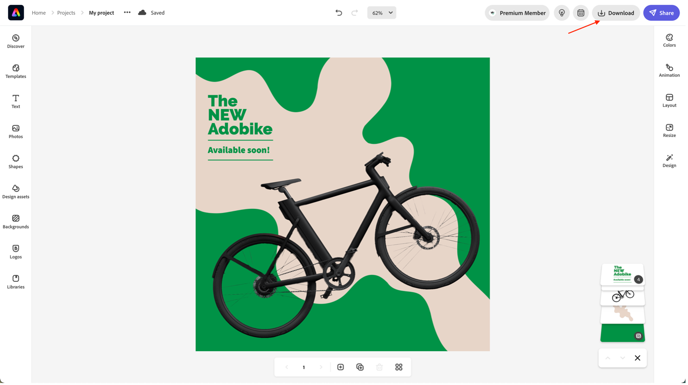

# ソーシャルメディア広告の作成

Adobe Expressは、ターゲットオーディエンスにリーチする企業でも、個人が自分の雰囲気を分かち合う企業でも、あらゆるプラットフォームで素晴らしいソーシャルメディア画像を作成するのに役立ちます。 アイデアが少ない場合は、テンプレートライブラリを参照して、創造性を始動します。 Adobe Expressには、以下の例のようにプロフェッショナルがデザインした何千ものソーシャルメディアグラフィックが付属しています。無料の画像、アイコン、グラフィックをデザインにドラッグ&amp;ドロップできます。

- [&#x200B; Adobe Expressに移動し &#x200B;](https://www.adobe.com/express/create/social-media-graphic) 「今すぐソーシャルメディアグラフィックを作成」ボタンをクリックして開始します。

- Adobe Expressを初めて使用する場合は、ポップアップ表示されるモーダルの「続行することに同意する」ボタンをクリックして開始します。

- 左側のサイドバーから、「フリー」チェックボックスをオンにして、Adobe Expressのフリーテンプレートの概要を確認し、チームで決定したグラフィックの種類を選択します。 ここでは、Instagramの投稿を作成します。エディターに読み込むテンプレートをクリックするだけです。

- 投稿に満足したら、右上の「ダウンロード」ボタンをクリックして、ソーシャルメディアの投稿を好みの形式でダウンロードします。 後で必要になるので、安全な場所に保管してください。

>[!NOTE]
>
>**ご存じでしたか？**\
>Adobe Expressは常に進化し続けており、Adobeではすべての製品が進化しています。 だからこそ、Adobe ExpressとAEM Assetsの今後の統合についてお知らせします。 これにより、ブランドのアセットをAdobe Expressで使用できるほか、結果をAdobe Expressに直接保存できます。

次の手順：[&#x200B; フェーズ 2 – 実稼動：モバイルアプリコンテンツの作成 &#x200B;](./app.md)

[フェーズ 2 に戻る – 実稼動：製品ホームページバナーを作成](./banner.md)

[すべてのモジュールに戻る](../../overview.md)
