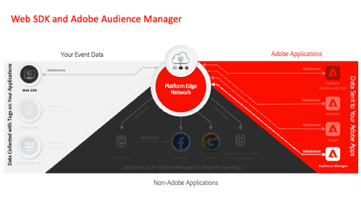

# データ収集チュートリアル

Data Collection は、Adobeが提供する次世代型の web サイトタグおよびモバイル SDKの管理機能です。 データ収集を使用すると、関連する顧客体験を強化するために必要な分析、マーケティング、広告などのソリューションを、簡単にデプロイして管理できます。 これらのビデオとチュートリアルを使用して、この重要なテクノロジーの学習に役立ててください。

## 移行ガイド

<table>
<tr>
  <td>
    
    

      <a href="https://experienceleague.adobe.com/ja/docs/platform-learn/migrate-target-to-websdk/introduction" target="_blank">
    <strong>Adobe Targetの Web SDKへの移行 </strong>
    </a>
    

    

    <em>at.js を Web SDKに置き換える </em>
    

  </td>
  <td>
    
    

      <a href="https://experienceleague.adobe.com/ja/docs/platform-learn/migrate-analytics-to-websdk/migration-to-websdk-overview" target="_blank">
    <strong> タグでのAdobe Analyticsの Web SDKへの移行 </strong>
    </a>
    

    

    <em>AppMeasurement.js をタグ付き web SDKに置き換える </em>
    

  </td>
  <td>
      
    </a>
    

      <strong>Adobe Audience Managerの Web SDKへの移行 </strong>
    

    

    <em><a href="https://experienceleague.adobe.com/ja/docs/audience-manager/user-guide/migrate-to-web-sdk/dil-extension-to-web-sdk" target="_blank">dil.js</a> を置き換えるか、<a href="https://experienceleague.adobe.com/ja/docs/audience-manager/user-guide/migrate-to-web-sdk/appmeasurement-to-web-sdk" target="_blank"> サーバーサイド転送を更新します </a></em>
    

  </td>
</tr>
<tr>
  <td>
    
    

      <a href="https://experienceleague.adobe.com/ja/docs/platform-learn/migrate-target-to-mobile-sdk-decisioning/overview" target="_blank">
    <strong>Edge Network上の Mobile SDKへのAdobe Targetの移行 </strong>
    </a>
    

    

    <em>Target 拡張機能をJourney Optimizer - Decisioning 拡張機能に置き換える </em>
    

  </td>
  <td>
  </td>
  <td>
  </td>
  </tr>
</table>

## 実装ガイド

<table>
<tr>
  <td>
    
    

      <a href="https://experienceleague.adobe.com/ja/docs/platform-learn/implement-web-sdk/overview" target="_blank">
    <strong>Web SDKを使用したExperience Cloudの実装 </strong>
    </a>
    

    

    <em> タグを使用した Platform Web SDKの実装 </em>
    

  </td>
  <td>
    
    

      <a href="https://experienceleague.adobe.com/ja/docs/platform-learn/implement-mobile-sdk/overview" target="_blank">
    <strong> モバイルアプリへのExperience Cloudの実装 </strong>
    </a>
    

    

    <em> タグを使用した Platform Mobile SDKの実装 </em>
    

  </td>
  <td>
    
    

      <a href="https://experienceleague.adobe.com/ja/docs/platform-learn/migrate-target-to-websdk/introduction" target="_blank">
    <strong> タグを使用したレガシーライブラリの実装 </strong>
    </a>
    

    

    <em> タグを使用して、従来の Analytics、Target およびAudience Manager ライブラリを実装する </em>
    

  </td>
</tr>
</table>

*Apple、Apple のロゴ、iPad、iPhone、iPod、iPod touch は、Apple Inc. の米国およびその他の国々での登録商標です。Swift と Swift のロゴは Apple Inc. の商標です。*
