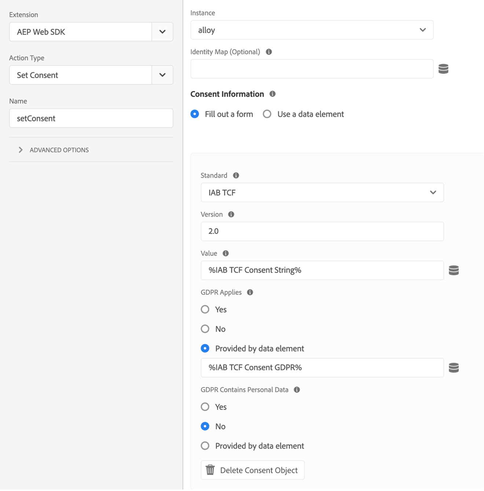

# Platform Web SDK 拡張機能を使用して、同意管理プラットフォーム（CMP）との同意を実装

多くの法的プライバシー規制では、データ収集、パーソナライゼーション、その他のマーケティングのユースケースに関して、アクティブで特定の同意に対する要件が導入されています。 これらの要件を満たすために、Adobe Experience Platformでは、個々の顧客プロファイルで同意情報を取得し、それらの環境設定をダウンストリームの Platform ワークフローで各顧客のデータがどのように使用されるかを決定する要因として使用できます。

>[!NOTE]
>
>Adobe Experience Platform Launch は、データ収集テクノロジーのスイートとして Adobe Experience Platform に統合されています。 このコンテンツを使用する際に注意する必要があるインターフェイスで、いくつかの用語がロールアウトされました。
>
> * Platform launch（クライアントサイド）が **[[!DNL tags]](https://experienceleague.adobe.com/docs/experience-platform/tags/home.html?lang=ja)** になりました
> * Platform launchサーバーサイドが **[[!DNL event forwarding]](https://experienceleague.adobe.com/docs/experience-platform/tags/event-forwarding/overview.html?lang=ja)** になりました
> * Edgeの設定が **[[!DNL datastreams]](https://experienceleague.adobe.com/docs/experience-platform/edge/fundamentals/datastreams.html?lang=ja)** になりました

このチュートリアルでは、データ収集の Platform Web SDK 拡張機能を使用して、Consent Management Platform （CMP）から取得した同意データを実装してアクティブ化する方法について説明します。 これは、Adobe標準と IAB TCF 2.0 同意標準の両方を使用して行い、OneTrust または Sourcepoint を CMP の例として使用します。

このチュートリアルでは、Platform Web SDK 拡張機能を使用して、同意データを Platform に送信します。 Web SDK の概要については、[ このページ ](https://experienceleague.adobe.com/docs/experience-platform/edge/home.html?lang=ja) を参照してください。

## 前提条件

Web SDK を使用するための前提条件を以下に示します [ こちら ](https://experienceleague.adobe.com/docs/experience-platform/edge/fundamentals/prerequisite.html?lang=ja#fundamentals)。

そのページには、「イベントデータセット」の要件があり、音と同様に、これはエクスペリエンスイベントデータを保持するデータセットです。 イベントと共に同意情報を送信するには、[IAB TCF 2.0 同意の詳細 ](https://experienceleague.adobe.com/docs/experience-platform/landing/governance-privacy-security/consent/iab/dataset.html?lang=ja) フィールドグループをエクスペリエンスイベントスキーマに追加する必要があります。


Platform 同意標準 v2.0 の場合、XDM 個人プロファイルスキーマとデータセットを作成するには、Adobe Experience Platformにもアクセスする必要があります。 スキーマの作成に関するチュートリアルについては [ スキーマエディターを使用したスキーマの作成 ](https://experienceleague.adobe.com/docs/experience-platform/xdm/tutorials/create-schema-ui.html?lang=ja#tutorials) を参照してください。必要な同意と環境設定の詳細フィールドグループについては [ 同意と環境設定のデータを取得するためのデータセットの設定 ](https://experienceleague.adobe.com/docs/experience-platform/landing/governance-privacy-security/consent/adobe/dataset.html?lang=ja) を参照してください。

このチュートリアルでは、データ収集へのアクセス権を持ち、Web SDK 拡張機能がインストールされたクライアントサイドのタグプロパティと、開発用に作成および構築された作業ライブラリを作成済みであることを前提としています。 これらのトピックについて詳しく説明し、以下のドキュメントで説明します。

* [ プロパティの作成または設定 ](https://experienceleague.adobe.com/docs/experience-platform/tags/admin/companies-and-properties.html?lang=ja#create-or-configure-a-property)
* [ ライブラリの概要 ](https://experienceleague.adobe.com/docs/experience-platform/tags/publish/libraries.html?lang=ja)
* [パブリッシュの概要](https://experienceleague.adobe.com/docs/experience-platform/tags/publish/overview.html?lang=ja)

また、[Platform Debugger](https://chrome.google.com/webstore/detail/adobe-experience-platform/bfnnokhpnncpkdmbokanobigaccjkpob) Chrome拡張機能を使用して、実装を調べ、検証します。

IAB TCF の例を CMP と共に独自のサイトに実装するには、OneTrust や Sourcepoint などの CMP にアクセスして、提供されるデータを生成する必要があります。または、こちらから順に進んで、結果を確認してください。

## Adobe同意標準（v1.0 または v2.0）での Web SDK の使用

>[!NOTE]
>
>1.0 標準は廃止され、v2.0 で置き換えられています。2.0 標準では、同意データを追加して、同意環境設定を手動で適用するために使用できます。 以下の Platform Web SDK 拡張機能のスクリーンショットは、Adobe同意標準の v1.0 または v2.0 と互換性のある拡張機能のバージョン [2.4.0](https://experienceleague.adobe.com/docs/experience-platform/edge/release-notes.html?lang=ja#version-2.4.0) のものです。

これらの標準について詳しくは、[ 顧客同意環境設定のサポート ](https://experienceleague.adobe.com/docs/experience-platform/edge/consent/supporting-consent.html?lang=ja) を参照してください。

### 手順 1:Web SDK 拡張機能での同意の設定

Platform Web SDK 拡張機能をタグプロパティにインストールしたら、拡張機能の設定画面で同意データをアドレス指定するためのオプションを設定できます。


ユーザーが同意環境設定を以前に指定していない場合、「プライバシー」セクションは SDK の同意レベルを設定します。 これにより、SDK での同意およびイベントデータ収集のデフォルト状態が設定されます。 選択した設定は、「ユーザーがまだ明示的な同意環境設定を指定していない場合、SDK は何を行うか」という質問に対する回答になります。

* 内 – ユーザーが同意環境設定を指定する前に発生するイベントを収集します。
* 出力 – ユーザーが同意環境設定を指定する前に発生するイベントをドロップします。
* 保留中 – ユーザーが同意環境設定を指定する前に発生するキューのイベント。
* データ要素によって提供

デフォルトの同意設定が「In」の場合、明示的な同意を待たずに、ユーザーが同意設定を指定する前に発生するイベントを収集する必要があることを SDK に指示しています。 これらの環境設定は通常、CMP で処理および保存されます。

デフォルトの同意設定が「Out」の場合、ユーザーのオプトイン環境設定が設定される前に発生するイベントを収集しないように SDK に指示します。 同意環境設定の設定前に発生する訪問者アクティビティは、同意が設定された後に SDK から送信されるデータには含まれません。 例えば、同意バナーを選択する前に web ページをスクロールして表示し、この「アウト」設定を使用した場合、ユーザーが後でデータ収集に明示的に同意すると、そのスクロールアクティビティと表示時間は送信されません。

デフォルトの同意設定が「保留中」の場合、SDK は、ユーザーが同意環境設定を指定する前に発生したイベントをキューに入れます。これにより、同意環境設定が設定された後、および訪問中に SDK が最初に設定された後にイベントが送信されることがあります。

この「保留中」設定では、ユーザーのオプトイン環境設定が必要なコマンド（event コマンドなど）を実行しようとすると、コマンドが SDK 内のキューに入れられます。 これらのコマンドは、ユーザーのオプトイン設定を SDK に通知するまで処理されません。

CMP がユーザーの環境設定を収集すると、その環境設定を SDK に送信できます。 以下の後の節では、そのオプトインデータを取得して Web SDK 拡張機能で使用する方法を確認します。

「データ要素によって提供」を使用すると、サイト上のカスタムコードまたは CMP、またはデータレイヤーでキャプチャされた同意環境設定データを含むデータ要素にアクセスできます。 この目的で使用されるデータ要素は、「in」、「out」または「pending」に解決される必要があります。

注意：SDK のこの設定は、ユーザーのプロファイルには保持されません。訪問者によって明示的な同意環境設定が提供される前に、SDK の動作を設定することに固有です。

Web SDK 拡張機能の設定について詳しくは、[Platform Web SDK 拡張機能の概要 ](https://experienceleague.adobe.com/docs/experience-platform/edge/extension/web-sdk-extension-configuration.html?lang=ja#configure-the-extension) および [ 顧客同意環境設定のサポート ](https://experienceleague.adobe.com/docs/experience-platform/edge/consent/supporting-consent.html?lang=ja) を参照してください。

この例では、「保留中」のオプションを選択し、「保存 **を選択して設定を保存し** す。

### 手順 2：同意環境設定の伝達

SDK のデフォルト動作を設定したので、タグを使用して、訪問者の明示的な同意環境設定を Platform に送信できます。 Adobe 1.0 または 2.0 標準を使用した同意データの送信は、タグルールで Web SDK の `setConsent` アクションを使用して簡単に実装できます。

#### Platform 同意標準 1.0 での同意の設定

これを示すルールを作成します。 Platform タグプロパティで、「ルール」を選択し、青い「ルールを追加」ボタンをクリックします。 ルールに「setAdobeConsent」という名前を付け、選択してイベントを追加します。 イベントタイプには、ページが当社のウェブサイトに読み込まれるたびにルールをトリガーする「Window Loaded」を選択します。 次に「アクション」で「追加」を選択して、アクション設定画面を開きます。 ここで同意データを設定します。 「拡張機能」ドロップダウンを選択して「Platform Web SDK」を選択し、「アクションタイプ」を選択して「同意を設定」を選択します。

「同意情報」で、「フォームに入力」を選択します。 このルールアクションでは、表示されたフォームに入力して、Web SDK を使用してAdobe 1.0 同意標準に同意を設定します。


この同意の設定アクションで、「受信」、「送信」、または「データ要素によって提供」を渡すことを選択できます。 この場合、データ要素は「in」または「out」に解決される必要があります。

この例では、「In」を選択して、訪問者が Web SDK による Platform へのデータ送信の許可に同意したことを示します。 青い「変更を保持」ボタンを選択してこのアクションを保存し、「保存」を選択してこのルールを保存します。

メモ：Web サイトの訪問者がオプトアウトすると、SDK では、ユーザーの同意を設定できません。

タグルールは、様々な組み込みイベントまたはカスタムイベントでトリガーできます [ これらのイベントを使用して ](https://experienceleague.adobe.com/docs/experience-platform/tags/extensions/adobe/core/overview.html?lang=ja) 訪問者セッション中の適切なタイミングでこの同意データを渡すことができます。 上記の例では、window loaded イベントを使用してルールをトリガーしました。 後の節では、CMP の同意環境設定イベントを使用して、同意を設定アクションをトリガーします。 同意を設定アクションは、オプトイン環境設定を示す任意のイベントによってトリガーされるルールで使用できます。

#### Platform Consent Standard 2.0 での同意の設定

Platform 同意標準のバージョン 2.0 は、[XDM](https://experienceleague.adobe.com/docs/platform-learn/tutorials/schemas/schemas-and-experience-data-model.html?lang=ja) データで機能します。 また、Platform のプロファイルスキーマに「同意と環境設定の詳細」フィールドグループを追加する必要もあります。 Adobe標準バージョン 2.0 とこのフィールドグループについて詳しくは、[Platform での同意処理 ](https://experienceleague.adobe.com/docs/experience-platform/landing/governance-privacy-security/consent/adobe/overview.html?lang=ja) を参照してください。

カスタムコードデータ要素を作成して、以下のスキーマに示す同意オブジェクトの collect プロパティと metadata プロパティにデータを渡します。


この同意および環境設定詳細フィールドグループには、[ 同意および環境設定 XDM データタイプ ](https://experienceleague.adobe.com/docs/experience-platform/xdm/data-types/consents.html?lang=ja#prerequisites) のフィールドが含まれています。このデータタイプには、ルールアクションの Platform Web SDK 拡張機能を使用して Platform に送信する同意環境設定データが含まれます。 現在、Platform Consent Standard 2.0 を実装するために必要なプロパティは、収集値（val）とメタデータ時間の値のみです（上記では赤でハイライト表示されています）。

このデータのデータ要素を作成しましょう。 「データ要素」を選択し、青い「データ要素の追加」ボタンを選択します。 これを「xdm-consent 2.0」と呼び、Core 拡張機能を使用して、カスタムコードタイプを選択します。 次のデータを入力またはコピーして、カスタムコードエディターウィンドウに貼り付けることができます。

```js
var dateString = new Date().toISOString();

return {
  collect: {
    val: "y"
  },
  metadata: {
    time: dateString
  }
}
```

時間フィールドは、ユーザーが同意環境設定を最後に更新した日時を指定する必要があります。 例として、JavaScript Date オブジェクトに対して標準のメソッドを使用し、タイムスタンプを作成します。 「保存」を選択してカスタムコードを保存し、もう一度保存を選択してデータ要素を保存します。

次に、ルールを選択し、青い「ルールを追加」ボタンを選択して、「setConsent onLoad - Consent 2.0」という名前を入力します。 ルールトリガーとして「ウィンドウの読み込み」イベントを選択し、「アクション」で「追加」を選択します。 Platform Web SDK 拡張機能を選択し、「アクションタイプ」で「同意を設定」を選択します。 標準はAdobe、バージョンは 2.0 にしてください。値には、Platform に送信する必要がある収集と時間の値を含んだ、作成したばかりのデータ要素を使用します。


この例のアクションを確認するには、Platform Web SDK 拡張機能から Set Consent を呼び出し、フォームから Standard と Version を渡し、前に作成したデータ要素から collect と time の値を渡します。

青い「保存」ボタンを選択し、もう一度ルールを保存します。

これで、Platform 同意標準ごとに 1 つ、2 つのルールが作成されました。 実際には、サイト全体で 1 つの標準を選択する可能性が高いでしょう。 次に、IAB TCF 2.0 同意標準を使用した例を作成します。

## IAB TCF 2.0 同意標準での Web SDK の使用

IAB の透明性および同意フレームワークのバージョン 2.0 について詳しくは、[IAB Europe web サイト ](https://iabeurope.eu/transparency-consent-framework/) を参照してください。

この標準を使用して同意環境設定データを設定するには、IAB TCF 2.0 同意詳細スキーマフィールドグループを Platform のエクスペリエンスイベントスキーマに追加する必要があります。


このフィールドグループには、IAB TCF 2.0 標準で必要な同意環境設定フィールドが含まれています。 スキーマとフィールドグループについて詳しくは、[XDM システムの概要 ](https://experienceleague.adobe.com/docs/experience-platform/xdm/home.html?lang=ja) を参照してください。

### 手順 1：同意データ要素の作成

IAB TCF 2.0 同意標準を使用してタグから同意イベントデータを送信するには、まず必要な同意フィールドを含む xdm データ要素を設定します。


タグのクライアントサイドプロパティで、「データ要素」を選択し、青い「データ要素の追加」ボタンを選択します。 この例では、このデータ要素に「xdm-consentStrings」という名前を付けます。 これらの xdm フィールドには、IAB TCF 2.0 標準に必要なユーザー同意データが含まれます。

拡張機能ドロップダウンメニューで、「Platform Web SDK」を選択し、「データ要素タイプ」で「XDM オブジェクト」を選択します。 xdm マッパーが表示され、上のスクリーンショットに示すように、「consentStrings」項目を選択して展開できます。

それぞれの consentStrings を次のように設定します。

* **`consentStandard`**: `IAB TCF`
* **`consentStandardVersion`**: `2.0`
* **`consentStringValue`**: `%IAB TCF Consent String%`
* **`containsPersonalData`**: `False` （「値を選択」ボタンから選択）
* **`gdprApplies`**: `%IAB TCF Consent GDPR%`

`consentStandard` フィールドと `consentStandardVersion` フィールドはどちらも、使用している標準（IAB TCF バージョン 2.0）の単なるテキスト文字列です。`consentStringValue` は、「IAB TCF 同意文字列」という名前のデータ要素を参照します。 テキストを囲むパーセント記号は、データ要素の名前を示しています。これについては後で説明します。 `containsPersonalData` フィールドは、IAB TCF 2.0 同意文字列に「True」または「False」の個人データが含まれているかどうかを示します。 `gdprApplies` フィールドは、GDPR が適用される場合は「true」、GDPR が適用されない場合は「false」、GDPR が適用されるかどうか不明な場合は「undefined」を示します。 現在、Web SDK では「undefined」が「true」として扱われるので、「gdprApplies: undefined」と共に送信された同意データは、訪問者が GDPR が適用される領域に配置されているかのように扱われます。

これらのプロパティとタグの IAB TCF 2.0 について詳しくは、[ 同意ドキュメント ](https://experienceleague.adobe.com/docs/experience-platform/edge/consent/iab-tcf/with-launch.html?lang=ja#getting-started) を参照してください。

### 手順 2:IAB TCF 2.0 標準で同意を設定するルールを作成する

次に、この標準の同意データが web サイトの訪問者によって設定または変更された場合に、Web SDK で同意を設定するルールを作成します。 このルールでは、[OneTrust](https://www.onetrust.com/products/cookie-consent/) や [Sourcepoint](https://www.sourcepoint.com/cmp/) などの CMP からの同意変更シグナルをキャプチャする方法も説明します。

#### ルールイベントの追加

Platform タグプロパティで「ルール」セクションを選択し、青い「ルールを追加」ボタンをクリックします。 ルールに setConsent - IAB という名前を付け、「イベント」の下の「追加」を選択します。 このイベントに tcfapi addEventListener という名前を付け、「エディターを開く」を選択してカスタムコードエディターを開きます。

次のコードをコピーして、エディターウィンドウに貼り付けます。

```js
// Wait for window.__tcfapi to be defined, then trigger when the customer has completed their consent and preferences.
function addEventListener() {
  if (window.__tcfapi) {
    window.__tcfapi("addEventListener", 2, function (tcData, success) {
      if (success && (tcData.eventStatus === "useractioncomplete" || tcData.eventStatus === "tcloaded")) {
        // save the tcData.tcString properties in data elements
        _satellite.setVar("IAB TCF Consent String", tcData.tcString);
        _satellite.setVar("IAB TCF Consent GDPR", tcData.gdprApplies);
        trigger();
      }
    });
  } else {
    // window.__tcfapi wasn't defined. Check again in 100 milliseconds
    setTimeout(addEventListener, 100);
  }
}
addEventListener();
```

このコードは、`addEventListener` という関数を作成して実行するだけです。 この関数は、`window.__tcfapi` オブジェクトが存在するかどうかを確認し、存在する場合は、API の仕様に従ってイベントリスナーを追加します。 これらの仕様について詳しくは、GitHub の [IAB リポジトリ ](https://github.com/InteractiveAdvertisingBureau/GDPR-Transparency-and-Consent-Framework) を参照してください。 このイベントリスナーが正常に追加され、web サイトの訪問者が同意と環境設定の選択を完了した場合、コードは、`tcData.tcString` のタグカスタム変数と GDPR 地域のインジケーターを設定します。 IAB TCF について詳しくは、IAB [web サイト ](https://iabeurope.eu/transparency-consent-framework/) および [GitHub リポジトリ ](https://github.com/InteractiveAdvertisingBureau/GDPR-Transparency-and-Consent-Framework) で技術的な詳細を参照してください。 これらの値を設定した後、このルールをトリガーして実行するトリガー関数が実行されます。

この関数が初めて実行されたときに `window.__tcfapi` オブジェクトが存在しなかった場合、この関数は 100 ミリ秒ごとにオブジェクトを再度チェックするので、イベントリスナーを追加できます。 コードの最後の行は、その上のコードの行で定義された `addEventListener` 関数を実行するだけです。

要約すると、Web サイトの訪問者が CMP （またはカスタム）同意バナーを使用して設定した同意のステータスを確認する機能を作成しました。 その同意環境設定が設定されている場合、このコードは、ルールアクションで使用できる 2 つのカスタム変数（カスタムコードデータ要素）を作成します。 上記のコードをイベントのカスタムコードエディターウィンドウに貼り付けた後、青い「保存」ボタンを選択してルールイベントを保存します。

次に、これらの値を使用して Platform に送信するように、同意ルールを設定アクションを設定します。

#### ルールアクションの追加

「アクション」セクションの「追加」を選択します。 「拡張機能」で、ドロップダウンから「Platform Web SDK」を選択します。 「処理タイプ」で、「同意の設定」を選択します。 このアクションに setConsent という名前を付けます。

同意情報の下のアクション設定で、「フォームに入力」を選択します。 「標準」で「IAB TCF」を選択し、「バージョン」に 2.0 と入力します。値には、イベントのカスタム変数を使用し、上記のルールイベントカスタム関数でキャプチャした [tcData](https://github.com/InteractiveAdvertisingBureau/GDPR-Transparency-and-Consent-Framework/blob/master/TCFv2/IAB%20Tech%20Lab%20-%20CMP%20API%20v2.md#tcdata) から取得した `%IAB TCF Consent String%` を入力します。

GDPR の適用では、イベントの他のカスタム変数を使用し、上記のルールイベントカスタム関数で取得した `tcData` から取得した `%IAB TCF Consent GDPR%` を入力します。 GDPR がこの web サイトの訪問者に適用されるか、適用されないことがわかっている場合は、カスタム変数（データ要素）の選択を使用する代わりに、該当する場合は「はい」または「いいえ」を選択できます。 データ要素で条件付きロジックを使用して、GDPR が適用されるかどうかを確認し、適切な値を返すこともできます。

「GDPR に個人データが含まれています」で、このユーザーのデータに個人データが含まれているかどうかを示すオプションを選択します。 この場合、データ要素は true または false に解決される必要があります。



青い「保存」ボタンを選択してアクションを保存し、青い「保存」（または「ライブラリに保存」）ボタンを選択してルールを保存します。 この時点で、IAB TCF 2.0 同意標準の Web SDK 拡張機能を使用して同意を設定するためのデータ要素とルールをタグに正常に実装しました。

### 手順 3：ライブラリに保存してビルド

[ 作業ライブラリ ](https://experienceleague.adobe.com/docs/platform-learn/implement-in-websites/configure-tags/add-data-elements-rules.html?lang=ja#use-the-working-library-feature) 前提条件を使用している場合は、これらの変更が既に保存されており、開発ライブラリが構築されています。


### 手順 4：データ収集のInspectと検証

このサイトで、ページを更新し、タグメニューセクションの [Debugger](https://chromewebstore.google.com/detail/adobe-experience-platform/bfnnokhpnncpkdmbokanobigaccjkpob) Chrome拡張機能のライブラリビルドを確認します。


また、Debugger Platform Web SDK セクションのAdobe 1.0 または 2.0 標準の setConsent 呼び出しを調べることもできます。それには、`{"consent":[{"value":{"general":"in"},"version…` が表示されるネットワークリクエストのPOST本文行でを選択します。


IAB TCF 2.0 標準に対する setConsent 呼び出しとルールを検証するために、テストサイトの OneTrust 同意バナーを使用して、同意設定を設定し、前述の tcData を作成します。


「同意する」を選択した後、ネットワークリクエストのPOST本文行でを選択することで、Debugger Platform Web SDK セクションの IAB TCF 2.0 標準の setConsent 呼び出しを調べることができ `{"consent":[{"value":"someAlphaNumericCharacters…` す。


ここでは、データ要素とタグルールで以前に設定したデータを確認します。 value プロパティには、以前に確認した、エンコードされた tcString データが含まれています。

IAB TCF 2.0 標準を実装する OneTrust、Sourcepoint およびその他の CMP はすべて、当社のページで同様のデータを生成します。 そのデータを取得し、上記で作成したルールのカスタムコードイベントを使用して、タグの Web SDK 拡張機能で使用できます。 カスタムコードは、IAB TCF 2.0 データの生成に使用された CMP に関係なく同じになります。 カスタムコードは、いずれかの Platform 同意標準（1.0 または 2.0）でも使用できます。

## エクスペリエンスイベントでの同意データの送信

どちらのルールでも、以前にデータ要素フィールドで作成した「xdm-consentStrings」データ要素を参照していないことに気づいたでしょうか。 このデータ要素は、エクスペリエンスイベントで同意データを送信する必要がある場合に使用します。


このデータ要素には IAB TCF 2.0 標準に必要なすべてのフィールドが含まれているので、この xdm データをエクスペリエンスイベントで送信する際に、データ要素を単に参照できます。


## まとめ

データを調査および検証したので、Platform の Platform Web SDK 拡張機能を使用して CMP から取得した同意データを実装およびアクティブ化する方法を確認できます。
