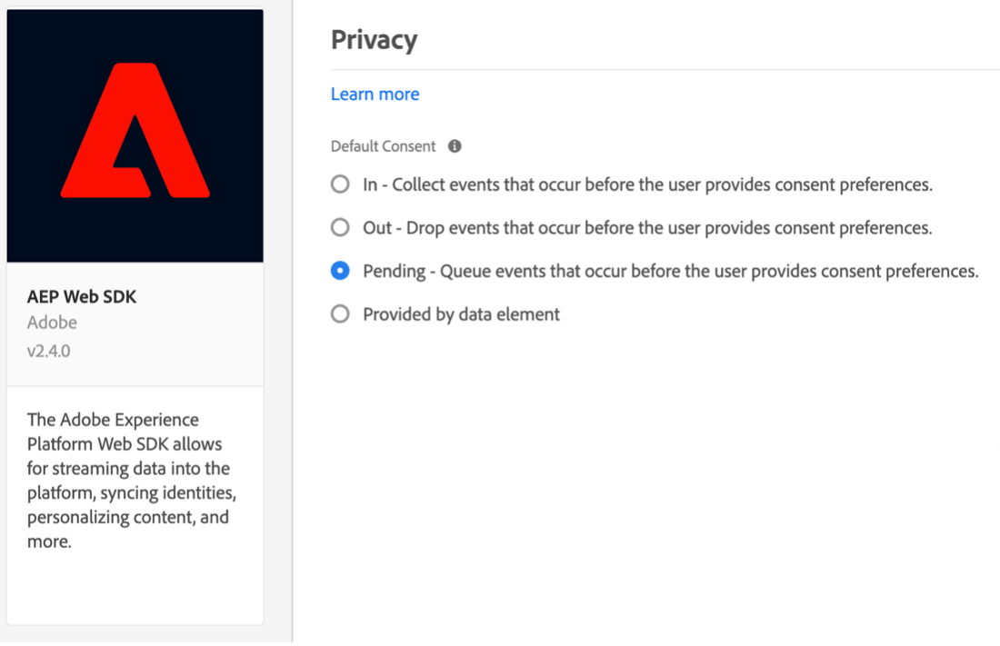

# Platform Web SDK 拡張機能を使用した同意管理プラットフォーム (CMP) による同意の実装

多くの法的プライバシー規制では、データ収集、パーソナライゼーション、その他のマーケティングの使用例に関して、アクティブで特定の同意に関する要件が導入されています。 これらの要件を満たすために、Adobe Experience Platformでは、個々の顧客プロファイルの同意情報を取り込み、それらの設定を、各顧客のデータがダウンストリームの Platform ワークフローでどのように使用されるかの決定要因として使用できます。

>[!NOTE]
>
>Adobe Experience Platform Launch は、データ収集テクノロジーのスイートとして Adobe Experience Platform に統合されています。 このコンテンツを使用する際に注意が必要な、いくつかの用語の変更がインターフェイスにロールアウトされました。
>
> * platform launch（クライアント側）が **[[!DNL tags]](https://experienceleague.adobe.com/docs/experience-platform/tags/home.html?lang=ja)**
> * platform launchサーバー側が **[[!DNL event forwarding]](https://experienceleague.adobe.com/docs/experience-platform/tags/event-forwarding/overview.html)**
> * エッジ設定が **[[!DNL datastreams]](https://experienceleague.adobe.com/docs/experience-platform/edge/fundamentals/datastreams.html?lang=ja)**

このチュートリアルでは、データ収集の Platform Web SDK 拡張機能を使用して、CMP（同意管理プラットフォーム）から取得した同意データを実装し、アクティブにする方法について説明します。 Adobe標準と IAB TCF 2.0 同意標準の両方を使用して、OneTrust または Sourcepoint を CMP の例として使用します。

このチュートリアルでは、Platform Web SDK 拡張機能を使用して、Platform に同意データを送信します。 Web SDK の概要については、 [このページ](https://experienceleague.adobe.com/docs/experience-platform/edge/home.html?lang=ja).

## 前提条件

Web SDK を使用するための前提条件を示します [ここ](https://experienceleague.adobe.com/docs/experience-platform/edge/fundamentals/prerequisite.html#fundamentals).

このページには「イベントデータセット」が必要で、聞こえるとおり、これはエクスペリエンスイベントデータを保持するデータセットです。 イベントで同意情報を送信するには、 [IAB TCF 2.0 同意の詳細](https://experienceleague.adobe.com/docs/experience-platform/landing/governance-privacy-security/consent/iab/dataset.html) フィールドグループをエクスペリエンスイベントスキーマに追加する必要があります。


Platform の同意標準 v2.0 の場合、Adobe Experience Platformにアクセスして、XDM の個別プロファイルスキーマとデータセットを作成する必要もあります。 スキーマの作成に関するチュートリアルについては、 [スキーマエディターを使用したスキーマの作成](https://experienceleague.adobe.com/docs/experience-platform/xdm/tutorials/create-schema-ui.html#tutorials) 必要な「同意および環境設定の詳細」フィールドグループについては、 [同意データと環境設定データを取り込むためのデータセットの設定](https://experienceleague.adobe.com/docs/experience-platform/landing/governance-privacy-security/consent/adobe/dataset.html).

このチュートリアルでは、データ収集にアクセスできるユーザーが、Web SDK 拡張機能がインストールされ、開発用に作成および構築された作業用ライブラリを使用して、クライアント側タグプロパティを作成していることを前提としています。 これらのトピックについては、次のドキュメントで詳しく説明します。

* [プロパティの作成または設定](https://experienceleague.adobe.com/docs/experience-platform/tags/admin/companies-and-properties.html?lang=ja#create-or-configure-a-property)
* [ライブラリの概要](https://experienceleague.adobe.com/docs/experience-platform/tags/publish/libraries.html?lang=ja)
* [パブリッシュの概要](https://experienceleague.adobe.com/docs/experience-platform/tags/publish/overview.html?lang=ja)

また、 [Platform Debugger](https://chrome.google.com/webstore/detail/adobe-experience-platform/bfnnokhpnncpkdmbokanobigaccjkpob) Chrome 拡張機能を使用して、実装を検査および検証します。

CMP を使用した IAB TCF の例を独自のサイトに実装するには、OneTrust や Sourcepoint などの CMP にアクセスして提供するデータを生成する必要があります。または、ここで簡単に実行して、以下の結果を確認できます。

## Adobe同意標準（v1.0 または v2.0）での Web SDK の使用

>[!NOTE]
>
>1.0 標準は v2.0 に代わって廃止されています。2.0 標準を使用すると、同意設定を手動で実施するために使用できる同意データを追加できます。 Platform Web SDK 拡張機能の以下のスクリーンショットは、バージョンのものです。 [2.4.0](https://experienceleague.adobe.com/docs/experience-platform/edge/release-notes.html#version-2.4.0) AdobeConsent Standard の v1.0 または v2.0 と互換性のある拡張機能の

これらの規格の詳細については、 [顧客の同意設定のサポート](https://experienceleague.adobe.com/docs/experience-platform/edge/consent/supporting-consent.html).

### 手順 1:Web SDK 拡張機能での同意の設定

Platform Web SDK 拡張機能をタグプロパティにインストールしたら、拡張機能の設定画面で同意データに対処するためのオプションを設定できます。



ユーザーが事前に同意設定を指定していない場合、「プライバシー」セクションでは SDK の同意レベルを設定します。 これにより、SDK での同意およびイベントデータ収集のデフォルトの状態が設定されます。 選択した設定は、「ユーザーが明示的な同意設定をまだ提供していない場合、SDK は何をすべきか」という質問に回答します。

* ：ユーザーが同意設定を提供する前に発生したイベントを収集します。
* 送信 — ユーザーが同意設定を提供する前に発生したイベントを削除します。
* 保留中 — ユーザーが同意設定を提供する前に発生したイベントをキューに入れます。
* データ要素によって指定

デフォルトの同意設定が「In」の場合、これは SDK に対し、明示的な同意を待つ必要がないことを通知し、ユーザーが同意設定を提供する前に発生したイベントを収集する必要があることを通知します。 これらの環境設定は通常、CMP で処理および格納されます。

デフォルトの同意設定が「Out」の場合、これにより、ユーザーのオプトイン設定が設定される前に発生したイベントを収集しないように SDK に通知します。 同意設定の前に発生した訪問者のアクティビティは、同意の設定後に SDK から送信されるデータには含まれません。 例えば、同意バナーを選択する前に Web ページをスクロールして表示し、この「アウト」設定を使用した場合、ユーザーが後でデータ収集に対して明示的な同意を提供した場合は、そのスクロールアクティビティと表示時間は送信されません。

デフォルトの同意設定が「保留」の場合、SDK はユーザーが同意設定を行う前に発生したイベントをキューに入れるので、同意設定の設定後、訪問中に SDK が最初に設定された後にイベントを送信できます。

この「保留」設定では、ユーザーのオプトイン設定が必要なコマンド（イベントコマンドなど）を実行しようとすると、そのコマンドは SDK 内のキューに追加されます。 これらのコマンドは、ユーザーのオプトイン設定を SDK に通知するまで処理されません。

CMP がユーザーの環境設定を収集したら、それらの設定を SDK に伝えることができます。 後の節では、そのオプトインデータを取得し、Web SDK 拡張機能と共に使用する方法を説明します。

「Provided by data element」を使用すると、サイト上のカスタムコードや CMP、またはデータレイヤーでキャプチャされた同意設定データを含むデータ要素にアクセスできます。 この目的で使用されるデータ要素は、「in」、「out」、「pending」に解決される必要があります。

注意：この SDK の設定は、ユーザーのプロファイルには保持されません。訪問者が明示的な同意設定をおこなう前に SDK の動作を設定することに固有です。

Web SDK 拡張機能の設定について詳しくは、 [Platform Web SDK 拡張機能の概要](https://experienceleague.adobe.com/docs/experience-platform/edge/extension/web-sdk-extension-configuration.html?lang=en#configure-the-extension) および [顧客の同意設定のサポート](https://experienceleague.adobe.com/docs/experience-platform/edge/consent/supporting-consent.html).

この例では、「保留」のオプションを選択し、「 **保存** 設定を保存します。

### 手順 2:同意設定の伝達

これで SDK のデフォルトの動作が設定され、タグを使用して、訪問者の明示的な同意設定を Platform に送信できます。 Adobe1.0 または 2.0 標準を使用した同意データの送信は、 `setConsent` タグルール内での Web SDK のアクションを参照してください。

#### Platform Consent Standard 1.0 による同意の設定

ルールを作成して、これを示します。 Platform タグプロパティで、「ルール」を選択し、青い「ルールを追加」ボタンを選択します。 ルールに「setAdobeConsent」という名前を付け、イベントを追加する場合に選択します。 「イベントタイプ」では、「Window Loaded」を選択します。このルールは、ページが Web サイトに読み込まれるたびにこのルールをトリガーにします。 次に、「アクション」の下で「追加」を選択してアクション設定画面を開きます。 同意データはここで設定します。 「拡張機能」ドロップダウンを選択し、「Platform Web SDK」を選択して、「アクションタイプ」を選択し、「同意を設定」を選択します。

「同意情報」で、「フォームに入力」を選択します。 このルールアクションでは、Web SDK を使用し、表示されるフォームに入力することで、Adobe1.0 の同意標準に対する同意を設定します。


この同意の設定アクションで、「In」、「Out」または「Provided by data element」を渡すように選択できます。 このデータ要素は、「in」または「out」に解決される必要があります。

この例では、「受信」を選択して、Web SDK による Platform へのデータ送信を許可した訪問者が同意したことを示します。 青い「変更を保持」ボタンを選択してこのアクションを保存し、「保存」を選択してこのルールを保存します。

注意：Web サイトの訪問者がオプトアウトすると、SDK ではに対するユーザーの同意を設定できなくなります。

タグルールは、様々な組み込みまたはカスタムでトリガーできます [イベント](https://experienceleague.adobe.com/docs/experience-platform/tags/extensions/adobe/core/overview.html) 訪問者セッション中に適切なタイミングでこの同意データを渡すために使用できます。 上記の例では、 window loaded イベントを使用してルールをトリガー化しました。 後の節では、CMP の同意設定イベントを使用して、「Set Consent」アクションをトリガーにします。 オプトインの環境設定を示す任意のイベントでトリガーされるルールで、同意の設定アクションを使用できます。

#### Platform Consent Standard 2.0 による同意の設定

Platform 同意標準のバージョン 2.0 は、 [XDM](https://experienceleague.adobe.com/docs/platform-learn/tutorials/schemas/schemas-and-experience-data-model.html?lang=ja) データ。 また、Platform のプロファイルスキーマに、「同意」フィールドグループと「環境設定の詳細」フィールドグループを追加する必要があります。 詳しくは、 [Platform での同意処理](https://experienceleague.adobe.com/docs/experience-platform/landing/governance-privacy-security/consent/adobe/overview.html) を参照してください。

次のスキーマに示す同意オブジェクトの collect プロパティと metadata プロパティにデータを渡すカスタムコードデータ要素を作成します。


この「同意」および「プリファレンスの詳細」フィールドグループには、 [同意および環境設定 XDM データタイプ](https://experienceleague.adobe.com/docs/experience-platform/xdm/data-types/consents.html#prerequisites) これには、ルールアクションで Platform Web SDK 拡張機能を使用して Platform に送信する、同意設定データが含まれます。 現在、Platform Consent Standard 2.0 を実装するために必要なプロパティは、収集値 (val) とメタデータ時間値（上記の赤で強調表示）のみです。

このデータのデータ要素を作成します。 データ要素を選択し、青い「データ要素を追加」ボタンを選択します。 これを「xdm-consent 2.0」と呼び、Core 拡張機能を使用して、カスタムコードタイプを選択します。 次のデータを入力またはコピーして、カスタムコードエディターウィンドウに貼り付けることができます。

```js
var dateString = new Date().toISOString();

return {
  collect: {
    val: "y"
  },
  metadata: {
    time: dateString
  }
}
```

時間フィールドには、ユーザーが同意設定を最後に更新した日時を指定する必要があります。 JavaScript の日付オブジェクトの標準的なメソッドを使用した例として、ここでタイムスタンプを作成しています。 「保存」を選択してカスタムコードを保存し、もう一度「保存」を選択してデータ要素を保存します。

次に、「ルール」を選択し、青い「ルールを追加」ボタンを選択して、名前を「setConsent onLoad - Consent 2.0」と入力します。 「Window Loaded」イベントをルールイベントとして選択し、「Actions」の下の「Add」をトリガーします。 「 Platform Web SDK Extension 」を選択し、「アクションタイプ」で「同意を設定」を選択します。 「標準」は「Adobe」、「バージョン」は「2.0」です。「値」では、作成したデータ要素を使用し、Platform に送信する必要のある収集と時間の値を含めます。


この例のアクションを確認するには、Platform Web SDK 拡張機能から Set Consent を呼び出し、前の手順で作成したデータ要素から collect および time の値を渡しながら、Standard と Version にフォームを渡します。

青い「保存」ボタンを選択し、ルールを再度保存します。

これで、2 つのルールが用意され、Platform の同意標準ごとに 1 つずつ用意されました。 実際には、サイト全体で 1 つの標準を選択することになります。 次に、IAB TCF 2.0 同意標準を使用した例を作成します。

## IAB TCF 2.0 Consent Standard での Web SDK の使用

IAB Transparency and Consent Framework のバージョン 2.0 について詳しくは、 [IAB Europe の Web サイト](https://iabeurope.eu/transparency-consent-framework/).

この標準を使用して同意設定データを設定するには、 IAB TCF 2.0 Consent Details スキーマフィールドグループを Platform のエクスペリエンスイベントスキーマに追加する必要があります。


このフィールドグループには、IAB TCF 2.0 標準で必要な同意設定フィールドが含まれています。 スキーマおよびフィールドグループについて詳しくは、 [XDM システムの概要](https://experienceleague.adobe.com/docs/experience-platform/xdm/home.html?lang=ja).

### 手順 1:同意データ要素の作成

IAB TCF 2.0 の同意標準を使用してタグから同意イベントデータを送信するには、まず xdm データ要素を設定し、必要な同意フィールドを指定します。


クライアントサイドのタグのプロパティで、「データ要素」を選択し、青い「データ要素を追加」ボタンを選択します。 この例では、このデータ要素に「xdm-consentStrings」という名前を付けます。 これらの xdm フィールドには、IAB TCF 2.0 標準に必要なユーザー同意データが含まれます。

「拡張機能」ドロップダウンメニューで「Platform Web SDK」を選択し、「データ要素の種類」で「XDM オブジェクト」を選択します。 xdm マッパーが表示され、上のスクリーンショットに示したように「consentStrings」項目を選択して展開できます。

各 consentStrings を次のように設定します。

* **`consentStandard`**:  `IAB TCF`
* **`consentStandardVersion`**:  `2.0`
* **`consentStringValue`**:  `%IAB TCF Consent String%`
* **`containsPersonalData`**:  `False` （「値を選択」ボタンから選択）
* **`gdprApplies`**:  `%IAB TCF Consent GDPR%`

この `consentStandard` および `consentStandardVersion` フィールドは、どちらも、使用している標準（IAB TCF バージョン 2.0）のテキストの文字列です。 `consentStringValue` は、「IAB TCF Consent String」という名前のデータ要素を参照します。 テキストを囲むパーセント記号はデータ要素の名前を示します。後でそれを確認します。 この `containsPersonalData` フィールドは、IAB TCF 2.0 のコンセントストリングに、「True」または「False」の個人データが含まれているかどうかを示します。 この `gdprApplies` 「 」フィールドは、GDPR が適用される場合は「true」、GDPR が適用されない場合は「false」、GDPR が適用される場合は「未定義」を示します。 現在、Web SDK は「未定義」を「true」として扱うので、「gdprApplies:「未定義」の場合は、GDPR が適用される領域に訪問者がいるかのように扱われます。

詳しくは、 [同意文書](https://experienceleague.adobe.com/docs/experience-platform/edge/consent/iab-tcf/with-launch.html#getting-started) これらのプロパティおよびタグの IAB TCF 2.0 について詳しくは、を参照してください。

### 手順 2:IAB TCF 2.0 標準に同意するようにルールを作成する

次に、Web サイトの訪問者がこの標準の同意データを設定または変更した場合に、Web SDK との同意を設定するルールを作成します。 このルールでは、次のような CMP からこれらの同意の変更シグナルを取り込む方法も確認します。 [OneTrust](https://www.onetrust.com/products/cookie-consent/) または [Sourcepoint](https://www.sourcepoint.com/cmp/).

#### ルールイベントを追加

Platform タグプロパティの「ルール」セクションを選択し、青い「ルールを追加」ボタンを選択します。 ルールに setConsent - IAB という名前を付け、「イベント」の下の「追加」を選択します。 このイベントに tcfapi addEventListener という名前を付け、「エディターを開く」を選択してカスタムコードエディターを開きます。

次のコードをコピーして、エディターウィンドウに貼り付けます。

```js
// Wait for window.__tcfapi to be defined, then trigger when the customer has completed their consent and preferences.
function addEventListener() {
  if (window.__tcfapi) {
    window.__tcfapi("addEventListener", 2, function (tcData, success) {
      if (success && (tcData.eventStatus === "useractioncomplete" || tcData.eventStatus === "tcloaded")) {
        // save the tcData.tcString properties in data elements
        _satellite.setVar("IAB TCF Consent String", tcData.tcString);
        _satellite.setVar("IAB TCF Consent GDPR", tcData.gdprApplies);
        trigger();
      }
    });
  } else {
    // window.__tcfapi wasn't defined. Check again in 100 milliseconds
    setTimeout(addEventListener, 100);
  }
}
addEventListener();
```

このコードは、という関数を作成して実行するだけです。 `addEventListener`. 関数は、 `window.__tcfapi` オブジェクトが存在し、存在する場合は、API の仕様に従ってイベントリスナーを追加します。 これらの仕様について詳しくは、 [IAB リポジトリ](https://github.com/InteractiveAdvertisingBureau/GDPR-Transparency-and-Consent-Framework) GitHub で このイベントリスナーが正常に追加され、Web サイトの訪問者が同意と環境設定の選択を完了した場合、コードは `tcData.tcString`、および GDPR 地域の指標。 IAB TCF について詳しくは、 IAB を参照してください。 [web サイト](https://iabeurope.eu/transparency-consent-framework/) および [GitHub リポジトリ](https://github.com/InteractiveAdvertisingBureau/GDPR-Transparency-and-Consent-Framework) 技術的な詳細については、を参照してください。 これらの値を設定した後、コードは、このルールを実行するトリガー関数をトリガーにして実行します。

この `window.__tcfapi` この関数を初めて実行したときにオブジェクトが存在しなかったので、関数は 100 ミリ秒ごとに再度チェックするので、イベントリスナーを追加できます。 コードの最後の行では、単に `addEventListener` 関数が定義されています。

要約すると、Web サイトの訪問者が CMP（またはカスタム）同意バナーを使用して設定した同意のステータスを確認する関数を作成しました。 その同意の環境設定が設定されている場合、このコードは、ルールアクションで使用できる 2 つのカスタム変数（カスタムコードデータ要素）を作成します。 上記のコードをイベントのカスタムコードエディターウィンドウに貼り付けた後、青い「保存」ボタンを選択してルールイベントを保存します。

次に、これらの値を使用して Platform に送信する同意ルールアクションを設定します。

#### ルールアクションを追加

「アクション」セクションの「追加」を選択します。 「拡張機能」の下のドロップダウンから「 Platform Web SDK 」を選択します。 「アクションタイプ」で、「同意を設定」を選択します。 このアクションに setConsent という名前を付けます。

「同意情報」の下のアクションの設定で、「フォームに入力」を選択します。 「標準」で「IAB TCF」を選択し、「バージョン」に 2.0 と入力します。「値」には、イベントのカスタム変数を使用して、「 `%IAB TCF Consent String%` それは [tcData](https://github.com/InteractiveAdvertisingBureau/GDPR-Transparency-and-Consent-Framework/blob/master/TCFv2/IAB%20Tech%20Lab%20-%20CMP%20API%20v2.md#tcdata) 上記のルールイベントカスタム関数でキャプチャしました。

「GDPR 適用」で、イベントの他のカスタム変数を使用し、「 `%IAB TCF Consent GDPR%` それはまた `tcData` 上記のルールイベントカスタム関数でキャプチャしました。 この Web サイトの訪問者に対して GDPR が確実に適用されるか適用されないかを把握している場合は、カスタム変数（データ要素）の選択を使用する代わりに、該当する場合は「はい」または「いいえ」を選択できます。 また、データ要素で条件付きロジックを使用して、GDPR が適用され、適切な値が返されるかどうかを確認することもできます。

「 GDPR Contains Personal Data 」で、このユーザーのデータに個人データを含めるかどうかを指定するオプションを選択します。 ここで指定するデータ要素は、true または false に解決される必要があります。


青い「保存」ボタンを選択してアクションを保存し、青い「保存」（または「ライブラリに保存」）ボタンを選択してルールを保存します。 この時点で、IAB TCF 2.0 同意標準を持つ Web SDK 拡張機能を使用して同意を設定するためのデータ要素およびルールをタグに正常に実装しました。

### 手順 3:ライブラリに保存してビルド

を使用している場合、 [作業ライブラリ](https://experienceleague.adobe.com/docs/platform-learn/implement-in-websites/configure-tags/add-data-elements-rules.html#use-the-working-library-feature) 前提条件：これらの変更を既に保存し、開発ライブラリを構築しています。


### 手順 4:Inspectとデータ収集の検証

サイトで、ページを更新し、 [デバッガー](https://chrome.google.com/webstore/detail/adobe-experience-cloud-de/ocdmogmohccmeicdhlhhgepeaijenapj) Chrome 拡張機能の「タグメニュー」セクションに表示されます。


また、AdobePlatform Web SDK の節で、ネットワークリクエストのPOST本文行でを選択して、デバッガー 1.0 または 2.0 標準の setConsent 呼び出しを調べることもできます。この行は、 `{"consent":[{"value":{"general":"in"},"version…`:


IAB TCF 2.0 標準に対する setConsent 呼び出しとルールを検証するには、テストサイトの OneTrust 同意バナーを使用して同意設定を設定し、前述の tcData を作成します。


「同意します」を選択した後、ネットワークリクエストの「POST本文」行でを選択することで、デバッガー Platform Web SDK セクションで IAB TCF 2.0 標準の setConsent 呼び出しを調べることができます ( 参照： `{"consent":[{"value":"someAlphaNumericCharacters…`.


ここでは、データ要素とタグルールで前に設定したデータを示します。 value プロパティには、先ほど参照したエンコード済みの tcString データが含まれています。

IAB TCF 2.0 標準を実装する OneTrust、Sourcepoint、およびその他の CMP は、すべてページで類似したデータを生成します。 そのデータをキャプチャし、上で作成したルールのカスタムコードイベントを使用して、タグ内の Web SDK 拡張機能で使用できます。 IAB TCF 2.0 データの生成に使用する CMP に関係なく、カスタムコードは同じです。 このカスタムコードは、Platform の同意標準（1.0 または 2.0）と共に使用することもできます。

## エクスペリエンスイベントを使用した同意データの送信

いずれのルールでも、データ要素フィールドで先ほど作成した「xdm-consentStrings」データ要素が参照されていないことに気付いたかもしれません。 このデータ要素は、エクスペリエンスイベントで同意データを送信する必要がある場合に使用します。


このデータ要素には IAB TCF 2.0 標準に必要なすべてのフィールドが含まれているので、Experience Events でこの xdm データを送信する際に、単にデータ要素を参照できます。


## まとめ

これで、データを検査して検証したので、Platform 用 Platform Web SDK 拡張機能を使用して、CMP から取得した同意データを実装し、アクティブ化する方法を確認できます。
